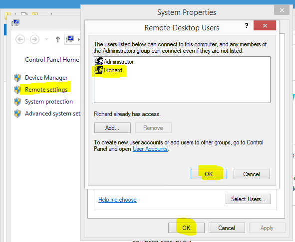

## Understanding DNS

Most ISPs make use of dynamic IP addresses to prevent you from hosting websites off your home computer, and rotate these addresses fairly often *(sometimes on a daily basis)*. It would be near impossible to know the currently assigned IP address of your home computer at a given time unless you were in front of it to check. This is not helpful, especially when you need to know this address when connecting to your computer away from home.

This is where Dynamic DNS comes in handy. DNS (**Domain Name System**) translates human-friendly host names to their associated IP addresses via a **DNS server**. Dynamic DNS services extend this by letting you update the resolved IP address whenever your home connection changes — meaning you can always reach your home computer by a consistent hostname regardless of what IP your ISP assigns.

When connecting to your home computer remotely it makes more sense to use a custom hostname over an IP address as you are more likely to remember the host name. We will be using this for our connection.

## Getting a DNS Server

You could create your own public DNS server and update your IP address manually, or you could make use of an existing paid or free service. When it comes to Dynamic DNS there are a lot of good free services available online (e.g. [FreeDNS](https://www.freedns.com/)) which allow you to sign up for a free sub-domain.

Depending on the service you are using you will have the option to either use a sub-domain or domain when connecting to your home computer (all free DNS providers make you use sub-domains). In my mind it makes more sense to use a sub-domain (e.g. `rdp.home.com`) over a top-level domain (e.g. `home.com`).

Just Google "**free dns provider**" and pick something that works for you.

## Keeping your IP Address Updated

After picking a DNS server and configuring your sub-domain you will need something in place to keep your IP address up to date with the DNS server. Most modern routers have some built-in tooling that allows you to sync your public IP address with a Dynamic DNS service right out of the box. With the wide range of routers on the market it would be impossible to document each one's configuration steps. Luckily most of these are simple and will have you up and running in no time.

If you don't want to pay for a service like Dynamic DNS you will need some sort of client to handle updating your IP address with the provider. Most service providers offer some form of application (or PowerShell / shell script) to do this — have a look through their documentation and FAQ to find out how to configure it.

I was not happy with any of the applications I found when it came to updating my IP address on [FreeDNS](https://www.freedns.com/), so I decided to write my own called [DnsUpdater](https://github.com/rniemand/code-archives/tree/master/2014) (archived) which is a simple Windows service capable of updating any DNS provider that follows the Dyn DNS Protocol and FreeDNS also.

Once you have something in place to keep your IP address updated with your DNS service of choice it is time to move on.

## Allowing RDP through your router

Next up we will need to tell your router at home to allow all RDP traffic from the internet to a computer of your choosing. This is done by configuring the firewall on your router and allowing all traffic on `TCP_3389` (the default RDP port) to the target computer. This process varies from router to router, but in most cases you will need to create (or select) the RDP service from a list of available services when creating your firewall rule.

Something to keep in mind here is that you are opening yourself up to potential abuse by exposing `TCP_3389` publicly — there will be attempts to exploit your computer via this intentional hole in your firewall. This is unavoidable if you need remote access, but I would strongly recommend taking the following steps to add additional security:

- Consider using port forwarding with an obscure public port that your router maps back to `TCP_3389`.
- Ensure that your target machine is up to date with Windows Updates.
- If possible, restrict the allowed IP range to your country's range (some routers allow this).
- If using an advanced router (such as a MikroTik), add rules to blacklist any IP address that fails to connect more than 3 times in a row.
- Select a limited user account and ensure it is the only account that can connect remotely.
- Place your target computer on its own network segment (`10.10.x.x` or `192.168.x.x`) to separate it from the rest of your home network.
- Choose a long password for the RDP user to make it nearly impossible to crack — change this password regularly.
- If possible, configure your router so that remote access is only available during time slots when you actually need it.

These are some basic steps one should take when setting up remote access — however they are still not guaranteed to prevent unauthorised access to your home computer.

## Enabling Remote Access on your computer

To enable remote access you will need a user account with a password (and possibly limited rights) before continuing. I am performing these steps on Windows 8.1 — the steps are very similar on Windows 10 and 11:

- Right-click on **My Computer** and select **Properties**.
- Click the **Remote settings** link to open the Remote tab on the System Properties dialog.
- Select the **Allow remote connections to this computer** radio button.
- Optionally check **Allow connections only from computers running Remote Desktop with Network Level Authentication** for added security.
- Click **Select Users** and use the provided dialog to add your targeted user account.
- Click **OK** to close all dialogs and save your configuration.

Once done you should have something like this:

That should be it from your computer's configuration side. Should you struggle to connect, a good thing to check is that your Windows Firewall is allowing RDP connections.

## Testing it all out

The last thing you will need to do is test your connection — the catch here is that you will need to do this remotely, as doing this locally (depending on your setup) could produce a false positive. I would suggest using a mobile data connection (or your phone's hotspot) to make the connection to your home computer. There are many free Remote Desktop Connection applications available for Android and iOS, and switching to mobile data will quickly tell you if your remote setup is working.
