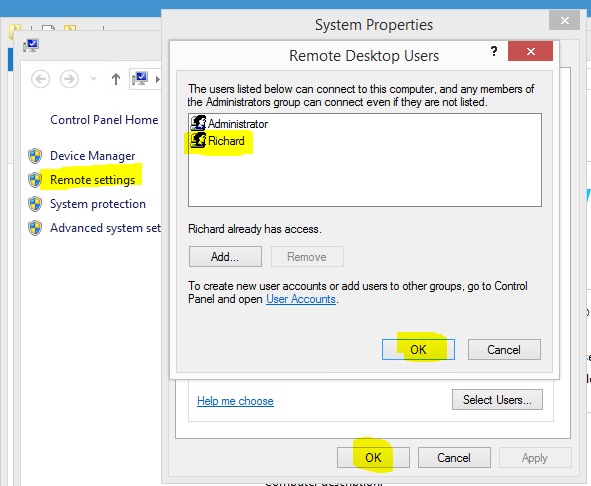

## Understanding DNS
Most ISP's make use of dynamic IP Addresses to prevent you from hosting websites off your home computer, and rotate these addresses fairly often (sometimes on a daily basis). It would be near impossible to know the currently assigned IP Address of your home computer at a given time unless you were in front of it to check. This is not helpful, especially when you need to know this address when connecting to your computer away from home.

This is where a custom DNS entry (`Dynamic Name Server`) comes in handy. A DNS entry is a simple name used to help your computer 
resolve the address of the targeted computer using a human friendly host name. These names are resolved to the associated IP Address via the DNS server, and any requests made to that host will end up going to the resolved IP Address. DNS names are easier for us humans to remember, with the bonus of being able to update them each time your computer address changes.

When connecting to your home computer remotely it makes more sense to use a Custom Hostname over an IP Address as you are more likely to remember the host name. We will be using this for our connection.

## Getting a DNS Server
You could create your own public DNS server and update your IP Address manually, or you could make use of an existing paid for or free service. When it comes to DNS servers there are a lot of good free ones available online (e.g. [FreeDNS](https://www.freedns.com/)) which allow you to sign up for a free sub-domain.

Depending on the service you are using you will have the option to either use a Sub Domain or Domain when connecting to your home computer (all free DNS providers make you use sub domains). In my mind it makes more sense to use a subdomain (e.g. rdp.home.com) over a top-level domain (e.g. home.com).

Just Google “free dns provider” and pick something that works for you.

## Keeping your IP Address Updated
After picking a DNS server and configuring your sub-domain you will need something in place to keep your IP Address up to date with the DNS server. Most modern routers have some built in tooling that allow you to sync your public IP Address with a DNS service such as Dynamic DNS right out of the box. With the wide range of routers on the market it would be impossible to document each one’s configuration steps. Luckily most of these are simple and will have you up and running in no time.

If you are in my boat and don't want to pay for a DNS service like Dynamic DNS you will need some sort of client to handle updating your IP Address with the service, again most service providers offer some form of application (or PowerShell / Shell script) to do this which change per provider, have a look through their documentation and FAQ to find out how to use and configure it.

I was not in love with any of the applications I found when it came to updating my IP Address on [FreeDNS](https://www.freedns.com/), so I decided to write my own one called [DnsUpdater](https://github.com/rniemand/DnsUpdater) which is a simple windows service capable of updating any DNS provider that follows the Dyn DNS Protocol and Free DNS also.

Once you have something in place to keep your IP Address updated with your DNS service of choice it is time to move on.

## Allowing RDP through your router
Next up we will need to tell your router at home to allow all RDP traffic from the wild to a computer of your choosing. This is done through configuring the firewall on your router and allowing all traffic on TCP_3389 (default RDP port) to the target computer. Again this process changes from router to router, but in 99% of cases you will need to either create (or select) the RDP service from a list of all available ports (a.k.a. services) when creating your firewall rule and choosing the allow option.

Something to keep in mind here is that you are opening yourself up to a whole lot of abuse (exposing TCP_3389 publicly) and there will be attempts to exploit your computer via this intentional hole in your firewall. This is unavoidable as you need to open this port up to the www to allow you to access your computer remotely, but I would strongly recommend that you take the following actions to add some additional security:

- Consider making use of port forwarding and using an obscure port publicly that your router maps back to `TCP_3389`.
- Ensure that your target machine is up to date with Windows Updates
- If possible restrict the allowed IP Range of allowed connections to your countries IP Range (some routers allow this)
- If using an advanced router (such as a Mikrotik) add rules to blacklist any IP Address that fails the connection more than 3 times in a row
- Select a limited user account and ensure that it is the only account that can remote into your computer
- Place your target computer on its own network (10.10.x.x or 192.168.x.x) to separate it from the rest of your home network
- Choose a long password for the RDP user to ensure it's nearly impossible to crack - change this password monthly (raises complexity)
- If possible (again need an advanced router) configure it so that remote access is only available in the time slots that you think you need it

These are some basic steps one should take when setting up remote access - however these are still not guaranteed to prevent unauthorised access to your home computer.

## Enabling Remote Access on your computer
To enable remote access from your computer's point of view you will need to have a user account with a password (and possibly limited rights on the computer) before continuing. I am performing these steps on my home computer running Windows 8.1 so some of the steps may vary depending on your operating system:

- Right click on My Computer and select properties
- Click the Remote settings link to open the Remote tab on the system properties dialog
- Check the radio button Allow remote connections to this computer
- Optionally select the Network Level Authentication check box to provide more security
- Click Select Users and use the provided dialog to add in your targeted user account
- Click OK a few times to close all open dialogs and save your configuration

Once done you should have something like this:

That should be it from your computer's configuration side. Should you struggle to connect, a good thing to check is that your firewall (on your computer) is allowing RDP connections.

## Testing it all out
The last thing that you will need to do is test your connection, the catch here is that you will need to do this remotely as doing this locally (depending on your setup) could produce a false positive. I would suggest using something like a 3G dongle (or your phone) to make the connection to your home computer. There are loads of Remote Desktop Connection applications for Windows Phone, Android and iOS available for free, and switching to 3G will quickly tell you if your remote setup is working.
