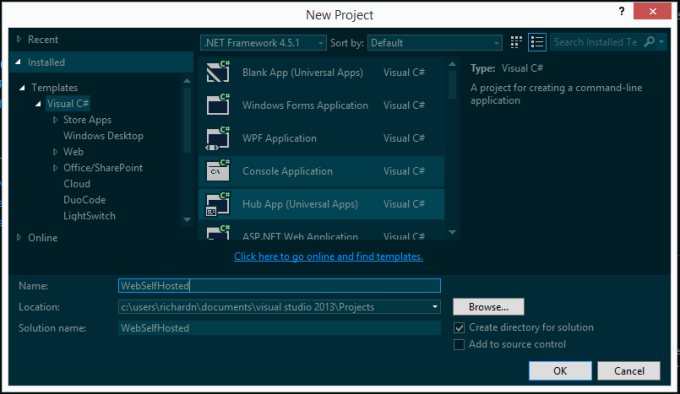
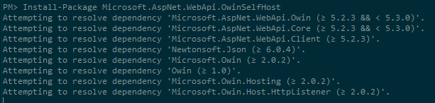
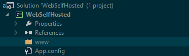
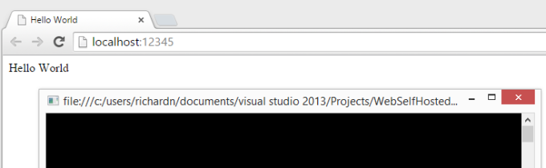

## Setting up the project
To begin you will need to create a new console application in Visual Studio.



Once your application has been created open the Package Manager console and install the following packages.

```
Install-Package Microsoft.AspNet.WebApi.OwinSelfHost
Install-Package Microsoft.Owin.StaticFiles
```

This will install all the dependencies needed to build our application.



## Startup class
Next, we will need to create a special class used by OWIN to bootstrap your web application called Startup with the following contents:

```cs
class Startup
{
    public void Configuration(IAppBuilder app)
    {
        HttpConfiguration config = new HttpConfiguration();
        config.Routes.MapHttpRoute(
            name: "DefaultApi",
            routeTemplate: "api/{controller}/{id}",
            defaults: new { id = RouteParameter.Optional }
        );

        app.UseWebApi(config);

        var physicalFileSystem = new PhysicalFileSystem(@"./www");
        var options = new FileServerOptions
        {
            EnableDefaultFiles = true,
            FileSystem = physicalFileSystem
        };
        options.StaticFileOptions.FileSystem = physicalFileSystem;
        options.StaticFileOptions.ServeUnknownFileTypes = true;
        options.DefaultFilesOptions.DefaultFileNames = new[]
        {
            "index.html"
        };

        app.UseFileServer(options);
    }
}
```

The lines in the class above do the following key things:

- Creates and configures Web API through the HttpConfiguration class and sets up the default routing (`api/{controller}/{id}`).
- Creates and configures a file server (for static content) through PhysicalFileSystem - and sets the root directory to `./www`.

Something to keep in mind here when setting the path for the PhysicalFileSystem class is that you will need to set the always copy flag to true on all items found under the www directory. This sucks, a better method I find is to add a new appSetting key to your web.config file and point that to a source folder.

```xml
<appSettings>
  <add key="www.rootDir" value="C:\path\to\www" />
</appSettings>
```

With this setting you just need to modify the following line:

```cs
var physicalFileSystem = new PhysicalFileSystem(@"./www");
```

Changing it to this:

```cs
var contentDir = ConfigurationManager.AppSettings["www.rootDir"];
var physicalFileSystem = new PhysicalFileSystem(contentDir);
```

P.S. don't forget to add a reference to System.Configuration.

## Adding static content
Let's presume like me you have a www folder where you would like to serve content from and this folder is part of your Visual Studio solution with an appSetting created pointing the PhysicalFileSystem to the right path:



When it comes to adding content, you can now treat the www folder as if it were the root folder for a static web server and add files to it at will (keeping references to other files relative to your root directory).

Let's create our index.html file with the following contents in the root of www:

```html
<!DOCTYPE html>
<html lang="en" xmlns="http://www.w3.org/1999/xhtml">
<head>
    <meta charset="utf-8" />
    <title>Hello World</title>
</head>
<body>
    Hello World
    http://scripts/hello.js
</body>
</html>
```

Next, we will create our scripts\hello.js file with the following contents:

```js
alert('hello world');
```

Hopefully by now you can see that this is pretty simple.

## Adding a Web API Controller
Now let’s get a bit more advanced and add in a simple Web API controller to the project that we can call to get some default values:

Create a new project file called Controllers\API\ValuesController.cs with the following contents:

```cs
using System.Collections.Generic;
using System.Web.Http;

namespace WebSelfHosted.Controllers.API
{
    public class ValuesController : ApiController
    {
        // GET api/values 
        public IEnumerable<string> Get()
        {
            return new[] { "value1", "value2" };
        }

        // GET api/values/5 
        public string Get(int id)
        {
            return "value";
        }
    } 
}
```

This controller will be available at http://localhost:12345/API/Values when we run our project.

## Wiring it all up
The last thing we need to do is create a new instance of our web application using the `WebApp.Start<>()` method in our program.cs file to tie everything together and run our application, add the following code to program.cs:

```cs
using System;
using System.Diagnostics;
using Microsoft.Owin.Hosting;

namespace WebSelfHosted
{
    class Program
    {
        static void Main(string[] args)
        {
            string baseUrl = "http://localhost:12345/";
            WebApp.Start<Startup>(new StartOptions(baseUrl)
            {
                ServerFactory = "Microsoft.Owin.Host.HttpListener"
            });

            // Launch default browser
            Process.Start(baseUrl);

            // Kick off other program logic
            // ...

            // In my case wait for ENTER to close app
            Console.ReadLine();
        }
    }
}
```

That's all there is to it (honestly). Save and run your project using F5 to see it all in action:



Web API up and running serving our ValuesController.cs file.

## Going forward
I would suggest either making use of NUget or Bower to get and install client side packages (both are capable package managers). Using such projects allows you to easily keep your client packages up to date and helps to modularize your project and removes the need to ship support libraries with your source code.

I would suggest making use of some MVVM framework (like [Angular.js](https://angularjs.org/), [Meteor](https://www.meteor.com/), etc.) to build up the client-side interface as adding MVC to this would be too much overkill :)

Let me know what you think in the comments section below.
