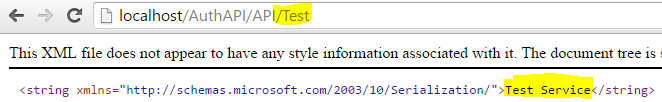

This post is meant to serve as a simple guide to get you up and running with Castle Windsor in your next WebAPI project.

First you will need to install Castle Windsor - open up the package manager console and enter in the following command (making sure that your targeted project is set correctly in the projects drop-down list).

```cs
Install-Package Castle.Windsor
```

The idea of dependency injection (DI) in WebAPI is simple enough - we are going to be replacing the default [HttpControllerActivator](https://docs.microsoft.com/en-us/previous-versions/aspnet/hh834502(v=vs.118)?redirectedfrom=MSDN) that the pipeline makes use of with a "smarter" one (in our case Castle) that is able to resolve and inject any dependencies that the controller being spun up is looking for.

This is my way of implementing DI in my applications and may be a bit different to the way you may do it. Please keep this in mind while looking through my code ;)

First, we will need to create a dependency scope to help manage the lifecycle of any components we pull out of our DI container.

```cs
public class WindsorDependencyScope : IDependencyScope
{
    private readonly IWindsorContainer _container;
    private readonly IDisposable _scope;

    public WindsorDependencyScope(IWindsorContainer container)
    {
        if (container == null)
            throw new ArgumentNullException("container");

        _container = container;
        _scope = container.BeginScope();
    }

    public object GetService(Type t)
    {
        return _container.Kernel.HasComponent(t)
            ? _container.Resolve(t) : null;
    }

    public IEnumerable<object> GetServices(Type t)
    {
        return _container.ResolveAll(t)
            .Cast<object>().ToArray();
    }

    public void Dispose()
    {
        _scope.Dispose();
    }
}
```

Once I have my scope defined, I create a dependency resolver which will be used later on.

```cs
public class WindsorHttpDependencyResolver : IDependencyResolver
{
    private readonly IWindsorContainer _container;

    public WindsorHttpDependencyResolver(IWindsorContainer container)
    {
        if (container == null)
            throw new ArgumentNullException("container");

        _container = container;
    }

    public object GetService(Type t)
    {
        return _container.Kernel.HasComponent(t)
            ? _container.Resolve(t) : null;
    }

    public IEnumerable<object> GetServices(Type t)
    {
        return _container.ResolveAll(t)
            .Cast<object>().ToArray();
    }

    public IDependencyScope BeginScope()
    {
        return new WindsorDependencyScope(_container);
    }

    public void Dispose()
    {
    }
}
```

To assist me when I am in a pinch and need access to the Castle container I normally create a class like "CastleHelper" that gives me access to the Windsor Container through the use of a simple static class (this is not required in most implementations though).

```cs
public static class CastleHelper
{
    public static WindsorContainer Container { get; private set; }
    private static WindsorHttpDependencyResolver _resolver;
    private static bool _initialized;

    static CastleHelper()
    {
        Container = new WindsorContainer();
        _initialized = false;
    }

    public static WindsorHttpDependencyResolver GetDependencyResolver()
    {
        if (_initialized)
            return _resolver;

        _initialized = true;
        Container.Install(FromAssembly.This());
        _resolver = new WindsorHttpDependencyResolver(Container);

        return _resolver;
    }
}
```

Next up I create an installer using the "IWindsorInstaller" interface that discovers and instals all classes derived from the APIController class.

```cs
public class WebApiControllerInstaller : IWindsorInstaller
{
    public void Install(IWindsorContainer container, IConfigurationStore store)
    {
        container.Register(Classes.FromThisAssembly()
            .BasedOn<ApiController>()
            .LifestylePerWebRequest());
    }
}
```

Next up, I add the following line to the "`WebApiConfig.cs`" file to replace the default dependency resolver with our newly created "`WindsorHttpDependencyResolver`".

```cs
config.DependencyResolver = CastleHelper.GetDependencyResolver();
```

To test that everything is working as expected I usually create a test service like so:

```cs
public interface ITestService
{
    string GetName();
}

public class TestService : ITestService
{
    public string GetName()
    {
        return "Test Service";
    }
}
```

...and install it using the following installer:

```cs
public class ServiceInstaller : IWindsorInstaller
{
    public void Install(IWindsorContainer container, IConfigurationStore store)
    {
        container.Register(Component
            .For<ITestService>()
            .ImplementedBy<TestService>()
            .LifestylePerWebRequest());
    }
}
```

...finally pulling it altogether using a test controller like so:

```cs
public class TestController : ApiController
{
    private readonly ITestService _testService;

    public TestController(ITestService testService)
    {
        _testService = testService;
    }

    [HttpGet]
    public IHttpActionResult Get()
    {
        return Ok(_testService.GetName());
    }
}
```

To ensure everything is working 100%, compile your project and head over to the newly created TestController, you should get the following response:



That's all there is to it :)
