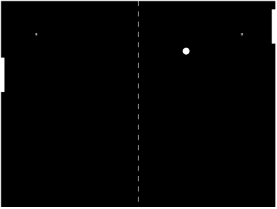

Ever since I was a little boy, I have always been fascinated with computer games and the way they work. How someone could wield a bunch of `0s` and `1s` into some of the games that shaped my childhood. I could never grasp how `3D rendering engines` worked (and admittedly still can't), and how the garbled text when opening the games files in `notepad` did this sorcery (I was young and had no clue about compilers etc.).

Now as an adult with a lot of server-side programming experience I have decided to take on the challenge of learning the basics of such an amazing skill-set \ talent and try to create some of my own simple games.

Not knowing where to start, I just `Googled` some game development starter tutorials (specifically `2D browser based` games) to see if I could work through them and build something that resembled a game in some way. I spent a lot of time going through tutorials and sample code, and am starting to come to terms with the basics, and thought it would be beneficial to myself (and hopefully others) to document the process going forward.

I will be linking back to all sites and developer's blogs when making use of their tutorials to give credit where it is due as creating tutorials is no easy feat. So without further adieu I present to you my first stab at making a `pong clone` based on the following [video series](https://www.udemy.com/join/login-popup/?next=/course/code-your-first-game/learn/lecture/2701754) by ([Chris DeLeon](https://twitter.com/gamedevslikeyou)).

See the [source code here](https://github.com/rniemand/code-samples/tree/main/blog-posts/2016/2016-07-29%20-Pong), or play with it on [JSFiddle](https://jsfiddle.net/qcvhxpq0/4/).

## Points on the code
After completing the tutorial and going through the generated code I have picked up some issues with it that are worthwhile pointing out. Having said that, I am no expert when it comes to game development (I am still learning the basics), and judging on the intended audience for the tutorial these may have been intentional. Nonetheless I would like to point them out.

### setInterval()
The game makes use of `setInterval()` to manage the calling of the `update()` and `draw()` methods, which is not best practice at all. There are 2 major issues with this approach.

On slower computers you run the risk of multiple calls to the `update()` / `draw()` methods executing at any given time provided the calls do not complete in the allocated time span (`1000 /30 ms`), and seeing that this is not a recursive call (rather an fire and forget call occurring every `33.33 ms`) this is highly possible. Over time this could render the game completely unusable on a computer and may result in the browser stopping execution of the game code as a result.

Another side-effect of using `setInterval()` is that the state of the game becomes unpredictable. There is no guarantee that Computer A will be in the same game state as Computer B after a few seconds have gone by. This could be due to frame dropping or the `update()` / `draw()` methods overlapping due to slow code execution. This doesn't sound that bad until you try to develop a multiplayer game and things like state become important and need to be predictable. Another issue with this approach is that the position of the ball is updated each frame which will result in a different movement speed of the ball which is directly linked to the speed of the computer.

There are better ways of scheduling calls to the `update()` and `draw()` methods as [this blog post covers](https://www.isaacsukin.com/news/2015/01/detailed-explanation-javascript-game-loops-and-timing), and I highly recommend giving it a read. 

**TL;DR**: The solution is to introduce the concept of delta time between frames and use that to calculate the position of the ball based on the amount of time that passes, rather than the number of frames. This makes the state more predictable and allows for easier testing and control of the game state.

### 30 FPS
Another thing worth mentioning is that the frame rate of the game is capped to `30 FPS`, which by most games standards is incorrect. Ideally your frame rate for your game should be around the `60 FPS` mark to better match the refresh rate of your monitor, and anything over and above 60 is ideal (but not required as this is a browser game and not a **AAA** title).

### Collision Detection
I suspect that I may have missed the ball on this one (pun intended) as the collision of the ball with the top of the paddle is not registering. Admittedly I have not done a line for line comparison with the final code from the video series, but I did follow it pretty much to the last line. I will do some further digging into the code some more and republish my findings in a follow up post as it has peaked my interest.
