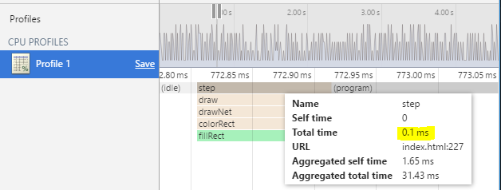

Following on from my [last post](/blog/2016/2016-07-29/post1/) I have made some minor tweaks to my pong game, and have addressed some of the issues that I picked up during the first phase of development, namely:

- Made use of the `requestAnimationFrame()` method to handle calls to the `update()` and `draw()` methods.
- Addressed issues with the collision detection to better match the relative position of the paddle and ball.
- Did some minor refactoring of the game code.

The game seems to be running a lot smoother at the higher frame-rate, with only a few frames being dropped now and then. When profiling the JavaScript a typical update for a game frame takes less than `0.3` ms in total (well within the `16.666 ms` threshold when running at 60 FPS).



Below is a nice little breakdown of the changes made.

## requestAnimationFrame()
I made use of `requestAnimationFrame()` to better handle the calling of the `update()` and `draw()` methods. To ensure that the position of the ball is predictable, I use the provided [DOMHighResTimeStamp](https://developer.mozilla.org/en-US/docs/Web/API/DOMHighResTimeStamp) to calculate the delta time between frames, and use the `time * velocity` of the ball to work out its new position on the canvas, something along the following lines.

```js
var start = null;
var remainder = 0;
var timeSlice = 1000 / 60;

function step(timestamp) {
    // Handle updating start and calculating the delta
    if (!start) start = timestamp;
    var delta = (timestamp - start) + remainder;
    start = timestamp;

    // work out the number of times we need to call update
    var updateCallCount = delta / timeSlice | 0;
    remainder = delta - (timeSlice * updateCallCount);

    // Call update the required number of times
    for (var i = 0; i < updateCallCount; i++) {
        update();
    }

    // Draw the current frame, and schedule a redraw
    draw();
    requestAnimationFrame(step);
};

requestAnimationFrame(step);
```

Admittedly for my second revision of the code I am not making use of the `delta` to move the ball, rather I am working out the number of times I need to call the update method and call it using a simple `for(;;){ ... }` loop. However, moving forward with the game code I will need to start making use of the delta value to calculate the actual position of the ball.

## Fixing Collision Detection
As I mentioned in my last post, I was having issues when it came to detecting the collision between the ball and paddles (it was completely out when colliding with the top half of the paddle). I mentioned that I followed the tutorial verbatim, however it seems I somehow managed to omit some brackets when calculating the position of the paddles when calculating the collisions in the `update()` method.

After including the brackets in the correct places the game's collision detection was working a lot better, but something still felt out of place. I decided to break up the majority of the collision detection into two helper methods `updateBallOnLeftSide()` and `updateBallOnRightSide()` and made adjustments in the detection logic to take into consideration that the y position of the paddle represents the middle of it and not the top of the paddle. This can be seen by the `paddleModifier` value being passed into the helper function below.

```js
function updateBallOnRightSide(paddleModifier) {
    var paddleTop = paddle2Y - paddleModifier;
    var paddleBottom = paddle2Y + paddleModifier;

    // log collision ...

    if (ballY >= paddleTop && ballY <= paddleBottom) {
        ballSpeedX *= -1;
        var deltaY = (ballY - paddleTop) - paddleModifier;
        ballSpeedY = deltaY * 0.35;
    } else {
        player1Score += 1;
        ballReset();
    }
}
```

Now things are working much better with collision detection, the only problem left to address is calculating the collision from the outside of the ball (rather than its centre as I am currently doing). This should be addressed in the next update in this series.

## Minor Code Refactoring
In addition to the two major changes above, I did a lot of code refactoring (and still have a lot to do) to help me identify and troubleshoot the issues with the collision detection, the most useful of them being the introduction of the `logCollission()` function and calling code.

```js
if(logColissions) {
    logCollission({
        "paddle": "left",
        "paddle-top": paddleTop,
        "paddle-bottom": paddleBottom,
        "ball-x": ballX,
        "ball-y": ballY
    });
}
```

Which when run returns the following to the debug `textarea`.

```json
{"paddle":"right","paddle-top":250,"paddle-bottom":350,"ball-x":535,"ball-y":300}
```

This helps me to determine that the ball did indeed collide with the paddle (the centre of it in this case), and makes pinpointing the root cause of my collision detection issues much easier.
The latest source code can be [found here](https://github.com/rniemand/code-samples/tree/main/blog-posts/2016/2016-08-02), and a [JSFiddle version](https://jsfiddle.net/fuwmbofb/) should you want to play around with it.