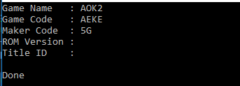
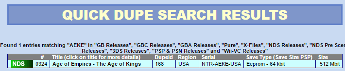

I am starting a small **ROM management** project to help me keep my various ROM backups in order and make searching for a specific backup easier. I decided it would be a good idea to programmatically extract information from the ROM file and then scrape the `www` to get more detailed metadata about the ROM file in question.

Being new to all of this I spent some time on Google and found the [following wiki page](https://dsibrew.org/wiki/DSi_cartridge_header), that details the DSi Cartridge Header, thus allowing me to create a module for my ROM scraper that would be able to look for and extract all the basic information I need to begin scraping the web for more metadata.

From the wiki, I am interested mainly in the following bits of information:

| Code | Length | Description |
| --- | --- | --- |
| 0x000 | 12 | The title of the game |
| 0x00C | 4 | The game code (used for lookups) |
| 0x010 | 2 | The code of the game developer |
| 0x01E | 1 | ROM version |
| 0x230 | 8 | Title ID |

With this information at hand I quickly put together the following sample project to check that I could pull the required information out of the ROM file.

```cs
class Program {
    static void Main(string[] args)
    {
        var source = @"E:\temp\test-rom.nds";
        var fs = new FileStream(source, FileMode.Open);
        var br = new BinaryReader(fs);

        Console.WriteLine("Game Name   : {0}", ReadBytes(br, 0x000, 12));
        Console.WriteLine("Game Code   : {0}", ReadBytes(br, 0x00C, 4));
        Console.WriteLine("Maker Code  : {0}", ReadBytes(br, 0x010, 2));
        Console.WriteLine("ROM Version : {0}", ReadBytes(br, 0x01E, 1));
        Console.WriteLine("Title ID    : {0}", ReadBytes(br, 0x230, 8));

        Console.WriteLine();
        Console.WriteLine("Done");
        Console.ReadLine();
    }

    private static string ReadBytes(BinaryReader br, int seek, int length)
    {
        byte[] test = new byte[length];
        br.BaseStream.Seek(seek, SeekOrigin.Begin);
        br.Read(test, 0, length);
        return Encoding.UTF8.GetString(test);
    }
}
```

There is a lot of room for optimization here, but for a quick test this seems to do the job correctly.



Using the information extracted from the ROM file and [advanscene.com](https://advanscene.com/), I can take the returned Game Code (AEKE) and run a basic search.



Success, my proof of concept works - now it's time to take this into the real world.
