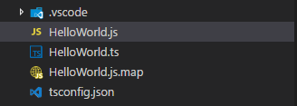
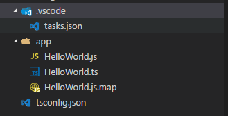
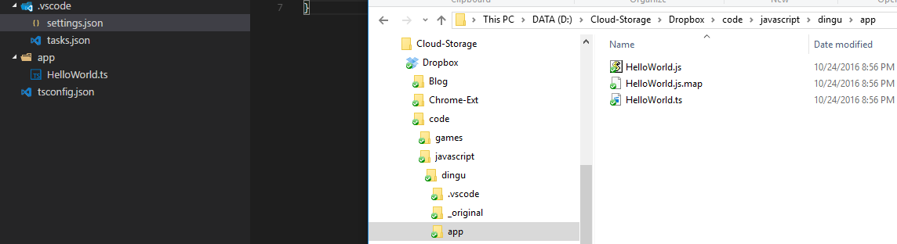

This blog post serves as an abridged summary of the below getting started guides for TypeScript and VS Code and is presented in the shortest possible form:

- [https://code.visualstudio.com/docs/languages/typescript](https://code.visualstudio.com/docs/languages/typescript)
- [https://www.keithcirkel.co.uk/how-to-use-npm-as-a-build-tool/](https://www.keithcirkel.co.uk/how-to-use-npm-as-a-build-tool/)

## Enabling TypeScript
First create a file called `tsconfig.json` to the project with the following contents:

```json
{
  "compilerOptions": {
    "target": "es5",
    "module": "commonjs",
    "sourceMap": true
  }
}
```

Next, create a sample `HelloWorld.ts` file with the following contents:

```ts
class Startup {
  public static main(): number {
    console.log('Hello World');
    return 0;
  }
}

Startup.main();
```

Press `Ctrl+Shift+P` type in `Configure Task Runner` select `TypeScript - tsconfig.json`. I tend to modify the `args` command and add an additional `-w` switch to run tsc in watch mode as can be seen below:

```json
{
  "version": "0.1.0",
  "command": "tsc",
  "isShellCommand": true,
  "args": ["-p", ".", "-w"],
  "showOutput": "silent",
  "problemMatcher": "$tsc"
}
```

Test out a build using `Ctrl+Shift+B` - this will generate `HelloWorld.js` and `HelloWorld.js.map` as can be seen below.



## Hiding Generated Files
If you are working primarily with `.ts` files in VS Code there is no need to see the generated `.map` and `.js` files (well at least I don't like looking at them). If you wish to hide these files and clean up your work-space all you need to do is follow the below steps:

In the root of your application create a `.vscode/settings.json` file (if you don't already have one), and add the following to it:

```json
{
    "files.exclude": {
        "node_modules/": true,
        "app/**/*.js": true,
        "app/**/*.map": true
    }
}
```

**NOTE**: I am presuming that your source files now live in a folder called `app/*/`, feel free to modify this to meet your project needs.



Folder structure in VS Code before adding in `.vscode/settings.json`.



Folder structure in VS Code after adding in .`vscode/settings.json` (source folder shown on the right).

I much prefer this way of working with .ts files as it feels a lot less cluttered.
