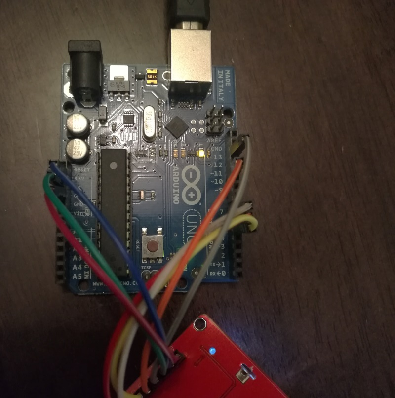
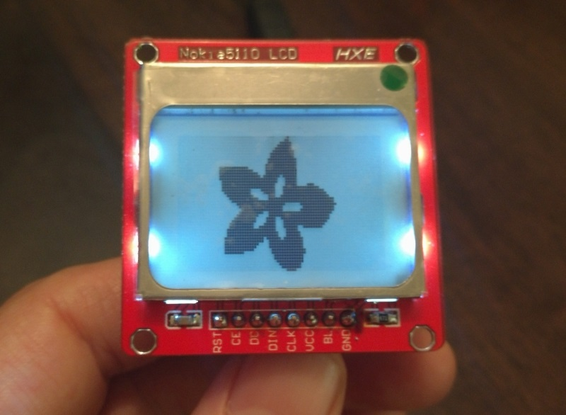
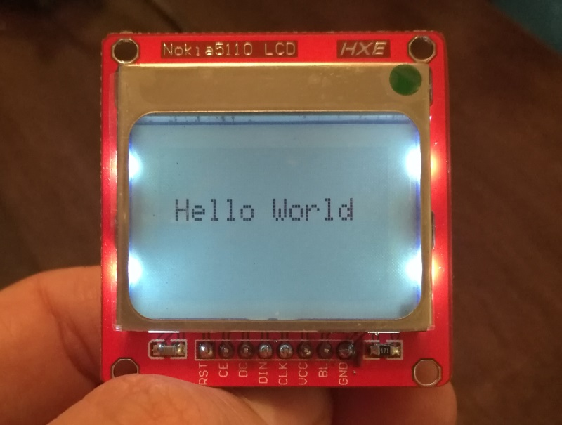
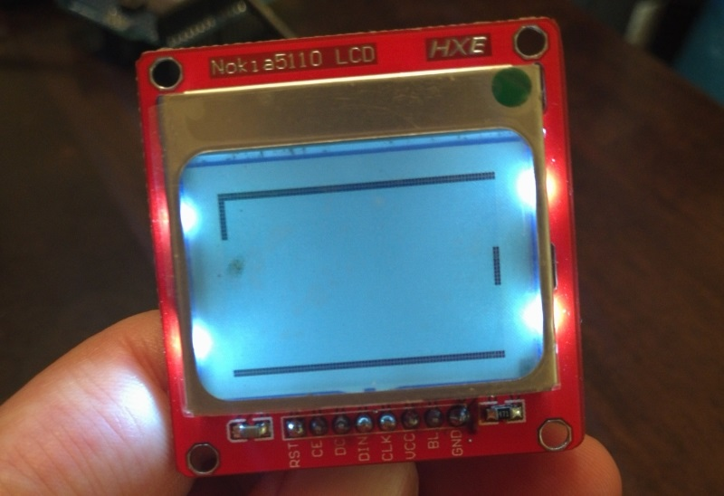

Today my goal is to get up and running with a **Nokia 5110 LCD module** and as little `Arduino` code as possible. The `Nokia 5110 LCD` module is a great little screen and offers a resolution of `84 x 48` pixels (that's 84 pixels across and 48 down). It's great for easily displaying data from your projects, and is widely used by hobbyists around the world (i.e. has a lot of support and is cheap).

## Required Components
Should you want to follow along with this blog post you are going to need the following components:

- Arduino (or compatible clone) - [get one](https://www.banggood.com/Geekcreit-UNO-R3-ATmega16U2-AVR-Development-Module-Board-Without-USB-Cable-Geekcreit-for-Arduino-products-that-work-with-official-Arduino-boards-p-1044808.html?imageAb=1&p=5T250523689812015082&stayold=1&akmClientCountry=CA&cur_warehouse=CN)
- Nokia 5110 LCD module - [get one](https://www.banggood.com/5110-LCD-Display-Module-White-Backlight-p-1272124.html?imageAb=1&p=5T250523689812015082&stayold=1&cur_warehouse=CN&akmClientCountry=CA)
- 8x Jumper wires (`male to female`) - [get some](https://www.banggood.com/120pcs-Multicolored-Dupont-Wire-Male-to-Female-Male-to-Male-Female-to-Female-Jumper-Wire-Kit-p-1262667.html?p=5T250523689812015082&stayold=1&cur_warehouse=CN)

In addition to the physical hardware you will need to have the [Arduino IDE](https://www.arduino.cc/en/software) installed on your computer and a USB cable to connect your computer to the Arduino, at the time of writing this the latest version is `1.8.1`.

## Pinout
**NOTE**: It seems that the pinout on these LCD screens differs depending on the manufacturer. When I was following tutorials online I could not find any that had my specific pinout order. This is not a show stopper however, it just means that if your pinout differs from mine you just need to pay extra special attention when connecting the LCD to the Arduino.

My pinout configuration goes a little something like this:

- 1 - `GND` - connected to `GND`
- 2 - `BL` - connected to `3.3v`
- 3 - `VCC` - connected to `5v`
- 4 - `SCLK` - connected to `D13`
- 5 - `DIN` (MOSI) - connected to `D11`
- 6 - `D/C` - connected to `D5`
- 7 - `CE` - connected to `D7`
- 8 - `RST` - connected to `D6`

When connected to my Arduino it looks like this:



## The Code
Once all our connections have been made we will need to write some code to tell our Arduino how to interact with the LCD screen.

**NOTE**: if you are like me and prefer the `TLDR`; version of this post feel free to skip right down to the `Complete Code Listing below` to get up and running quickly.

### Required Libs
To save time (and my sanity) I am going to be making use of some 3rd party libraries to talk to the LCD screen and keep the code as simple as possible, I will be using the following:

- [Adafruit GFX Library](https://github.com/adafruit/Adafruit-GFX-Library) - `1.1.5` at the time of writing
- [Adafruit PCD8544 Nokia-5110-LCD-library](https://github.com/adafruit/Adafruit-PCD8544-Nokia-5110-LCD-library) - `1.0.0` at the time of writing

You can add these libraries using the Arduino IDE's built in library manager - just search for and install the latest version of each one.

### Including Required Libs
Start up a new sketch in the Arduino IDE and add in the following `include` statements at the top of the file.

```cpp
#include <Adafruit_GFX.h>
#include <gfxfont.h>
#include <Adafruit_PCD8544.h>
```

This will include all the required files needed to talk to the LCD module.

### Define pin mappings
Next up I like to define the pins used in my sketches via `#define` to give me easier access to them, and ensure that they don't get overridden down the line. Let's add that to our sketch now:

```cpp
// Define the pins used to control the LCD module
#define LCD_SCLK    13
#define LCD_DIN     11
#define LCD_DC      5
#define LCD_CS      7
#define LCD_RST     6
```

### Create a GLOBAL display object
The next thing we will need to do is create a global `display` object using the `Adafruit_PCD8544` class - this needs to be outside of the `setup()` and `loop()` methods to ensure that it is accessible everywhere.

```cpp
// Create a global instance of the display object
Adafruit_PCD8544 display = Adafruit_PCD8544(
  LCD_SCLK, LCD_DIN, LCD_DC, LCD_CS, LCD_RST
);
```

### setup() the display
Next we will need to do a once off initialization of the display module by calling the `display.begin()` method provided by the `Adafruit_PCD8544` class.

Seeing that this code only needs to be called once this should be done in the `setup()` method of your sketch as it is designed to do exactly that.

```cpp
void setup() {
  // Start the display and set a good contrast
  display.begin();
  display.setContrast(50);
  display.clearDisplay();
}
```

### Initial run
That's everything you need to talk to the display - let's do a quick sanity check by uploading the code to the Arduino and making sure that we have all our connections and pin definitions correct. Provided you were able to map your LCDs pins correctly you should see the following:



## Actual Implementation: A Hello World Example
What good is a starter tutorial without the obligatory `Hello World` sample? Not good at all I say! Let's get rid of that Adafruit splash screen and print out a nice little `Hello World` message.

To do this we are going to be putting code into the `loop()` method (although we could have technically used the `setup()` method seeing that this will be static text).

Add the following lines:

```cpp
void loop() {
  display.clearDisplay();
  display.println();
  display.println();
  display.println(" Hello World");
  display.display();
  delay(1000);
}
```

Once done, save and upload your sketch to your Arduino to see a nice **Hello World** message.



## Complete Code Listing
You can find the complete code listing along with all my other projects over on [my GitHub page](https://github.com/rniemand/code-samples/tree/main/blog-posts/2017/2017-03-01).

## Going further
The `Adafruit_GFX` library offers a lot of useful methods to help you draw all kinds of objects to the **Nokia 5110 LCD module**, and your imagination is the limit. The first "useful" application I wrote for my screen was a very rough port of PONG (will be coming as a blog post in the future).



I hope that you found this post informative and enjoyable and would like to thank you for your time.
