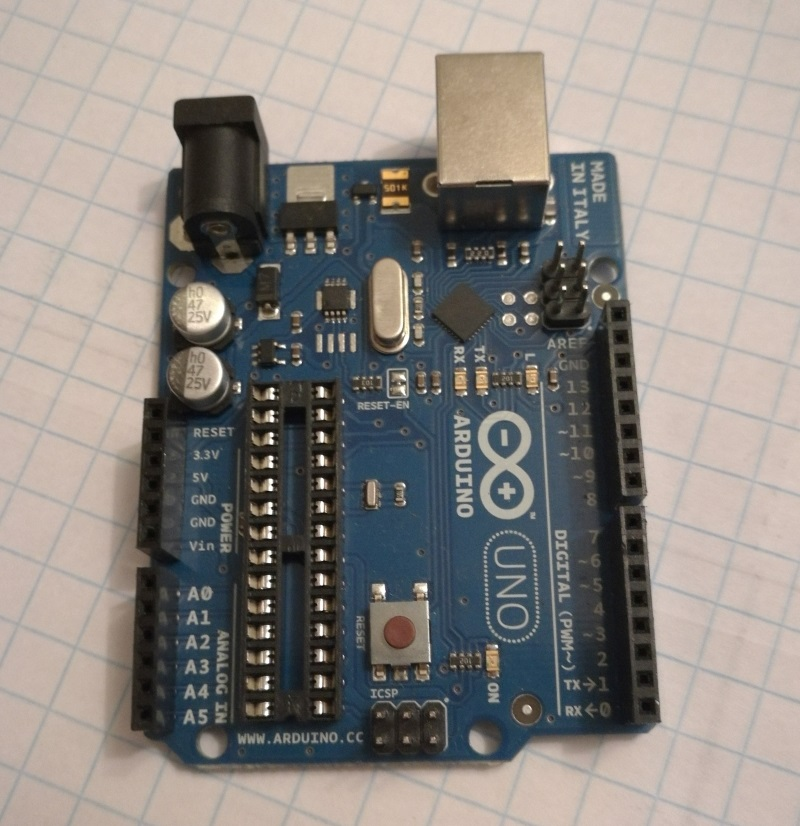
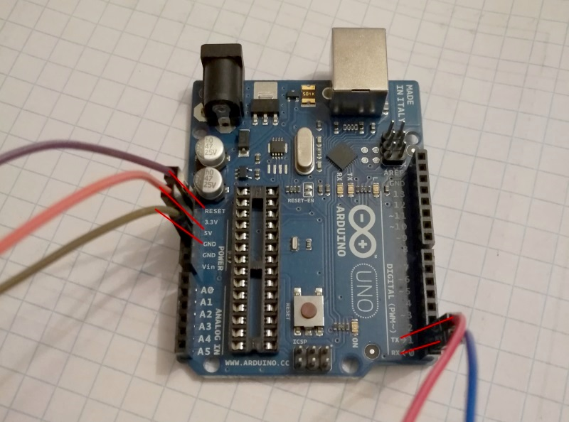
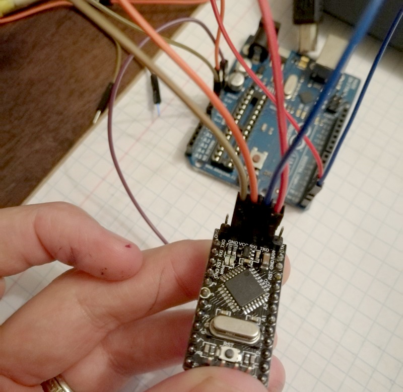
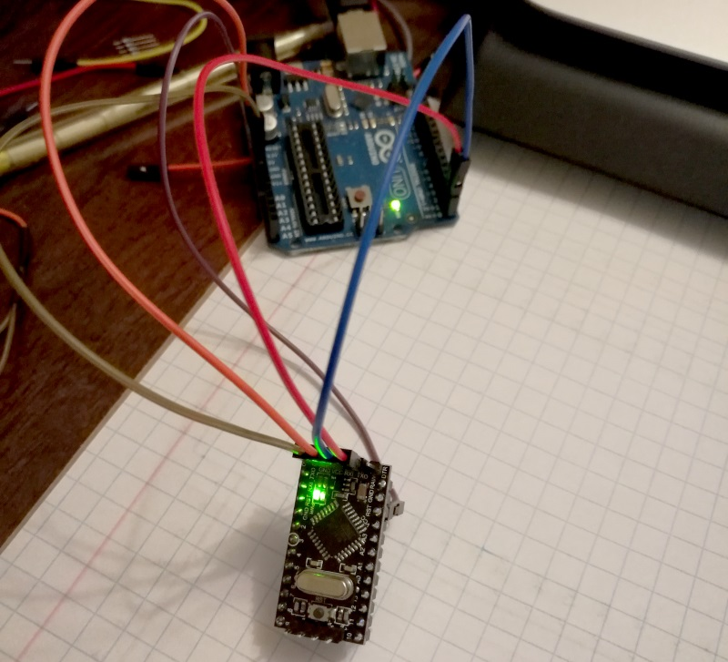
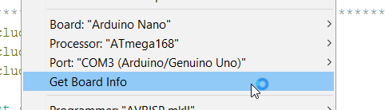
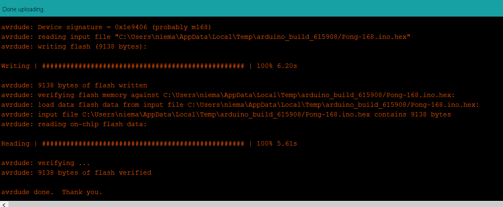

In preparation for my post on building a pong game on Arduino I wanted to flash the game code to the smallest Arduino compatible board I had lying around (my `ATmega 168 Pro Mini` I got from [AliExpress](https://www.aliexpress.com/item/32579326448.html?spm=2114.13010608.0.0.flKfAz)). I immediately ran into a problem as the board has no built-in flasher due to its form factor. After some Googling I found out it was possible to flash the board using an Arduino UNOusing the below process.

## Prepping the Devices
In order to do this the first thing you will need to do is remove the Atmel ATMega Chip from the UNO as shown in the picture below.



Once removed you will need to connect some jumper wires to the following pinouts on the UNO.

```
RESET ................. (RST on target)
5v .................... (VCC on target)
GND ................... (GND on target)
TX (1) ................ (TXO on target)
RX (2) ................ (RXI on target)
```



Following the pinout above make the appropriate connections on the Pro Miniyou are wanting to flash, it should look something like this:



Now when you power up the UNO you should see that the Pro Mini gets power too.



## Uploading your sketch
Open the Arduino IDE with the UNO connected to your computer and make the following configuration changes under the Tools menu.

```
Board: Arduino Nano
Processor: ATmega168
Port: (depends on your PC - mine was COM3)
```



Once done you should see your settings reflected on the bottom toolbar in the Arduino IDE.


You are good to upload your sketch, to do so simply click the upload button and wait for the sketch to upload as normal.



Once the upload is completed you can remove the connected jumper wires.

Congratulations you have just flashed your Pro Mini, just don't forget to replace your "Atmel ATMega Chip" at this point to avoid losing it.
