In this tutorial I am going to be making a simple digital clock using an **Arduino Pro Mini 168** and a **DS3231 RTC clock module**. To keep the wiring simple I am going to be talking to both devices on [I2C](https://learn.sparkfun.com/tutorials/i2c). Because we are using I2C for the communication to both the display and the clock we are able to reduce the complexity of wiring it all together.

## Components list

If you would like to build this yourself you are going to need the following components.

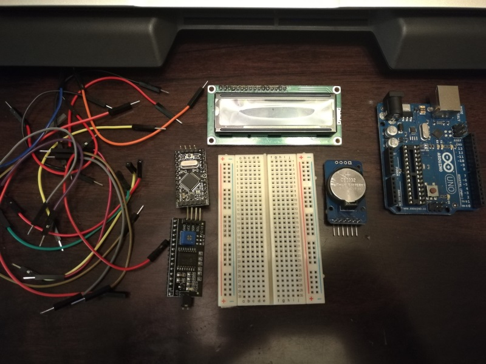

- [Jumper wires](https://www.banggood.com/120pcs-Multicolored-Dupont-Wire-Male-to-Female-Male-to-Male-Female-to-Female-Jumper-Wire-Kit-p-1262667.html?p=5T250523689812015082) (a mix of `male -> male`, `male -> female`)
- [I2C LCD driver board](https://www.banggood.com/RobotDyn-Graphic-LCD-12864-Adapter-Module-Backlight-Control-Board-I2C-MCP23017-Driver-Expander-5V-p-1244353.html?imageAb=1&p=5T250523689812015082&akmClientCountry=CA&cur_warehouse=CN)
- [Arduino Pro Mini 168 5v](https://www.banggood.com/3Pcs-Pro-Mini-ATMEGA328P-Module-3_3V-8M-Interactive-Development-Board-p-1193820.html?imageAb=1&p=5T250523689812015082&akmClientCountry=CA&cur_warehouse=CN)
- [16x2 LCD Module](https://www.aliexpress.com/item/32357804531.html)
- [400 Tie Points Breadboard](https://www.banggood.com/3Pcs-8_5x5_5cm-400-Tie-Points-400-Holes-Solderless-Breadboard-Bread-Board-p-1278571.html?p=5T250523689812015082&cur_warehouse=CN)
- [DS3231 RTC Module](https://www.banggood.com/DS3231-AT24C32-IIC-High-Precision-Real-Time-Clock-Module-p-81066.html?imageAb=1&p=5T250523689812015082&akmClientCountry=CA&cur_warehouse=HK)
- Some ISP - I just use an original UNO with the chip removed

> **NOTE**: The Arduino UNO is an optional component, I wanted to use the Pro Mini for the final product to keep the build small, however there is nothing stopping you from using the UNO directly. Just be sure that you select the appropriate configuration in the Arduino IDE when flashing the code.

## Arduino IDE Setup

Next up we will need to ensure that our development environment is configured correctly.

### Importing Libraries

You will need to add the following libraries to your Arduino IDE if you haven't already done so.

- `LiquidCrystal I2C` - by Frank de Brabander

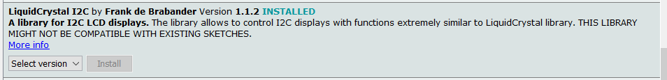

- `RTClib` - by Adafruit


That's all we are going to need for this build.

### Data Sheets

Should you want to learn a little bit more about the devices / modules used in this build I have included a couple of links to their data sheets.

- DS3231 RTC module
- [1602A1 - 16x2 LCD Screen](https://www.openhacks.com/uploadsproductos/eone-1602a1.pdf)

## Breadboarding

Let's jump right in and start pacing all our components onto our breadboard.

### Basic component layout

Below is the most optimal layout I could come up with given the space restrictions on my selected breadboard.

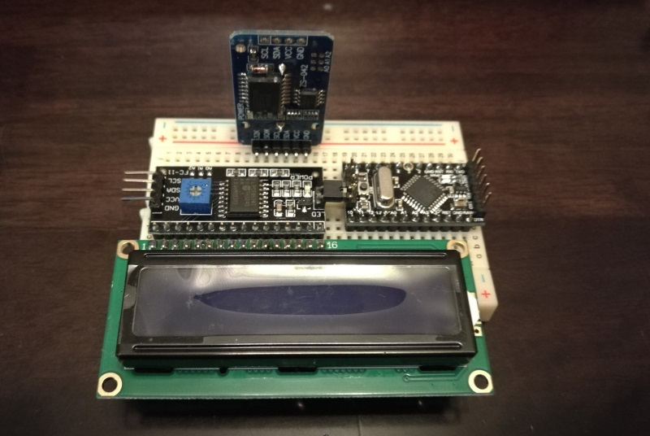

As you can see it is a tight fit once everything is placed on the breadboard, but thankfully everything fits. I had to be careful when placing the `LCD driver` and `Pro Mini` as the LED pins from the driver module were bridging the additional `analog` pins on the Pro Mini.

I would recommend double checking everything before powering on the final product to ensure that there are no unwanted connections.

### I2C "Bus"

The first wires we are going to add are for the `I2C bus`. I decided to make use of the power supply rails as they run the entirety of the board allowing for easy access to the I2C bus from anywhere on the board.

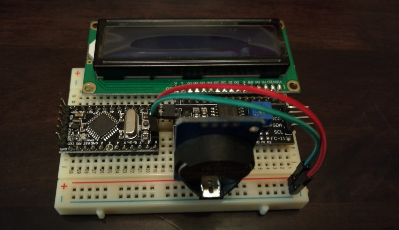

### RTC Clock Module

Next up we are going to connect the RTC Clocks `SCL` and `SDA` lines to the I2C bus as shown below.

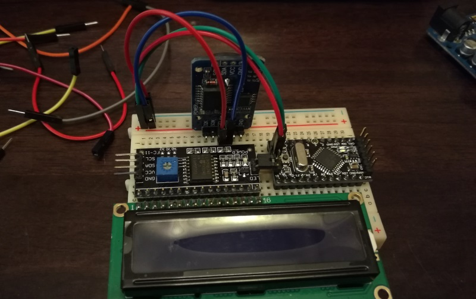

Then we are going to supply power to the clock via the VCC and GND pins on the Pro Mini.

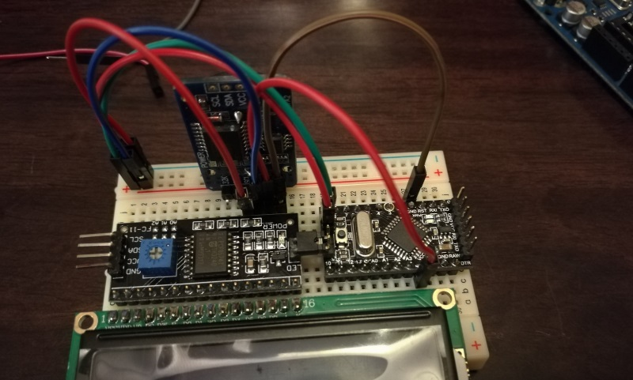

### LCD Driver

Next we are going to add the VCC and GND wires required to power the LCD driver board. For simplicity sake I am connecting these to the same pins used for the RTC module. They can be seen in the picture below (Red VCC and Brown GND).

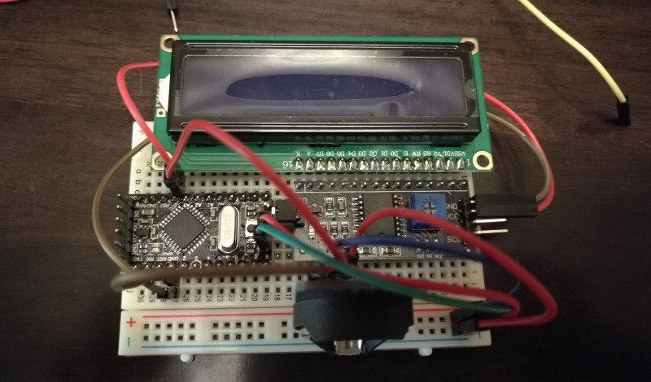

Once we have the power connected to the LCD we will need to hook up its SCLand SDA lines to the I2C bus. This is done below using the Yellow and Red wires.

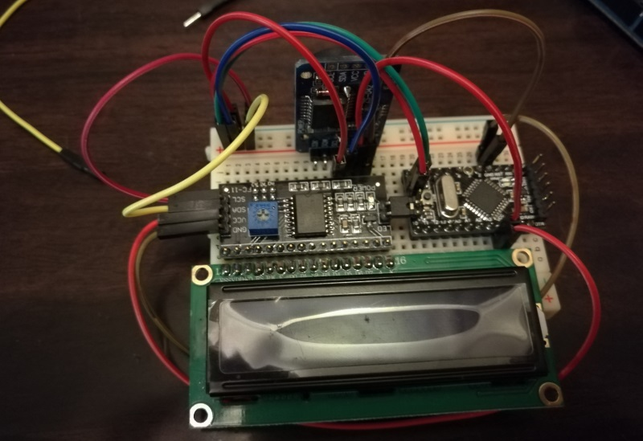

### Connecting the UNO

Now it's time to move onto uploading our code to the Pro Mini. To do this I am going to be using my Arduino UNO and [the flashing process described here](/blog/2017/2017-03-10/post/). The hook up between the devices are as follows:

```
RESET ................. (RST on Pro Mini)
5v .................... (VCC on Pro Mini)
GND ................... (GND on Pro Mini)
TX (1) ................ (TXO on Pro Mini)
RX (2) ................ (RXI on Pro Mini)
```

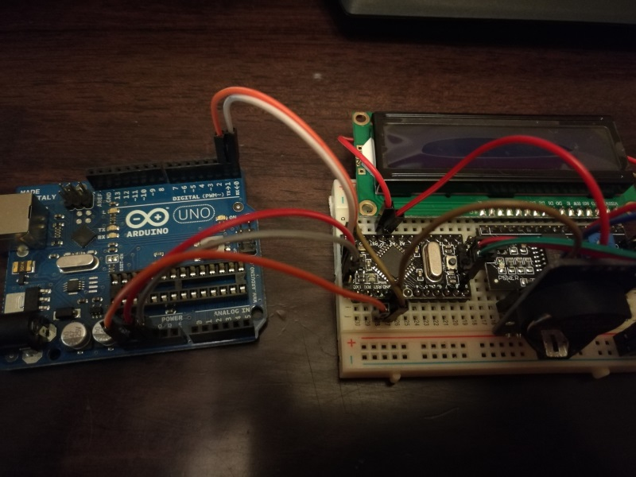

Another view showing the pin connections to the Arduino UNO.

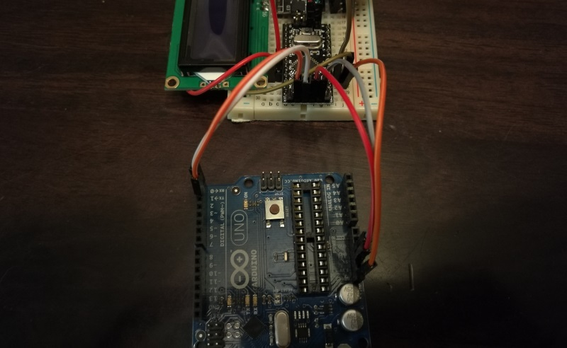

## The Code

I threw together the below code using the provided examples from the RTC library and the I2C LCD library. It is far from perfect, but it gets the job done.

```cpp
#include <Wire.h>
#include "RTClib.h"
#include <LiquidCrystal_I2C.h>

LiquidCrystal_I2C   lcd(0x27, 16, 2);
RTC_DS3231          rtc;

char daysOfTheWeek[7][12] = {"Sun", "Mon", "Tue", "Wed", "Thu", "Fri", "Sat"};
char monthsOfTheYear[12][12] = {"Jan", "Feb", "Mar", "Apr", "May", "Jun", "Jul", "Aug", "Sep", "Oct", "Nov", "Dec"};

void setup () {
  Wire.begin();
  Serial.begin(9600);

  setupLcd();
  setupRtc();

  // Use this to set the correct time on the RTC module
  // setTime(2017, 3, 15, 22, 02, 0);
}

void loop () {
  DateTime now = rtc.now();

  // Date row
  lcd.setCursor(0, 0);
  lcd.print(daysOfTheWeek[now.dayOfTheWeek()]);
  lcd.print(" ");
  lcd.print(now.day() < 10 ? "0" + String(now.day()) : now.day());
  lcd.print(" ");
  lcd.print(monthsOfTheYear[now.month() - 1]);

  // Time row
  lcd.setCursor(0, 1);
  lcd.print(now.hour() < 10 ? "0" + String(now.hour()) : now.hour());
  lcd.print(":");
  lcd.print(now.minute() < 10 ? "0" + String(now.minute()) : now.minute());
  lcd.print(":");
  lcd.print(now.second() < 10 ? "0" + String(now.second()) : now.second());

  //Serial.println();
  delay(100);
}

void setupLcd() {
  // put your setup code here, to run once:
  lcd.init(); // initialize the lcd
  // Print a message to the LCD.
  lcd.backlight();
  lcd.print("Booting...");
}

void setupRtc() {
  if (!rtc.begin()) {
    Serial.println("Couldn't find RTC");
    while (1);
  }
}

void setTime(int y, int m, int d, int h, int i, int s) {
  Serial.println("Setting time");
  rtc.adjust(DateTime(y, m, d, h, i, s));
}
```

### Setting the initial time

If you are using the RTC Clock Module for the first time there is a high likelihood that the module has the incorrect time set (if its even set at all).

In order for the clock to keep the correct time (even when there is no power coming from the Arduino) it draws power from a coin cell battery. Using this battery the clock is able to keep time regardless of the overall power state of the circuit you are building. If you are working with the clock for the first time, or the battery has run dry you are going to need to set the correct time on it.

In the code listing above you will see the following lines commented out under the `setup()` method.

```cpp
// Use this to set the correct time on the RTC module
// setTime(2017, 3, 15, 22, 02, 0);
```

To update the time on the clock will be as simple as uncommenting the second line, adjusting the time (year, month, day, hour, min, sec) and timing the upload / initial boot of the clock with the date you specified. Once you have booted the clock and have it showing the correct time you will need to comment out the last line again and reupload the sketch to prevent the time from being overwritten again.

I am going to be posting a follow up post soon that will allow the clock to be adjusted using Serial, but opted to leave that out here for brevity (this is already a long post).

## First boot

Ensure that you have the appropriate board and programmer selected in the Arduino IDE then click upload.

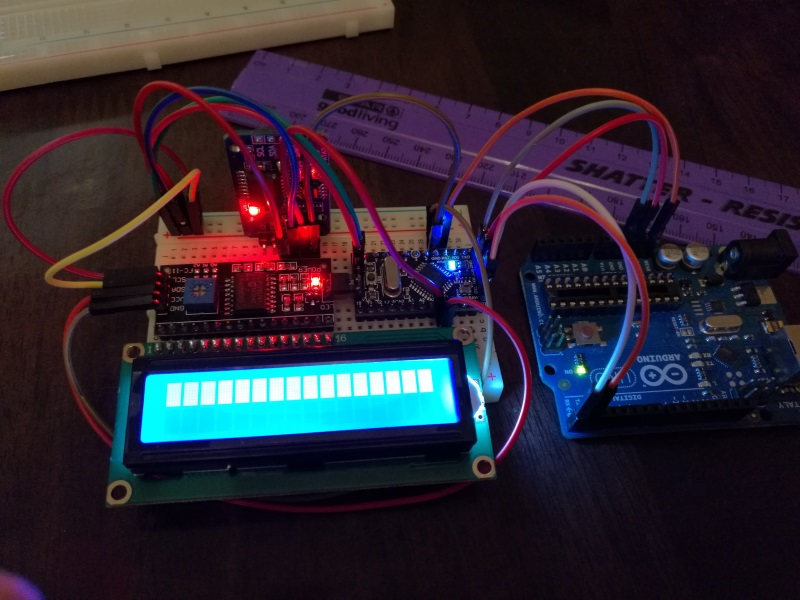

If everything went well, you should see the current time being displayed on the LCD panel.

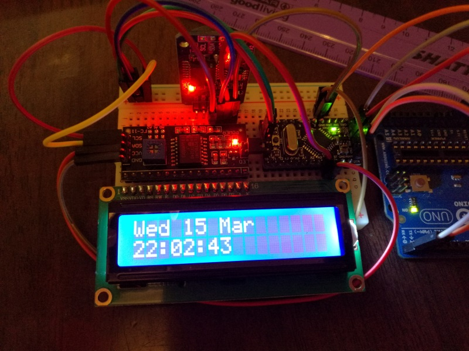

**NOTE**: If you had to manually set the time using the method described above, please comment out the appropriate line and re-upload your sketch.

Congratulations, you now have a working Arduino powered clock.

## Powering the Clock

In order to keep this post as short as possible I have created a new post called [powering your Arduino projects](/blog/2017/2017-04-26/post/) that cover this topic in a lot more detail.
