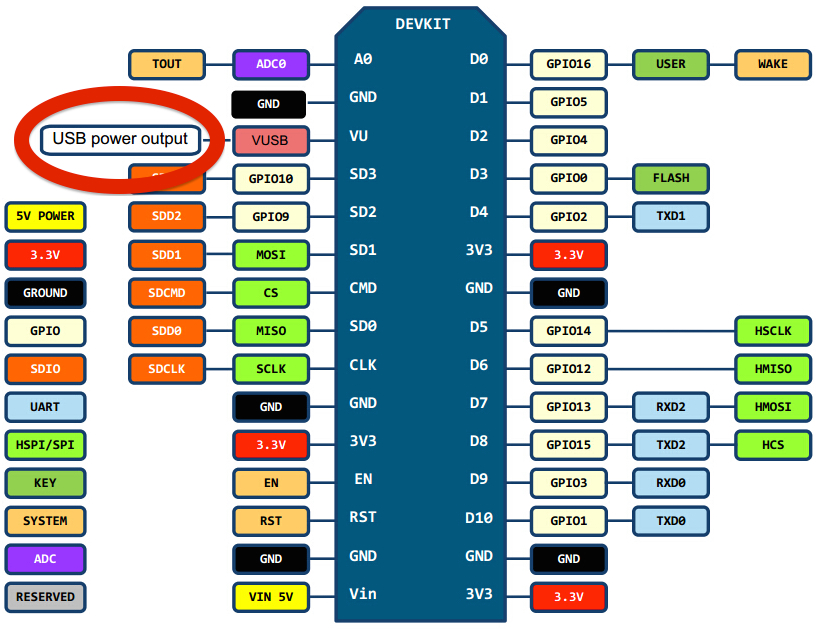
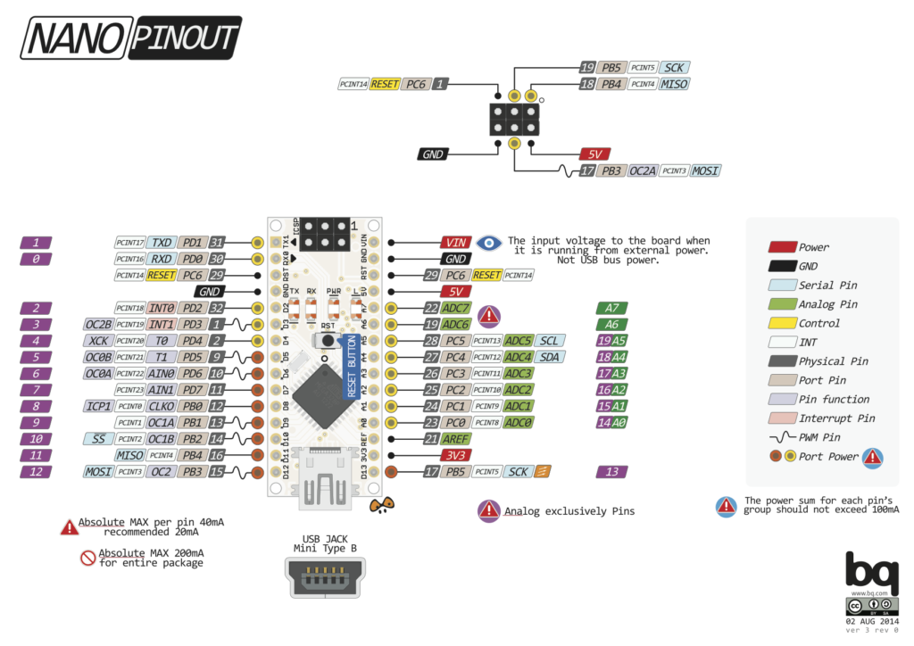
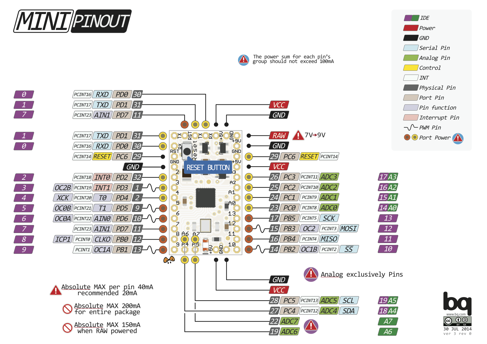

## ESP8266

### LoLin NodeMCU V3


```
SD CARD
VCC ............ 3.3v
GND ............ GND
MISO ........... D6
MOSI ........... D7
SCK ............ D5
CS ............. D8
```

### WeMos ESP8266 D1 Mini


```
I2C
  SDA => D2
  SCL => D1

SPI
  M-CLK => D5
  MISO => D6
  MOSI => D7
```

## Arduino Clones
### Arduino Nano


```
SD CARD
VCC ............ 3.3v
GND ............ GND
MISO ........... D12
MOSI ........... D11
SCK ............ D13
CS ............. D4
```

### Arduino Pro Mini

