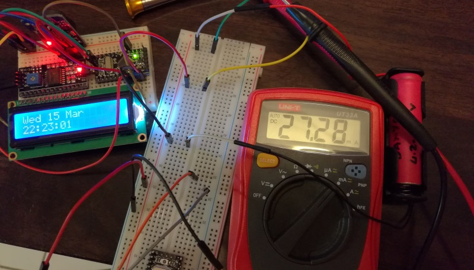
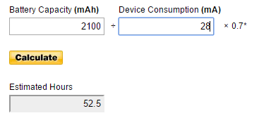
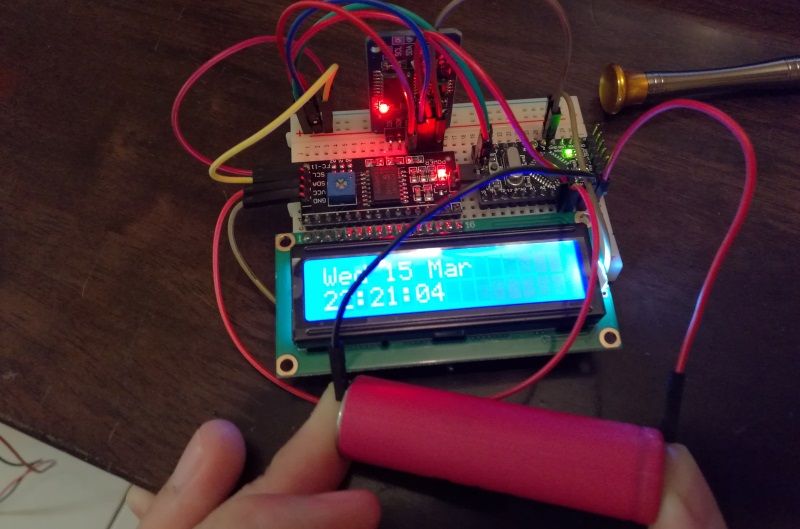
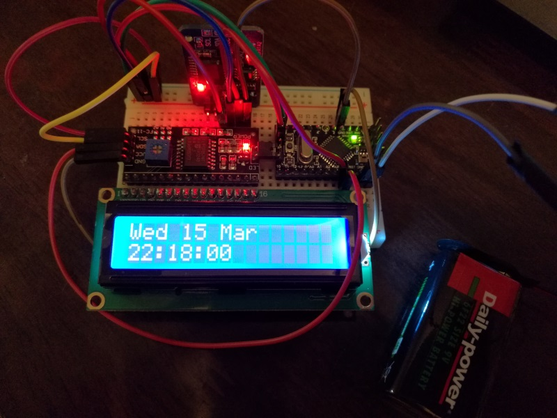

This is a complimentary post for my [Arduino digital clock project](/blog/2017/2017-03-17/post/), and aims to provide some insight into powering your Arduino projects once they have left the prototyping stage. I am by no means an expert when it comes to this subject, in fact, I am still learning myself. I decided to jot down my findings from various posts online in hopes that others may find it useful.

## Working out the power draw
If you are going to go the way of batteries to power a project, the first thing you will need to do is work out the power draw (amount of milliamps) consumed by your project during operation.

The simplest way to get the current draw is to connect a multimeter in series between your power source and project (as can be seen below).

Allow your project to run a while taking note of the amount of current being consumed every now and then. Once you have enough samples (some when idling, some when under load) you can average the values collected to work out an approximate current draw (in the case of my clock, it is drawing ~28 mA when running).

## Using 18650 Battery
As you can see from the picture below I am using a `18650 battery` to power the project. I know that this battery has a mAh rating of 2100 mA, so by using one of the many free online tools I am able to get an approximation of how long I can power my project simply by entering in the collected values as seen below. In the case of my clock I should be able to get ~52 hours of run-time out of it, although in actuality it could be better. I prefer the tool shown below as they add a somewhat realistic multiplier to the current (x 0.7), without it other tools suggest that my setup would power the clock for 75 hours.

I would strongly suggest making use of a 18650 battery clip for the final solution, and possibly placing 2 of them in parallel to allow for uninterrupted power when swapping out an almost flat battery ;).

## Using 9v Battery
Like the 18650 battery a 9v battery will work just as well to power your projects. It's a better power source than the 18650 due to its higher voltage rating, and battery clips are a lot easier to find. It is always possible to place multiple 18650 cells together to reach a similar voltage, but the 9v battery is a lot easier (and cheaper) to get your hands on.

Like the 18650 cells you will need to connect your battery to the VIN and GNDconnectors on your Arduino.

## Battery Longevity
It is worth mentioning that you can stack the batteries in 1 of 2 ways. Either in series (increases the overall voltage supplied) or parallel (increases the overall mAh of the power source).

A good example would be with the 18650 batteries. A single battery by itself is rated at ~2100 mAh and yields ~52 hours (2.1 days) of current for the clock project. If I were to put two of them in parallel I would increase these values to ~4200 mAhwhich should yield ~104 hours (4.3 days) of current.

Putting the 18650s batteries in series would leave the current at ~2100 mAh, but increase the supply voltage to around 8v (these batteries range from 3.3 - 4.2 volts). The clock would get more voltage but still only be powered for ~52 hours.

## USB Power
Another option for power would be to connect your project to a USB power source such as a Power Bank or phone charging cable & plug.

This option is only available if your Arduino board has a USB connection (my one doesn't), or you have an USB cable you are happy to cut up. Making use of the USB port to power the device opens up the following additional power sources:

- Power Bank - with a wide range of mAh rating
- Wall wart - a.k.a. USB cable & phone charger
- Computer - or any other device that has a USB output (think of TVs, Home Theatre systems etc.)
