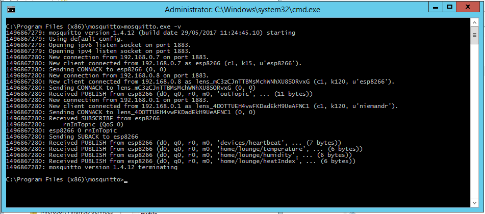
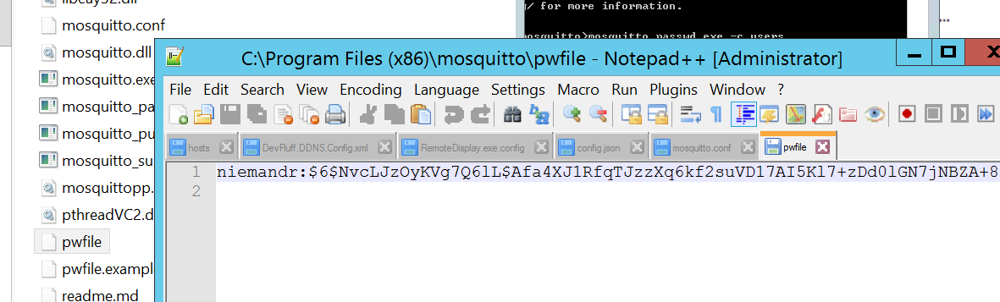

After discovering the joys and simplicity of using **MQTT** on IoT enabled devices such as an NodeMCU ESP8266 I decided I wanted to host my own local (and with the right configuration public) instance of [mosquitto](https://mosquitto.org/download/) for my devices to make use of. This post covers the basics of getting everything up and running on a Windows environment.

## Prerequisites
There are 3 prerequisites when it comes to installing mosquitto locally:

- [Open SSL](https://slproweb.com/products/Win32OpenSSL.html)
- pthreads
- [Mosquitto](https://mosquitto.org/download/)

First, download and install **Open SSL** (I used `Win64OpenSSL_Light-1_0_2L.exe`), please take note of the installation directory.

```
C:\OpenSSL-Win32
```

Next you will need to grab `pthreadVC2.dll` from `ftp://sourceware.org/pub/pthreads-win32/dll-latest/dll/x64/`, all you need is the `pthreadVC2.dll` file.

Lastly you will need to grab the latest version of mosquitto (in my case this was `mosquitto-1.4.12-install-win32.exe`).

## Installing
Installation of mosquitto is a bit tricky, and I find that the following process works well for myself.

First you need to install `Open SSL` - feel free to change the installation directory, but be sure to take note of where you are installing it to (in my case: `C:\OpenSSL-Win32`).

Next install mosquitto as you would normally, again taking note of the installation directory (in my case: `C:\Program Files (x86)\mosquitto`), complete and close the installer.

Finally you will need to copy the following files into your mosquitto installation directory:

From: C:\OpenSSL-Win64:

- libeay32.dll
- ssleay32.dll

From: Download:

- pthreadVC2.dll

You should now be able to run mosquito with the following command line:

```
mosquitto.exe -v
```



## Securing
I highly recommend securing mosquitto if you are planning to use it on the web. It is simple to do and should only take a few moments.

Open a command window in the context of your mosquitto installation directory and enter the following command.

```
mosquitto_passwd.exe -c pwfile user
```

Be sure to replace pwfile with the name of the password file you want to create, and user with your desired username. Once the command is completed you should have a password file with the specified user in it.



To add another user to the file you use the command:

```
mosquitto_passwd.exe pwfile newuser
```

Lastly we need to update the `mosquitto.conf` file and make it aware of the password file you created. Find the following lines in the config file and update them as required, in my case:

```
password_file pwfile
allow_anonymous false
```

You are done locking down mosquitto!

## Running
Lastly we will need to run mosquitto using the updated configuration file, to do this you can simply open a command window in the context of your mosquitto installation directory and run the following command:

```
mosquitto -c mosquitto.conf
```

This is far from ideal, but it's a step in the right direction. I am planning on creating another post on how to run mosquitto as a service (should you not want to use the provided broker service that is installed by default). For now I find that creating a bat file with the following commands does the job quite nicely.

```
cd "C:\Program Files (x86)\mosquitto\"
mosquitto.exe -v -c mosquitto.conf
```

That's all there is to it.
