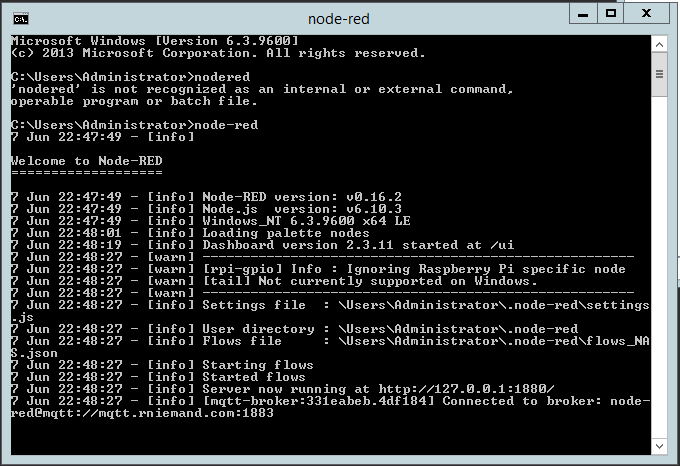
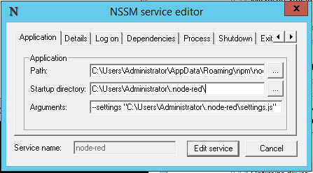
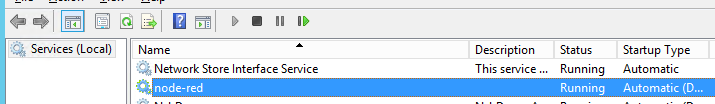
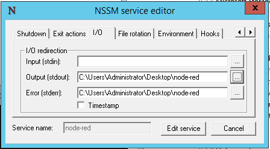
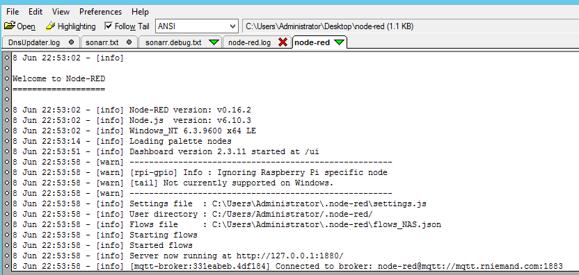
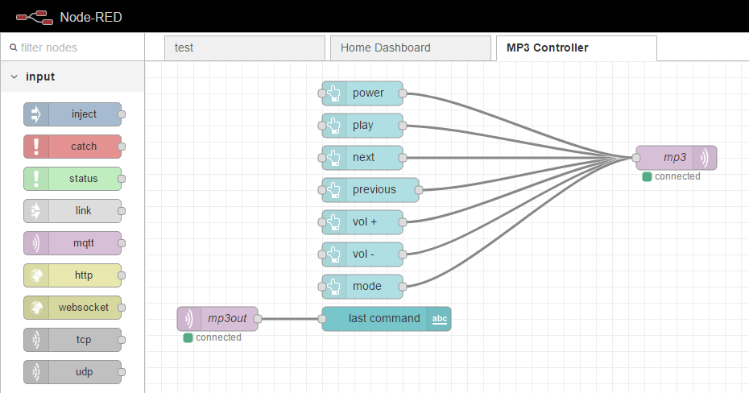
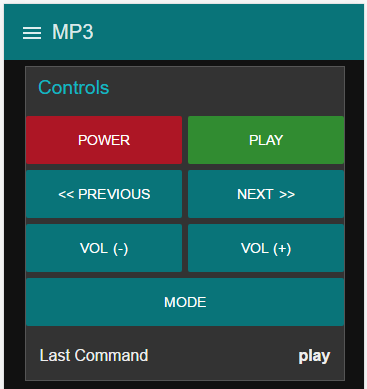
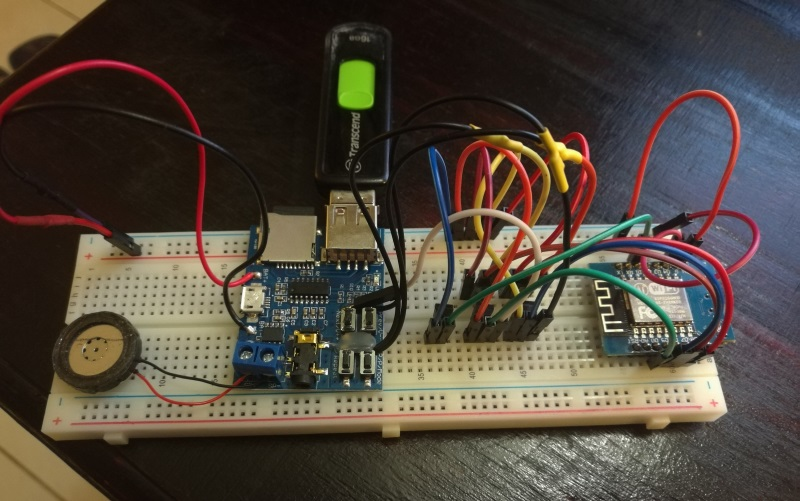

In this post I am going to cover installing, configuring and running Node-REDas a Windows service. [Node-RED](https://nodered.org/) is a programming tool for wiring together hardware devices, APIs and online services in new and interesting ways, and is especially useful for home automation through IoT. There is a lot to cover, so let's dive right in.

## Installing Node-RED
Installation is pretty straight forward and requires only 2 simple steps, more [detailed installation notes](https://nodered.org/docs/getting-started/local) are available on the official Node-RED site should you need them.

The first thing you will need is any stable version of [node.js](https://nodejs.org/en/) installed. At the time of writing this article `v6.10.3` was the latest stable build.

Once node.js is installed, open a command window and enter in the following command to install Node-RED.

```
npm install -g --unsafe-perm node-red
```

That's it Node-RED is installed and ready to be used, to launch it run "node-red" from the same command line.



## Securing Node-RED
It is a good idea to secure your Node-RED installation with an username and password, especially if you would like it to be public facing. To secure Node-RED you will need to modify your `settings.js` file which is located in your users directory, in my case this is:

```
C:\Users\Administrator\.node-red\settings.js
```

Locate the `adminAuth` section in the file and uncomment it. You will notice that there is a `password` property with a hashed password value assigned to it, we are going to need to generate a new hash for your password to replace it with. The Node-RED creators provide a tool for doing just this, and can be installed and run using the following console commands:

```
npm install -g node-red-admin
node-red-admin hash-pw
```

You will be prompted for your password 2 times and after the second time the `node-red-admin` tool will print out a hash value. The output value needs to find its way back into your `settings.js` file.

You will also need to modify the `userDir` property and hard-code its value to your `.node-red` folder. You need to specify the full path to the directory because when running Node-RED as a service the working directory may differ breaking any relative paths you may have defined. In my case I set `userDir` to the following:

```
userDir: 'C:/Users/Administrator/.node-red/'
```

Save and close the settings file.

## The Node-RED Service
You will need to download a tool called [NSSM](https://nssm.cc/download) in order to run Node-RED as a service - I covered NSSM in more detail in [this post](/blog/2017/2017-06-08/post/), however for now, all you need to do is download the latest version (`nssm 2.24-101-g897c7ad`) and copy either the 32-bit or 64-bit executable to any folder on your computer.

In a command line, navigate to the folder containing `nssm.exe` and run the following command:

```
nssm install
```

This will present you with a dialog box similar to the one below.



On the Application tab enter in the below values, making sure that you adjust the paths where necessary.

- **Path**: C:\Users\Administrator\AppData\Roaming\npm\node-red.cmd
- **Startup Dir**: C:\Users\Administrator\.node-red\
- **Arguments**: --settings "C:\Users\Administrator\.node-red\settings.js"
- **Name**: node-red

On the Details tab, give the service a name and set its startup type to `Automatic (Delayed Start)` - this will ensure that Node-RED starts with Windows, but only once your computer has had some time to settle.



You now have a Node-RED service - under service manager, click the Start Service button to start your Node-RED service.

## Troubleshooting
Should you run into any problems starting your new Node-RED service (like stopping immediately after starting it) you can follow the below steps to make identifying the issue a lot easier.

Navigate to the folder where you place the nssm.exe executable and run the following command.

```
nssm edit node-red
```

This will present you with an edit screen like the one shown below.



If you navigate to the I/O tab you will see options for stdin, stdout and stderror streams. These are used mainly on *NIX based systems, but node.js provides some implementation of them and so does nssm. If you provide a path to a .txt file like shown above (although I forgot to add the extension), save and restart your Node-RED service, the files will be created and any console output from Node-RED will be redirected to the file specified, e.g.:



Hopefully Node-RED will provide you with some reason for failure in this file that will make troubleshooting a lot easier.

Please do not forget to run nssm edit node-red again once you have resolved your issue, and remove these values.

## Conclusion
Node-RED is an amazing tool, and opens up a ton of possibilities through a simple drag and drop UI. There is a lot more to Node-RED that initially meets the eye, and coupled with something like `MQTT` gives you so much more power.

Below is the controller flow, and UI designed with Node-RED to control a MP3 player board via an ESP8266 (post coming soon)






