About a year ago I discovered [Sonoff WiFi switches](https://sonoff.tech/product/diy-smart-switch/basicr2/) on [AliExpress](https://www.aliexpress.com/) and was able to pick up a couple of them for $10. These devices are basically IoT connected smart switches that you can control via your smartphone, or their website, and for the most part work pretty well right out of the box for most consumers. Until recently I was more than happy to use them "as is" with the shipped firmware and mobile application, and it was only when I wanted to integrate these switches into my home automation did I find the shipped firmware and software quite limiting.

After some Googling I discovered an awesome project on GitHub called [Sonoff-Tasmota](https://github.com/arendst/Tasmota), a custom firmware created specifically for Sonoff devices that allows me to customise what these devices can do. This post will cover the steps required to get the firmware up and running on your Sonoff devices.

## Adding programming header

In order to flash any firmware to your device, you are going to need to open it up and attach some header pins to the circuit board. This will make flashing the initial firmware a lot easier, and allow for troubleshooting the device over a serial connection.

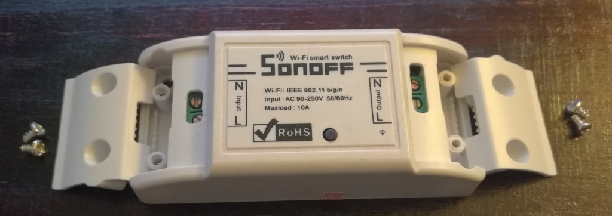

Start by removing the cable cover plates as shown above, then using a screwdriver to pop off the backing plate of the device.

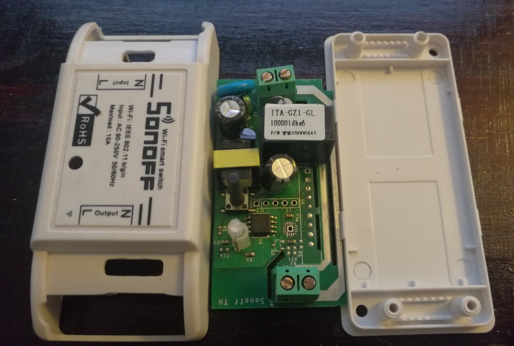

Next you will need to locate the programming header pin holes (on the right of the push button, just above the small microchip). There should be 5 of them.

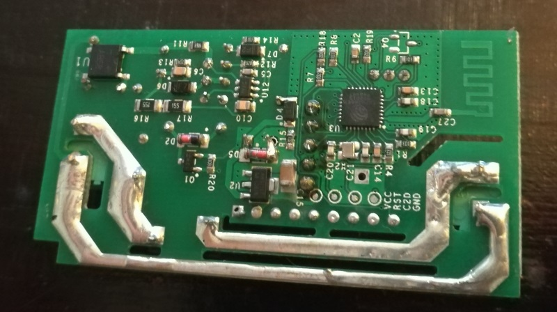

Solder on some header pins as shown above, making sure you are careful not to damage any of the surrounding components.

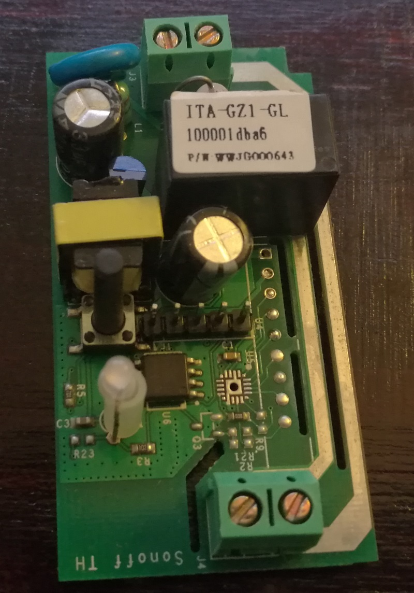

New header pins on the board.

## Setting up Flashing Environment

Next you will need an IDE / Application to compile & upload your custom firmware. I followed the steps detailed in the official guide ([https://github.com/arendst/Sonoff-Tasmota/wiki/Upload](https://github.com/arendst/Sonoff-Tasmota/wiki/Upload)), but decided to take the [Visual Studio Code](https://code.visualstudio.com/) with [PlatformIO](https://platformio.org/) as it seemed easier at the time.

Open VS Code, navigate to the plugins tab and search for PlatformIO as shown below. Click install and wait for it to complete.

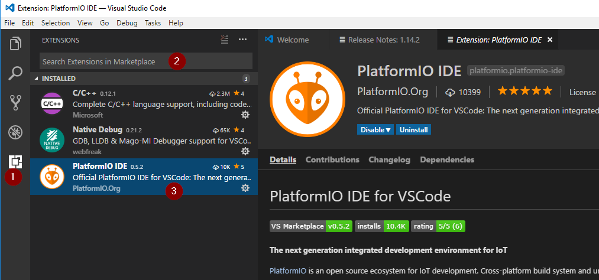

Once installed I recommend restarting VS Code and allowing PlatformIO to pull down any additional dependencies it may have.

## Download Sonoff-Tasmota

Next, head over to the official [Sonoff-Tasmota](https://github.com/arendst/Tasmota/releases) release page and download the latest stable version of the firmware (`5.5.0 20170730` at the time of writing).

Extract the contents of the release .zip file to an easily accessible folder on your computer (in my case `D:\Tools\Sonoff\Sonoff-Tasmota-5.5.0`).

Open the folder in VS Code as shown below.

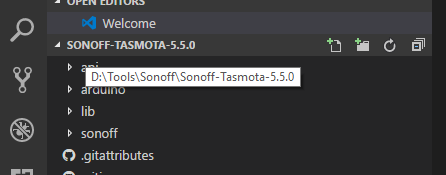

You are now ready to customise your firmware.

## Firmware Customization

Open the `platform.ini` file (in the root folder) and locate the below line, removing the comment (;) to enable it.

```
env_default = sonoff
```

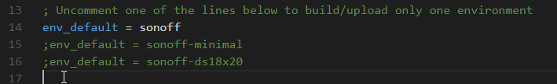

Next open sonoff/user_config.h, locate the WiFi settings as shown below and modify the SSID and password for your WiFi network.

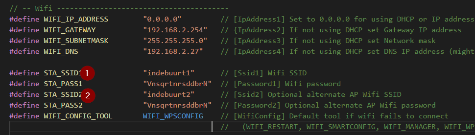

After that, locate the MQTT configuration in the same file and enter in your MQTTconfiguration. If you are using TLS you will need to complete section (1), otherwise enter your values in section (2) and save the file.

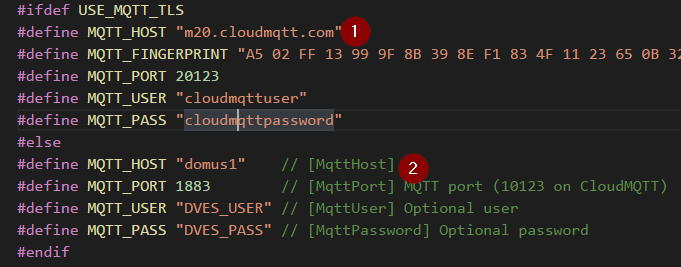

That completed all the configuration.

## Flashing firmware

To flash your firmware to the Sonoff switch you will need an ISP of some sorts. Unfortunately I didn't have one on me, so I had to make a plan using an Arduino UNO with its microprocessor removed (see below).

I found a nice picture detailing the pin-out on ([https://randomnerdtutorials.com/](https://randomnerdtutorials.com/)):

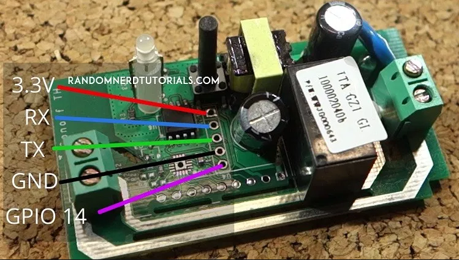

Following the picture as a guide and using my UNO I made all the necessary connections to the Sonoff before giving power to the UNO.

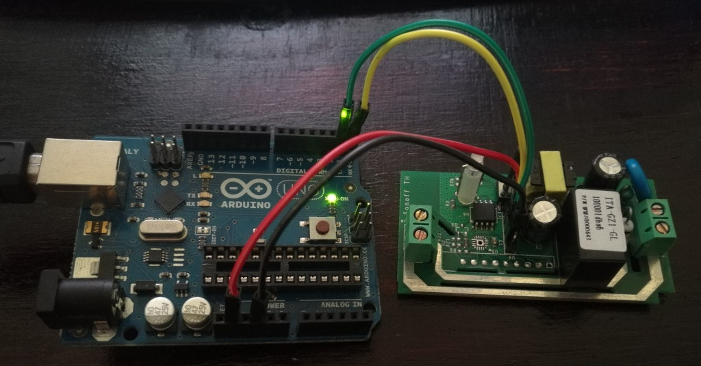

> **NOTE** To put the Sonoff into flash mode you will need to hold down the power switch while powering it on!

Once connected, make sure that VS Code and PlatformIO can see your programmer's (in my case the UNO) serial port. There should be a row of icons at the bottom left hand side of VS Code, provided you have the Tasmota folder open.


Click the upload button and wait for it to complete. It should take about a minute to do the initial upload as shown below.

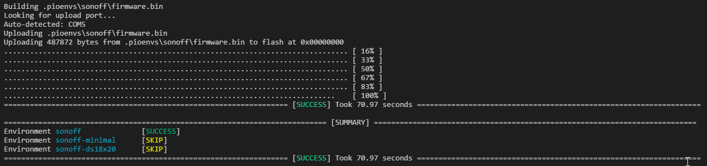

Provided that there were no errors flashing you should be up and running with the Sonoff-Tasmota firmware.

## Connecting to your device

The last step in the flashing process is locating and connecting to your device over the WiFi. I found an amazing Android application called [Fing](https://play.google.com/store/apps/details?id=com.overlook.android.fing&hl=en) that makes this really easy, but feel free to use any other app you are comfortable with.

Once you know the IP Address of your device (in my case 192.168.0.15) open your preferred web browser and connect to it (e.g. http://192.168.0.15). You should be presented with a screen similar to the below.

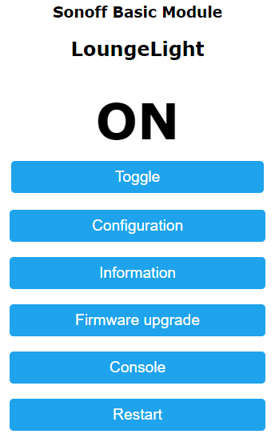

That's it, you are done :)

> **NOTE**: The relay will not trigger if you are powering the device via an ISP, it seems to only trigger on mains
