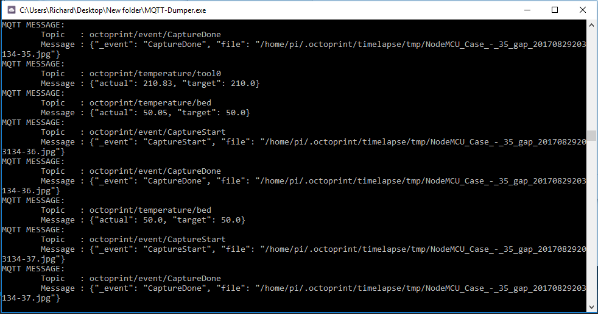
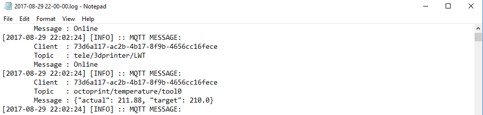
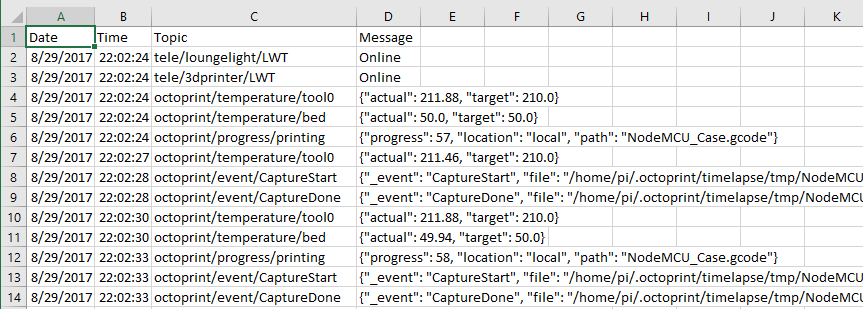
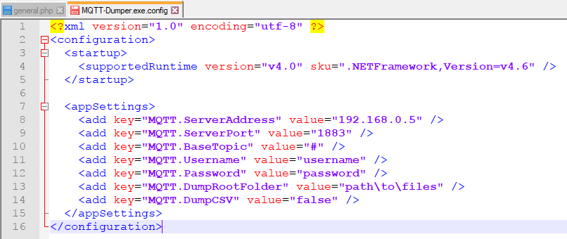

**MQTT Dumper** is a simple utility (well, `console application` at the moment) that I put together in about an hour to help me spy on the communication of all my IoT devices at home. Currently the utility has the below features:

- Configurable server address (and port)
- Dump messages to `.log` file (always enabled)
- Dump messages to `.csv` file (optional)
- Configurable output folder for log files
- Ability to subscribe to a custom topic (defaults to `#`)

## Screen Shots
For the moment `MQTT-Dumper` will run as a console application (shown below):

This will generate a similar log file like this:

With the CSV option enabled:

## Configuration
The following configuration options are available:

| Option | Notes |
| --- | --- |
| MQTT.ServerAddress | Address of your MQTT server |
| MQTT.ServerPort | The communication port to use (1889 is default) |
| MQTT.BaseTopic | The base topic to subscribe to (# for all) |
| MQTT.Username | Login username (blank for no auth) |
| MQTT.Password | Login password (blank for no auth) |
| MQTT.DumpRootFolder | Base folder to dump generated files to |
| MQTT.DumpCSV | If "true" a csv file will be generated |

These settings are found in the `MQTT-Dumper.exe.config` file included with the alpha release.

## Source Code
At the moment MQTT-Dumper is in the alpha stage, so the code is a bit of a mess, and as a result has not been made public yet. Once I have had some time to refactor the code and have been able to use the tool a bit I will upload the code to Github :).

## Download
At the moment you can grab the alpha build on my public DropBox share listed below:

- [MQTT-Dumper (Alpha).zip](https://www.dropbox.com/s/ha15xleajmswrsh/MQTT-Dumper%20%28Alpha%29.zip?dl=0) - 79.83 KB

Please feel free to leave some feedback / comments below using disqus.