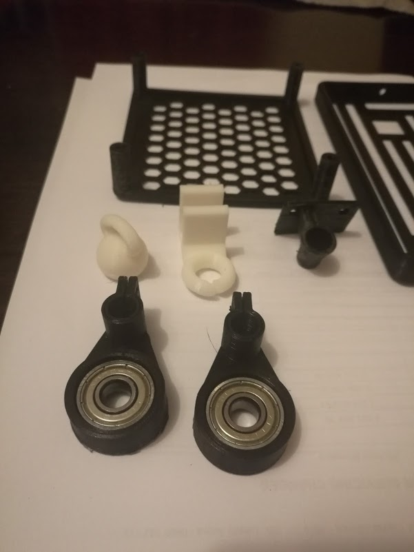

About 2 months ago I finally received one of my biggest packages from China to date, that was an [Anet A8 3D printer](https://www.banggood.com/Anet-A8-DIY-3D-Printer-Kit-1_75mm-or-0_4mm-Support-ABS-or-PLA-or-HIPS-p-1130694.html?imageAb=2&akmClientCountry=CA&cur_warehouse=CN) from [BangGood](https://www.banggood.com/) for around $239.99including shipping. I had a small issue with customs over the price of the printer / import duties which added about 3 additional weeks onto the shipping time.

With the customs issue it took my printer about 6 weeks to arrive, and came decorated with some free [SARS](https://www.sars.gov.za/) tape (thanks customs).

I was pretty impressed with how the printer was packed, and everything has its place in the box with more than sufficient padding. There were no missing parts, and everything required to assemble the printer was included in the box.

## Assembly

The build was pretty straight forward, and the supplied build instructions (included on the 8 Gb SD Card that came with the printer) were enough to get up and running. I much prefer video instructions when it comes to building things and ended up following these to complete my printer build:

- [Anet A8 Assembly - Part 1](https://www.youtube.com/watch?v=-tiHfzBQZpI)
- [Anet A8 Assembly - Part 2](https://www.youtube.com/watch?v=EbNocv6-OOQ)

Below are some progress photos of the build process:

The frame of the printer is pretty compact, to give you a reference for size the build plate (with the yellow tape sitting on top) is 220 mm x 220 mm.

A quick power on test confirmed that I didn't wire up any of the components incorrectly, and I made use of the auto-home (home all) command in the UI to confirm that all the stepper motors were receiving power.

> The total time it took me to build the printer was around 4-5 hours, I decided to take my time and ran numerous checks during the build process to ensure that I did not make any silly mistakes.

> **FYI**: you need to be careful with tightening all screws and belts. Too much tension can lead to a cracked frame. Also be extra careful to match all polarity when wiring up the controller boards.

## Upgrades

By itself the Anet A8 is an amazing entry level (learning) printer given its low barrier to entry, and is able to produce pretty good quality prints. It has a heated print bed allowing it to print in a multitude of materials PLA, ABS, HIPS, WOOD, PVA and Nylon, however I mainly print in PLA as it is a lot easier to work with in my opinion.

So far I have added / printed the following upgrades for the printer:

- [Extruder Button Upgrade](https://www.thingiverse.com/thing:1935151) - makes the button a lot easier on your fingers to push down
- [Center Nozzle Fan Upgrade](https://www.thingiverse.com/thing:1620630) - allows for better cooling of your print

- [Anet A8 Fan Holder](https://www.thingiverse.com/thing:2373970) - allows for quick replacement of the filament.

- Heat bed printing mat - although I found that my prints stuck a little too well and ended up removing it. I would recommend this if you are having adhesion issues.

- 12v LED Strip - added mainly for printing at night.

- Custom webcam mount for OctoPrint (I designed this one myself)

- [Anti Z Wobble for Anet A8](https://www.thingiverse.com/thing:1858435) - adds better stability to the Z-Axis while printing
- [Anet A8 filament guide](https://www.thingiverse.com/thing:1764285) - simple guide for my filament before I printed a proper spool holder
- [Anet A8 Mainboard Cover](https://www.thingiverse.com/thing:2013479) - helps to neaten up the wires coming out of the driver board

- [Anet A8 - Spool Holder](https://www.thingiverse.com/thing:2441675)
- Quick Change Universal Spool Holder

## Print Quality

Below are some pictures showcasing the quality of prints that I have been able to achieve using the Anet A8.

Simple project box for a LED display matrix project I was working on, unfortunately I managed to damage the matrix board and have ordered a replacement. This was printed at around 60 mm/s and had some warping issues as I printed it on a cold heat bed.

iPhone cover for my mom's phone was printed at a lower speed (~40 mm/s) and came out a lot better.

Small Boston Terrier test print, here the printer struggled with the ears due to the fact I was using a fast travel speed, and not nearly enough retraction.

My current print which is a case for PacketMonitor

