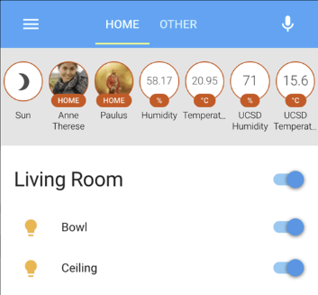
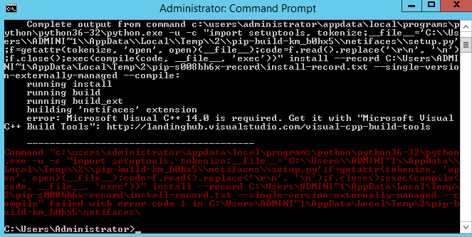
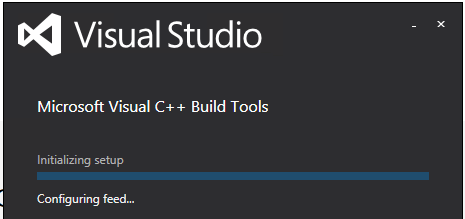
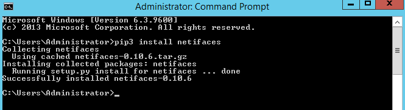

I have been watching a lot of videos about home automation lately and found that [Home Assistant](https://www.home-assistant.io/) (`HASS`) seems to be the most popular choice when it comes to consolidating all of your IoT enabled devices. Hass offers a clean, powerful and easy to use interface that displays all of your nodes / sensory data through a consistent, mobile friendly viewport with support for over 800 unique inputs into the system.



I was sold on this pretty much straight away and wanted to get up and running as soon as possible. I downloaded and installed the latest stable release of [Python](https://www.python.org/) (ensuring to add the python executable to my system `PATH`) and ran the install command:

```
pip3 install homeassistant
```

Unfortunately I was greeted with the following error:

```
2017-09-04 17:40:29 ERROR (SyncWorker_6) [homeassistant.util.package] Unable to install package netdisco==1.1.0: Command "c:\users\administrator\appdata\local\programs\python\python36-32\python.exe -u -c "import setuptools, tokenize;__file__='C:\\Users\\ADMINI~1\\AppData\\Local\\Temp\\2\\pip-build-d9xyxziz\\netifaces\\setup.py';f=getattr(tokenize, 'open', open)(__file__);code=f.read().replace('\r\n', '\n');f.close();exec(compile(code, __file__, 'exec'))" install --record C:\Users\ADMINI~1\AppData\Local\Temp\2\pip-3vu4z519-record\install-record.txt --single-version-externally-managed --compile --user --prefix=" failed with error code 1 in C:\Users\ADMINI~1\AppData\Local\Temp\2\pip-build-d9xyxziz\netifaces\
2017-09-04 17:40:29 ERROR (MainThread) [homeassistant.setup] Not initializing discovery because could not install dependency netdisco==1.1.0
2017-09-04 17:40:29 ERROR (MainThread) [homeassistant.setup] Setup failed for discovery: Could not install all requirements.
2017-09-04 17:40:30 ERROR (MainThread) [homeassistant.core] Error doing job: Exception in callback _ProactorReadPipeTransport._loop_reading(<_OverlappedF...op_reading()]>)
Traceback (most recent call last):
  File "c:\users\administrator\appdata\local\programs\python\python36-32\lib\asyncio\events.py", line 127, in _run
    self._callback(*self._args)
  File "c:\users\administrator\appdata\local\programs\python\python36-32\lib\asyncio\proactor_events.py", line 190, in _loop_reading
    data = fut.result()  # deliver data later in "finally" clause
  File "c:\users\administrator\appdata\local\programs\python\python36-32\lib\asyncio\futures.py", line 239, in result
    raise InvalidStateError('Result is not ready.')
asyncio.base_futures.InvalidStateError: Result is not ready.
```

Basically the error was saying that the installation of HASS was failing due to a missing dependency (`netifaces`), I attempted to install this using an elevated command prompt window and the following command:

```
pip3 install netifaces
```

This too failed, and when looking at the output it became apparent that I was missing `Microsoft Visual C++ 14.0`:



This is simple enough to fix, and after a quick search on Google I found the relevant build of Microsoft Visual C++ 14.0 for my system here. I downloaded them and ran the installer:



Once completed I re-opened a new command prompt window and attempted to install netifaces again:

```
pip3 install netifaces
```

Great success, the installation went through without any hitches:



I re-ran the installer for HASS and it completed successfully, now I just need to start plugging in all my devices :)

Hopefully this will save you some time in the future when setting everything up on windows.