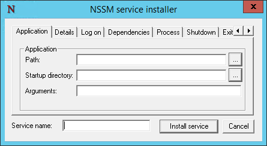
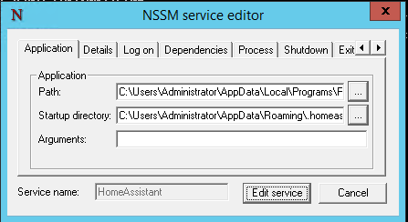
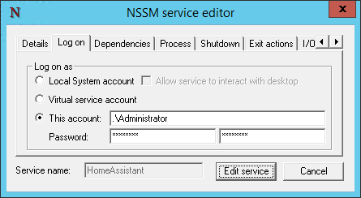
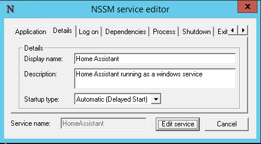
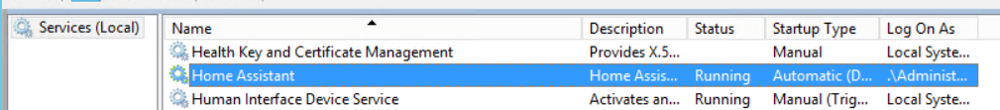
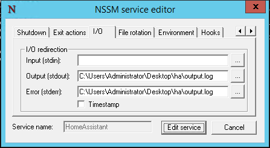
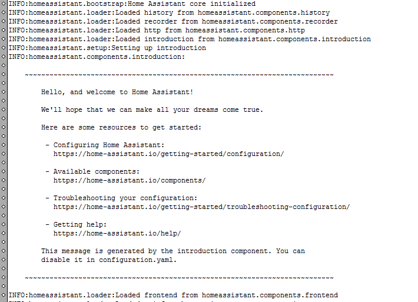
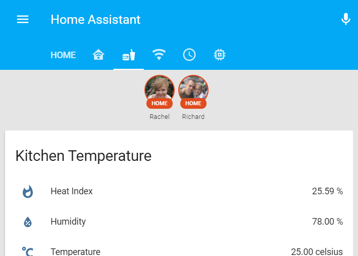

In this post I will cover some simple steps on how to get [Home Assistant](https://www.home-assistant.io/) as a service on windows. I will be making use of a nifty utility called [nssm](https://nssm.cc/) (the `Non-Sucking Service Manager`) which lives up to its name. Before you begin you will need to have the following prerequisites met:

- [Python 3.x](https://www.python.org/) installed (do not use 2.x)
- [netifaces and Microsoft Visual C++ 14.0](https://www.richardn.ca/posts/HomeAssistantMissingDependenciesWindows/)
- [Home Assistant](https://www.home-assistant.io/) installed under some elevated account
  - In my case I am using the Administrator account :/

## Initial Service Installation
The first thing you will need to do is find the location of `hass.exe` for the selected user account, in my case this was the path:

```
C:\Users\Administrator\AppData\Local\Programs\Python\Python36-32\Scripts\hass.exe
```

Take note of the path for `hass.exe`, then download the latest release of [nssm](https://nssm.cc/download) and place the `nssm.exe` in a location where it won't be deleted (you will need the exe for the lifetime of the service - I placed mine in `p:\tools\nssm.exe`). Open an elevated command prompt, navigate to the folder containing `nssm.exe` and run the below command:

```
nssm.exe install
```

You will be presented with the following dialog:



On the Application tab populate the following fields:

- **Path**: `C:\Users\<user>\AppData\Local\Programs\Python\Python36-32\Scripts\hass.exe`
- **Startup directory**: C:\Users\<user>\AppData\Roaming\.homeassistant
- **Service name**: HomeAssistant



On the Log on tab, ensure that you configure the service to run using the selected account you used to install Home Assistant (in my case this is the Administrator account).



Feel free to add some additional context to the Details tab, in my case I set it to the following:



Click Install Service to create the initial service (mine says Edit as I only took screenshots after getting it up and running). You should now have your newly installed Home Assistant service.



## Troubleshooting
At this point I tried running the service, only to be greeted with absolutely nothing in my browser. Thankfully nssm comes with a nifty I/O feature that allows you to redirect the stdin, stdout and stderr streams to / from files on disk. To enable this logging you will need to edit your home assistant service by running the following command:

```
nssm edit HomeAssistant
```

You will be presented with a slightly modified install screen where you can make changes to the service, more specifically the following changes on the I/Otab:

- **Output**: `C:\Users\<user>\Desktop\output.log`
- **Error**: `C:\Users\<user>\Desktop\error.log`



Save your changes and restart the Home Assistant service while keeping an eye on your log files. I like to make use of [baretail](https://www.baremetalsoft.com/baretail/) for this as it provides real time updates as the log file changes. After a few seconds my initial problem became clear:



The Home Assistant instance I was running was not running under the correct user context hence the welcome message being displayed (not to worry this is corrected in the installation section above). After editing my service via nssm everything was working perfectly:



Hopefully this saves you some time.

Please feel free to leave any comments, suggestions or improvements below as they are appreciated.
