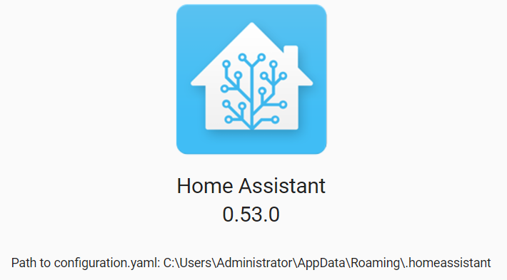

I have been using [Home Assistant](https://www.home-assistant.io/) for about a week and already there is a new version of the software available. From what I can make out the [project](https://github.com/home-assistant/core) is extremely active with a fortnightly release cycle. Generally the update process is pretty simple, however I am running my Home Assistant instance as a windows service covered in [my previous blog post](https://www.richardn.ca/posts/RunningHomeAssistantAsAWindowsService/).

This is a quick post on the process you will need to take if you are doing the same:

- Stop the **Home Assistant** service using the windows service manager
- Once stopped, back up your configuration files to be safe
  - That's all the `*.yaml` files in your user directory
  - In my case that's `C:\Users\<user>\AppData\Roaming\.homeassistant`

Open an elevated command prompt and issue the below command:

```
pip3 install --upgrade homeassistant
```

This will download and install the latest version of Home Assistant from the GitHub repository, once done you can start up your home assistant service via the windows service management console.

You're done!


