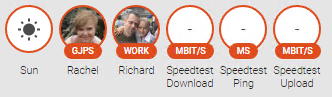
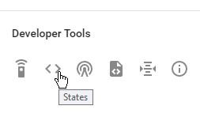
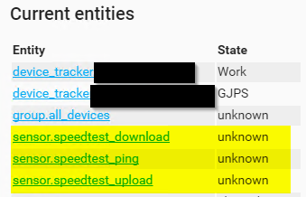
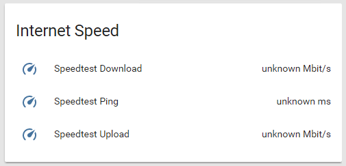
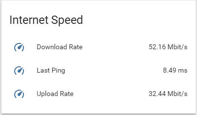
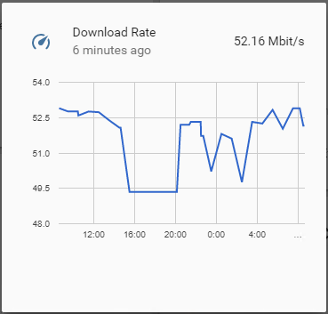
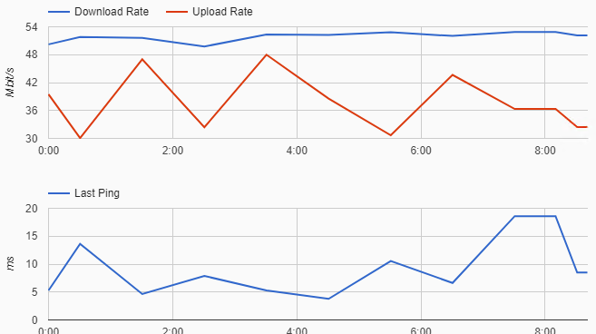

Continuing with my series around home automation using [Home Assistant](https://www.home-assistant.io/) I would like to cover the `speedtest` sensor component. As the name suggests this component makes use of [speedtest.net](https://www.speedtest.net/) to periodically test your server's internet connection and graphs the results for you to keep an eye on.

When it comes to the configuration for this component I am going to be splitting up the main `configuration.yaml` file used by Home Assistant into smaller, more specific `*.yaml` files and referencing them using the `!include` keyword. This allows our configuration file to stay nice and small, and helps to break up the configuration for all your plugins. Lets begin:

## Configure the sensor
The [speedtest](https://www.home-assistant.io/integrations/speedtest/) component falls under the `sensor` category in Home Assistant, and as such needs to appear in your main sensor list. We are going to break this list out of the main configuration file into a new file called `config/sensor.yaml` (I keep all my config in it's own directory to make backups easier). Let's create the `config/sensor.yaml` configuration file and add the below configuration:

```yaml
- platform: speedtest
  monitored_conditions:
    - ping
    - download
    - upload
  minute: 30
```

This will enable the [speedtest](https://www.home-assistant.io/integrations/speedtest/) component, and monitor ping, download and upload speeds. The minute argument tells Home Assistant to run this test every 30 min, this is covered more in depth on the components page.

Next we will need to reference this file back in our configuration.yaml file using the below command.

```
sensor: !include config/sensor.yaml
```

Basically this declares a sensor key, imports the contents of config/sensor.yamlat run time and replaces "!include config/sensor.yaml" with the actual referenced files content (this is why spacing in these files are so important).

Save all of your files, restart Home Assistant.



## Creating groups
I personally prefer the cards (groups) over the "bubbles" on the Home Assistant UI, so next I would like to move the newly added Speedtest components into their own "Internet Speed" card.

To do this we will follow the same steps as adding the sensor, i.e. we will create a new configuration file called config/groups.yaml and declare our group in that file.

To do this we will need the name of the objects created by the speedtest component, you can get these values from the states button on the main menu.



They should appear somewhere in the full list of items, below you can see mine:



So our group we are going to be creating will need to contain the following entities.

- sensor.speedtest_download
- sensor.speedtest_ping
- sensor.speedtest_upload

We define our group in config/groups.yaml as shown below (making sure to replace your entities names if they differ from mine):

```yaml
internet_speed_group:
  name: Internet Speed
  entities:
    - sensor.speedtest_download
    - sensor.speedtest_ping
    - sensor.speedtest_upload
```

After a quick restart of Home Assistant we are now able to see our new Internet Speed group.



Things are starting to shape up, however there is one last bit of customization I would like to do, and that is changing the default names of the speedtest components.

## Renaming things
To change the name of any object in Home Assistant you will need to make use of the customize property, which is nested under the root homeassistant configuration node. To keep things simple we will create a new file called config/customize.yaml and reference it back in using the below import statement.

```yaml
homeassistant:
  customize: !include config/customize.yaml
```

We will make use of the object ids discovered previously to target and rename our sensors. The contents of config/customize.yaml looks like this:

```yaml
sensor.speedtest_download:
  friendly_name: Download Rate
sensor.speedtest_ping:
  friendly_name: Last Ping
sensor.speedtest_upload:
  friendly_name: Upload Rate
```

Along with the name you can also change the icon, visible state, unit of measurement and more - [full documentation can be found here](https://www.home-assistant.io/docs/configuration/customizing-devices/). To keep this post short, we will just focus on the names for now.

After a quick restart of Home Assistant I can see that my name changes were a success.



Clicking on the Download Rate property will pop up a graph with all your recorded data (this was after 24 hours, yours will need +- 30 min to get the first data point).



Finally checking on the history component, we can see that all our speedtest data is being recorded as expected.



I hope that you found this post helpful, and as always I look forward to any comments, suggestions or questions below!
