Recently I bought [my first 3D printer](https://www.richardn.ca/posts/AnetA8MyFirst3DPrinter/) and could not be happier with it, or at least that's what I thought... While watching some YouTube videos around 3D printing I stumbled upon an amazing project called [OctoPrint](https://octoprint.org/) which blew my mind. OctoPrint's tagline is "The snappy web interface for your 3D printer", and boy does it live up to that statement!

OctoPrint is written in [Python](https://www.python.org/) and can pretty much run anywhere (windows, mac, linux, etc). It interfaces with your 3D printer via it's USB cable and controls your printer through GCode commands. This offers the end user a lot of control over the print, and adds some features you would not otherwise have (e.g. the ability to pause and resume mid print). It offers an API should you want to interact with it programmatically and has a pretty big plugin repository covering all things 3D printing.

Right out of the box OctoPrint is usable, and has more than enough built in features to get your first print out perfectly. Below you can see the base plugins that come with OctoPrint.

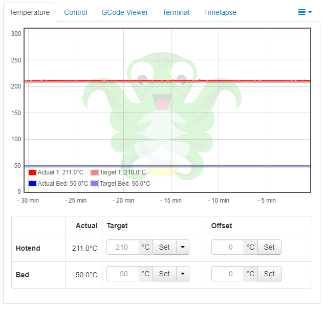

One of my favourite features is the GCode Viewer that provides a visual representation of the print head movement while printing your selected model. It has the ability to synchronise the preview of the GCode with the actual print progress, and can show you the previous / next layers to give you an idea of what's coming up next.

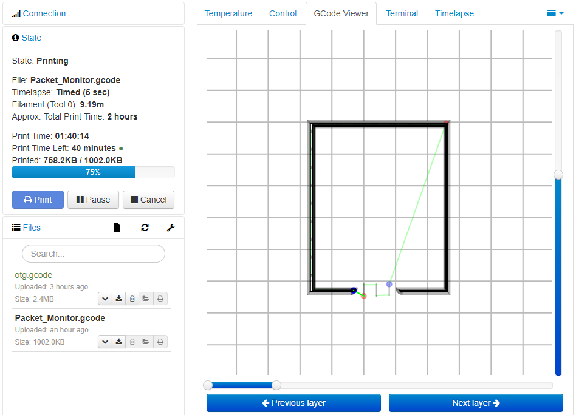

## Hardware
For my OctoPrint setup I decided to go with an [OrangePi Lite](https://www.banggood.com/Orange-Pi-Lite-with-Quad-Core-1_2GHz-512MB-DDR3-WiFi-Mini-PC-p-1101903.html?cur_warehouse=CN) from BangGood, as it was only $15 and came with WiFi, Quad Core 1.2 Ghz processor and 512 MB of RAM - which is more than enough to run OctoPrint. The OrangePi is basically a cheaper clone of the Raspberry Pi range of computers, and in my opinion gives you a lot more bang for your money.

After a bit of time on Google I managed to find [this blog post](https://www.cnx-software.com/2017/07/11/how-to-use-octoprint-on-orange-pi-lite-board-amlogic-s905x-and-s912-tv-boxes/) detailing the steps on how to get OctoPrint up and running on an OrangePi, and more importantly provides links to an image file with everything you need setup ready for writing with [win32 disk imager](https://sourceforge.net/projects/win32diskimager/). Like the Raspberry Pi you will need a microSD card to burn the image to (anything over 4Gb will suffice), and please make sure that the card is at least a class 10 (anything lower and things pretty much grind to a halt).

Once flashed, you will need to plug in your OrangePi into a display and follow the steps detailed in [the blog post](https://www.cnx-software.com/2017/07/11/how-to-use-octoprint-on-orange-pi-lite-board-amlogic-s905x-and-s912-tv-boxes/) to expand your disk image, connect to the WiFi and set a new password for the default user account. I highly recommend that you assign a static IP Address to the OrangePi (and enforce it with your router's DHCP service) as in most cases you are going to want to run this as a headless server. Once you have an IP Address configured I suggest running a test login via Putty to make sure you can remote into the device should you need to do maintenance. Once you are happy with your setup, shut down the OrangePi and set it up next to your printer, not forgetting to plug in the USB cable.

There are plenty of ways to power your print server, but the one that makes the most sense to me is to have it powered off your printer's PSU. You will need a [buck converter](https://www.aliexpress.com/item/32695785476.html) to drop the voltage down to the 5v needed and will set you back about $0.50. The benefits of having it run off your printers PSU are:

- OctoPrint will only run when your printer is on
- When OctoPrint completes booting the printer is already connected (there is no need to manually do this each time)
- You don't need any additional plugs to power your OrangePi
- The device uses so little current it will not add strain on the PSU
- When the printer turns off, so does the print server

## UI
The default user interface (UI) provided by OctoPrint is more than enough to get you up and running, and comes with the following:

- Temperature monitoring of your extruder(s) and print bed:

- State monitoring of your print job, with quick controls:

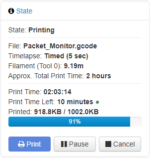

- Webcam and manual controls for all printer functions

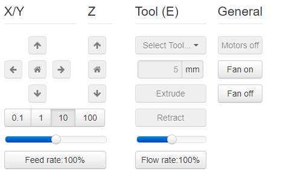

- GCode viewer:

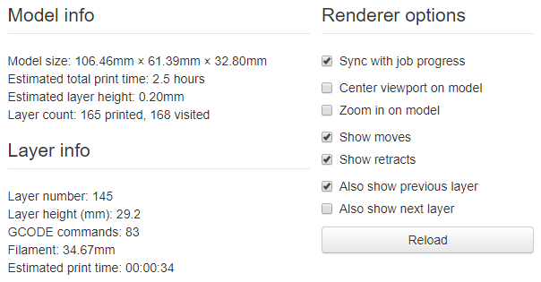

- Terminal view to send / receive commands from your printer

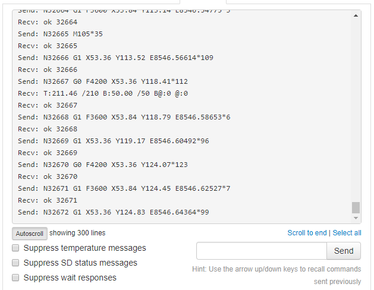

- Time Lapse functionality

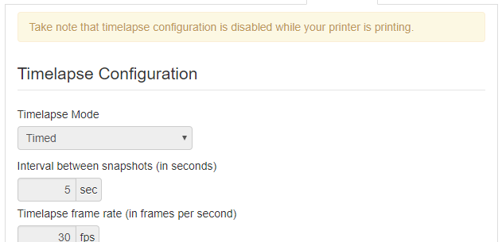

As I said, right out the box there is pretty much nothing else needed to get up and running with your first print. This leads me onto my next section...

## Plugins
OctoPrint has a lot of [plugins](https://plugins.octoprint.org/) that build onto the existing functionality and blend in well with the look and feel of the application. Most users won't need to add any additional plugins into OctoPrint in my opinion, but for the ones that do they should be more than happy with what's available out there. Should you not be able to find what you are looking for, there is an SDK available to develop plugins for OctoPrint which is pretty well documented. I highly recommend the following plugins:

### AutomaticShutdown
The [AutomaticShutdown](https://plugins.octoprint.org/plugins/automaticshutdown/) plugin as the name suggests provides the option to shut down your printer based on a timer once your current print job has completed:

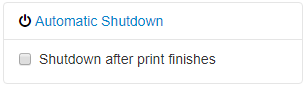

The timeout for shutting down the printer is configurable via OctoPrint's settings panel:

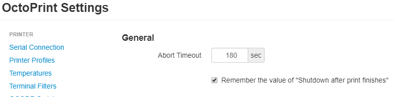

I would suggest using a timeout of ~2 min for the timeout to allow your hot end some time to cool down (in my case there is a cooling fan that blows directly onto it).

### MQTT
The [MQTT](https://plugins.octoprint.org/plugins/mqtt/) plugin allows OctoPrint to publish useful print related messages over the MQTT protocol to use with your home automation. In a [previous blog post](https://www.richardn.ca/posts/OctoPrintMQTTEventsWithSamples/) I covered some of the more useful messages that were published, and an example Node-RED flow you can implement with the published data.

Again this plugin is configurable via the built in configuration panel in OctoPrint:

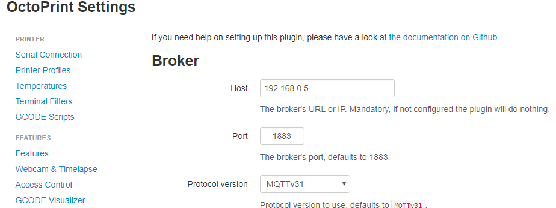

Some example messages from OctoPrint can be seen below:

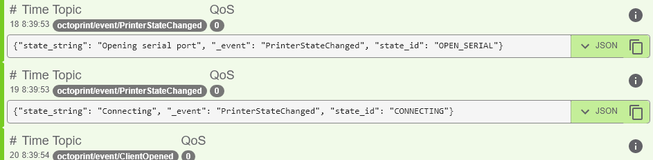

### Printer Statistics
The last plugin I have been playing around with is [printer statistics](https://plugins.octoprint.org/plugins/stats/), which as the name suggests provides some deeper insight into how your printer is performing. If configured correctly you will be able to calculate things like:

- Print job successes, failures, etc.
- Power consumption per device
- Power consumption per print

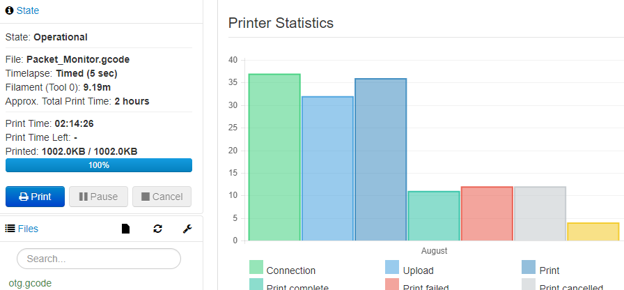

That covers everything I have discovered with OctoPrint. The developers have put a lot of work into it, and it shows. Hopefully you found this post informative and I look forward to any comments / suggestions below.