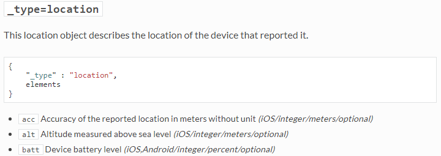
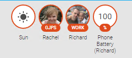
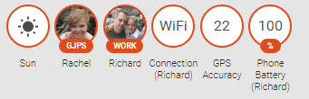
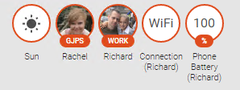
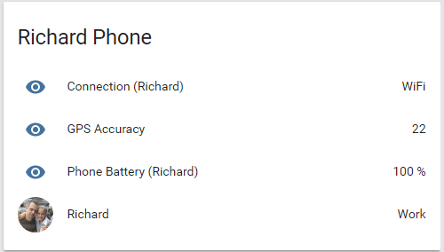
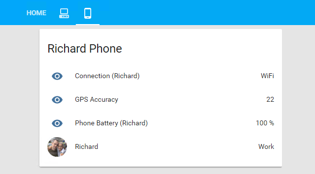

Following on from a [previous post](/blog/2017/2017-09-15/post/) I would like to extend the functionality of [Home Assistant](https://www.home-assistant.io/) using the [OwnTracks](https://www.home-assistant.io/integrations/owntracks/) plugin to get an idea of how full my phone battery is. This information could be used to send an alert to you should your battery drop too low and you are at home, or let you know that your spouse's battery is low when they are out and about (the only limit here is your imagination).

In order to accomplish this I will need to know a couple of things, mainly what data is being sent by OwnTracks, and how to get at this bits of it I want.

## OwnTracks payload

First we will need to see exactly what is being sent over the wire when OwnTracks "calls home" and identify where in that payload the phone battery level is stored. To do this I made use of my [MQTT dumper application](/blog/2017/2017-08-29/post/) filtering it to the owntracks/# publications, I forced my phone to check in and recoded the data sent over the wire:

```json
{
  "_type": "location",
  "tid": "xt",
  "acc": 22,
  "batt": 15,
  "conn": "w",
  "lat": xxx,
  "lon": xxx,
  "tst": 1505225118,
  "_cp": true
}
```

It seems that the batt property is what we are looking for, and a quick cross-check with the [OwnTracks booklet](https://owntracks.org/booklet/tech/json/) confirmed my suspicion:



> Something to note here "iOS,Android/integer/percent/optional"

There is a possibility that this value won't always be there, and this is due to the fact that you can enable / disable advanced reporting in the application. We will need to make sure that this case is catered for when we attempt to collect this information.

## Tracking battery usage

In order to store and present this information in Home Assistant we will need to make use of a sensor, more specifically the [mqtt sensor](https://www.home-assistant.io/integrations/sensor.mqtt). This sensor will allow us to subscribe to any MQTT topic and collect data from it, with the added bonus of being able to manipulate this data using the [templating engine](https://www.home-assistant.io/docs/configuration/templating/) built into Home Assistant.

I created this sensor in my config/sensor.yaml file, with the following config:

```yaml
- platform: mqtt
  state_topic: owntracks/xxx/xxx
  name: Phone Battery (Richard)
  unit_of_measurement: "%"
  value_template: ...
```

Most of it is self-explanatory with the exception of the value_template, which I am sure most of you can work out. Basically this template first checks that we have some battery information to extract (value_json.batt) and providing we do it will extract it, should there be no information to extract it will use the last known value of the battery. I found that sometimes OwnTracks would check in without sending battery information, this is just a safeguard against that.

After restarting Home Assistant, and checking in with my phone I am able to see my battery information!



## Tracking WiFi / Mobile

Using the same approach as above I was able to add the following sensor to Home Assistant to track what type of connection my phone was using to call home (either WiFi or mobile data). This information could be used to alert you when you are at home and not on the WiFi network, and possibly save you some money :).

This sensor is configured as below, using very similar logic to the battery code:

```yaml
- platform: mqtt
  state_topic: owntracks/niemandr/hwnxt
  name: Connection (Richard)
  value_template: ...
```

After another restart of Home Assistant (notice a trend here) I was able to see my WiFi / mobile connection information.



## Tracking GPS accuracy

The last bit of useful data from the "call home" payload of OwnTracks is the GPS accuracy value. Personally I have yet to think of a useful flow involving this data, but I am collecting it nonetheless just in case.

To track this information you will need to add another sensor with the following configuration:

```yaml
- platform: mqtt
  state_topic: owntracks/niemandr/hwnxt
  name: GPS Accuracy
  value_template: ...
```

After restarting Home Assistant I can now see my GPS accuracy in meters I believe:



## Create a nice card

To better display this information on the Home Assistant UI (and to stop cluttering up the top bar) I like to group related values together in cards (or groups). To do this I added the following group to my config/groups.yaml file:

```yaml
richard_phone_group:
  name: Richard Phone
  entities:
    - sensor.connection_richard
    - sensor.gps_accuracy
    - sensor.phone_battery_richard
    - device_tracker.niemandr_hwnxt
```

Restart Home Assistant and voila:



If you want to you can create a new TAB with the below view for quick access to your mobile data should you want to track multiple users:

```yaml
phone_overview_group:
  name: Phones Overview
  view: yes
  icon: mdi:cellphone-android
  entities:
    - device_tracker.niemandr_hwnxt
    - group.phone_richard_group
```

Not too bad for 20 min of effort :)



Hopefully you found this post useful and as always I look forward to any comments, questions and suggestions below.
