Today I would like to cover some simple security related monitoring in Home Assistant using the below components for under $5.00:

- [Reed switch](https://www.aliexpress.com/wholesale?catId=523&SearchText=reed+switch)
- [ESP8266 module](https://www.banggood.com/3pcs-D1-Mini-Lite-V1_0_0-WIFI-Internet-Of-Things-Development-Board-Based-ESP8285-1MB-FLASH-p-1295716.html?imageAb=2&p=5T250523689812015082&akmClientCountry=CA&cur_warehouse=CN) needs to be a D1 Mini if you are planning to use my enclosure
- [Buck converter](https://www.banggood.com/Mini-Converter-DC-DC-Adjustable-Step-down-Power-Voltage-Module-p-1064472.html?p=5T250523689812015082) needs to be this size if using my enclosure
- **Magnet** for triggering the reed switch
- **Wire** any reasonably gauged wire should do
- (optional) [3D printer](https://www.banggood.com/Anet-A8-DIY-3D-Printer-Kit-1_75mm-or-0_4mm-Support-ABS-or-PLA-or-HIPS-p-1130694.html?imageAb=2&p=5T250523689812015082&akmClientCountry=CA&cur_warehouse=CN) ~$220 (or just get someone to print the enclosure for you) - [I reviewed the Anet A8 here](/blog/2017/2017-08-31/post/)

## The idea

I would like to receive push notifications as soon as my gate opens at home, so I can tell when my wife gets home in the afternoon, and to be alerted at night should someone try to lift it off the runners or force it open. I wanted to create a self-contained unit that I could print with my 3D printer, hide in the gate's motor enclosure and power it off the 12v backup battery of the gate.

This will be monitored as a [MQTT binary sensor](https://www.home-assistant.io/integrations/binary_sensor.mqtt) in Home Assistant, where a number of rules can be configured to fire upon the state change of the entity.

## The Arduino code

I have pushed the required Arduino code to my [github repository](https://github.com/rniemand/code-samples/tree/main/blog-posts/2017/Arduino%20Gate%20Alarm) under the name gate-alarm. The code is pretty simple, and should take only a few seconds to customize to your home network. The only changes you will need to make are shown below.

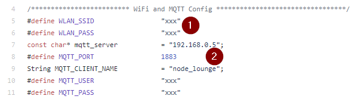

- Configure your WiFi settings
  - Enter in your WiFi name for `WLAN_SSID`
  - Enter in your WiFi password `WLAN_PASS`
- Configure your MQTT server settings
  - At the moment the code does not support `TLS`
  - Ensure that you change the `MQTT_CLIENT_NAME`

Once you have made the appropriate configuration changes for your home setup, upload the sketch to the ESP using the [Arduino software](https://www.arduino.cc/en/software) and you are good to go.

## The enclosure

> **Note**: This step is optional. Thingiverse files [here](https://www.thingiverse.com/thing:2542138)

Powering it off the battery was a lot simpler than using the 14v regulated power that comes into the main controller board of the gate, and less complex to hook up. The ESP8266 I have chosen requires 3.3v to operate and thus requires a buck converter to step down the 12-14v supplied by the gate's battery.

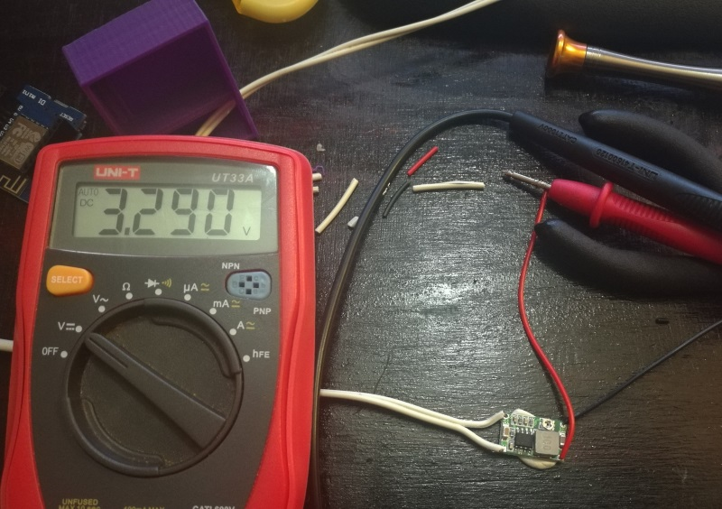

The print came out pretty good, and all the components fit pretty snugly too.

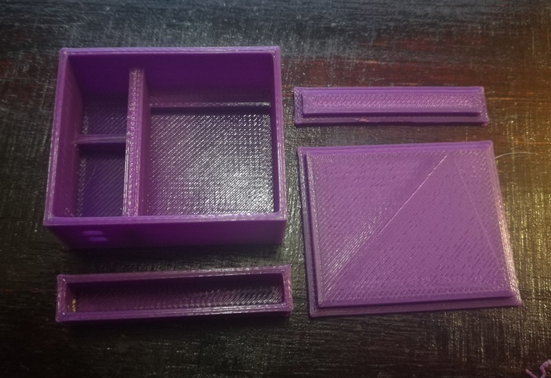

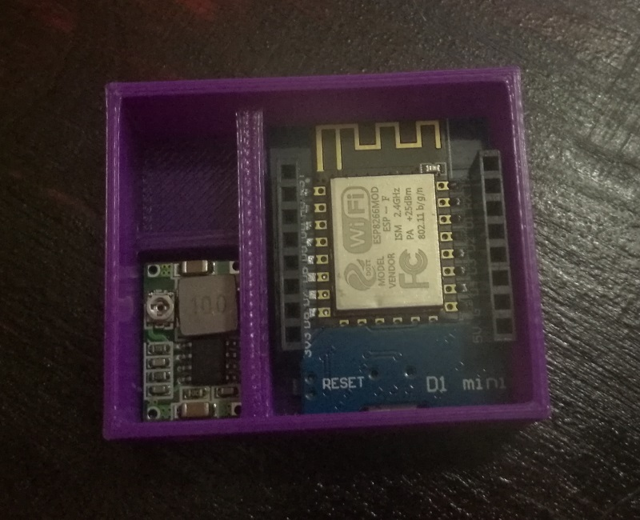

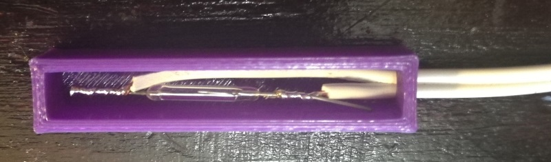

My wiring however, leaves a lot to be desired - and this was mainly due to the fact that I had soldered on the headers for the ESP8266 a while ago when working on another project. In the end I just broke off the one bit that was annoying me and soldered directly to the exposed pin :)

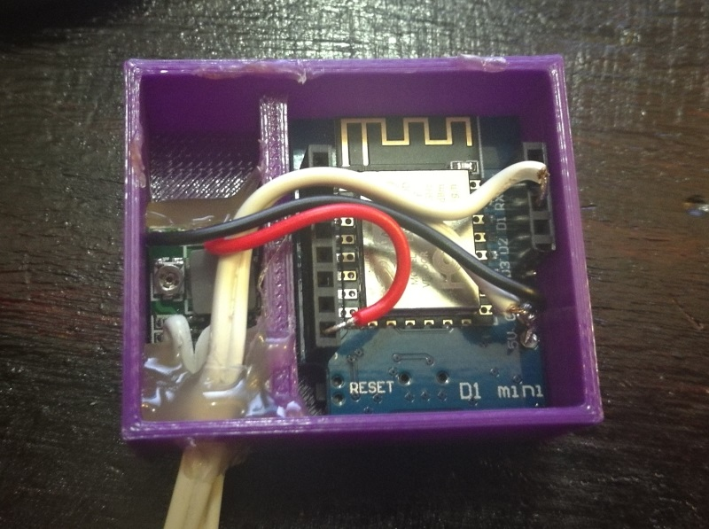

This is what the final product looked like when all closed up:

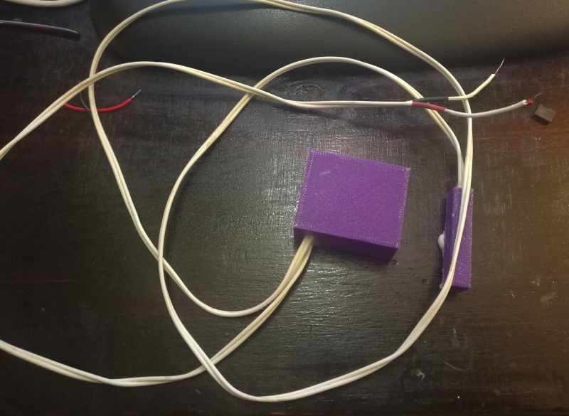

## The binary sensor

Once the sketch has been uploaded you can power up the ESP using an external power source (USB or power from a battery using the buck converter). Using a tool like [MQTTLens](https://chrome.google.com/webstore/detail/mqttlens/hemojaaeigabkbcookmlgmdigohjobjm?hl=en) subscribed to `security/reed_switch/#` you should see a couple of messages being published by the ESP during its startup phase. If you don't see these, try restarting the device, double checking your credentials (WiFi and MQTT) or re-uploading the code.

We will now create a new binary_sensor in my config/binary_sensors.yaml file as shown below:

```yaml
- platform: mqtt
  state_topic: "security/reed_switch/node_kitchen"
  name: "Kitchen Door"
  qos: 0
  payload_on: "OPEN"
  payload_off: "CLOSED"
  device_class: opening
```

If you have not done so, you will need to reference the config/binary_sensors.yamlfile in your main configuration.yaml file with the following statement:

```
binary_sensor: !include config/binary_sensors.yaml
```

After restarting Home Assistant we get our sensor showing up.

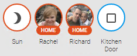

We can test that this sensor is working correctly by publishing an OPEN event on your devices channel.

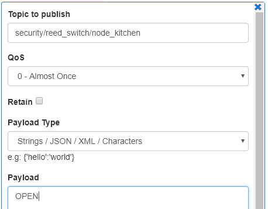

If you see the icon change to the open state everything is working as expected.

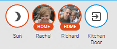

## Grouping it

I prefer having all my sensors appear as cards in Home Assistant, so I added the following group definition in my config/groups.yaml file:

```yaml
security_kitchen_group:
  name: Kitchen Security
  entities:
    - binary_sensor.kitchen_door
```

Restart Home Assistant...

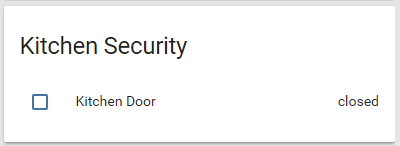

Then decided to create a new security view via the below view definition in my config/groups.yaml file:

```yaml
kitchen_view:
  name: Kitchen
  view: yes
  icon: mdi:food-fork-drink
  entities:
    - device_tracker.niemandr_hwnxt
    - device_tracker.niemandr_raesphone
    - group.security_kitchen_group
```

Another Home Assistant restart...

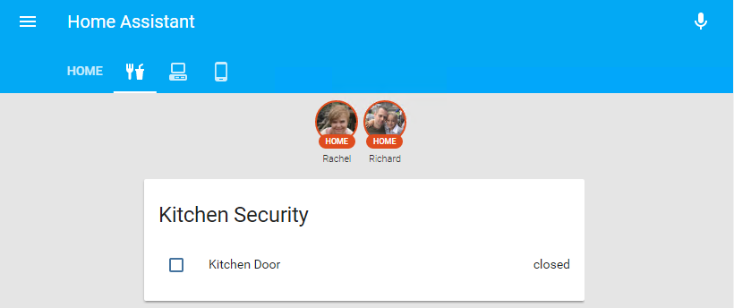

That's much better.

## Creating an alert

Next I would like to get an alert when the door opens or closes. I did this by adding in the following automation task in Home Assistant - in a new file called config/automation/kitchen_door_closed.yaml:

```yaml
alias: Kitchen Door Closed
trigger:
  platform: state
  entity_id: binary_sensor.kitchen_door
  to: "off"
  from: "on"
action:
  service: notify.pushbullet
  data:
    message: "Kitchen door is closed"
    title: "Kitchen Door"
```

> **Note** when using include_dir_list you need to have more than 1 file in the target directory - I tried using a single file and got all manner of errors from Home Assistant when loading my automation tasks\

I reference my automation tasks in Home Assistant using the below statement paying special attention to the warning above:

```yaml
automation: !include_dir_list config/automation/
```

Another restart of Home Assistant and my new automation tasks shows up.

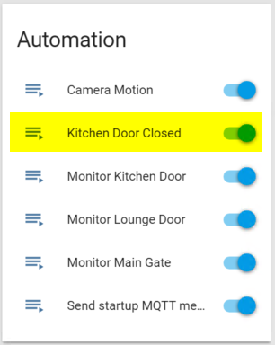

Sending the CLOSED state via MQTTLens results in an alert via pushbullet and a state change on the door entity.

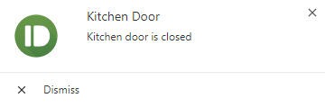

When I open the door the state is reset :)


Great success!

Hopefully you found this post interesting, please feel free to comment or ask any questions you may have below!
