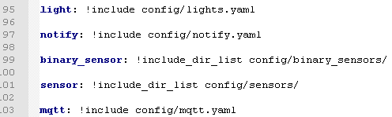
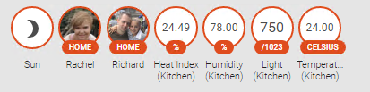
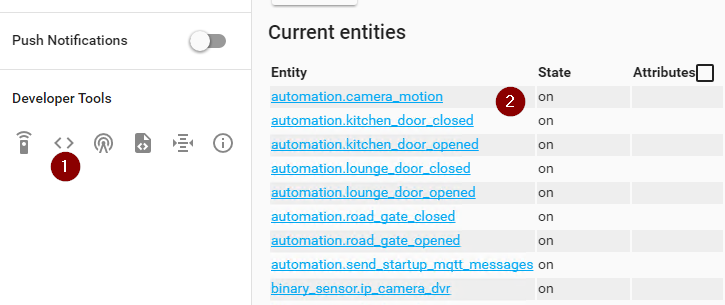
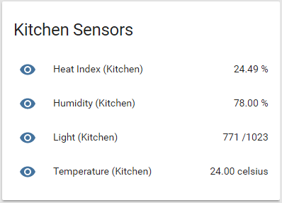
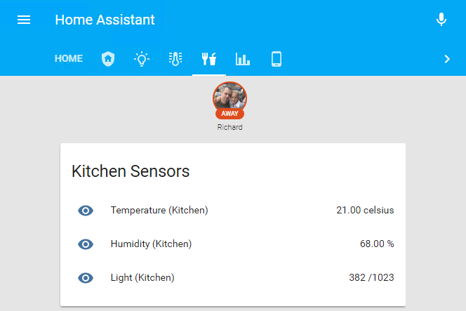
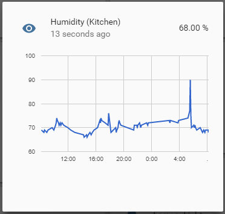

Today I will be looking at collecting and presenting temperature and humidity published by a couple of `DHT11 & ESP8266` microcontrollers around the house. The code used to generate the messages will be covered at a later stage, however to get up and running quickly in your home I would suggest making use of the [ESP Easy](https://www.letscontrolit.com/wiki/index.php/Main_Page) project as it's really simple to get up and running with.

You will need to ensure that you have configured Home Assistant to talk to your MQTT server ([look at step 2 in this post](/blog/2017/2017-09-13/post/)), your sensor has been deployed, and it's successfully publishing information to your MQTT broker. You will also need to know what topic the data is being published to (in my case this is `dht/temperature/xxx`) - if you are not too sure of the exact topic you can always make use of any [MQTT dumper](/blog/2017/2017-08-29/post/) application to log all messages passing through your broker.

## Configuring the sensors
We will be making use of the [MQTT sensor component](https://www.home-assistant.io/integrations/sensor.mqtt) provided with Home Assistant to collect our temperature and humidity data. In order to do this we will need to define a new sensor, point it to the correct topic and tell Home Assistant the unit of measurement to use when tracking this data.

I like to split out the configuration sections of Home Assistant into their own unique files (usually a single file per section), and include them back into the main configuration file via the `<section>: !include <path>` syntax as shown below:



In my case I will be adding the following lines into my `config/sensors.yaml` file:

```yaml
- platform: mqtt
  state_topic: "dht/temperature/node_kitchen"
  name: Temperature (Kitchen)
  qos: 0
  unit_of_measurement: celsius

- platform: mqtt
  state_topic: "dht/humidity/node_kitchen"
  name: Humidity (Kitchen)
  qos: 0
  unit_of_measurement: "%"

- platform: mqtt
  state_topic: "dht/heat_index/node_kitchen"
  name: Heat Index (Kitchen)
  qos: 0
  unit_of_measurement: "%"

- platform: mqtt
  state_topic: "misc/light_reading/node_kitchen"
  name: Light (Kitchen)
  qos: 0
  unit_of_measurement: "/1023"
```

As you can see from the above there is nothing too special going on with the configuration. I defined 4 new sensors (`temperature`, `humidity`, `heat_index` and `light_index`), all of them getting their data from the mqtt platform. I define a name and unit of measurement for each data source (this will help Home Assistant to graph the data and group similar sources together). Then lastly I defined a QOS (Quality Of Service) of 0 for each device (basically telling Home Assistant that I don't necessarily care if I miss some data - [more on QOS here](https://www.hivemq.com/blog/mqtt-essentials-part-6-mqtt-quality-of-service-levels/)).

After a quick restart of Home Assistant I can now see my new values being displayed at the top of my home view.



## Creating a group
I prefer to have this data being displayed as a card and not clutter up the top bar as it is currently doing. To do this I will need to make use of the group feature in Home Assistant. Groups are collections of entities that we can define and are used to display any sensory data that Home Assistant provides. Furthermore groups can be converted into views (which appear as tabs along the top bar) and help to create specific views that cater to a common theme or area of our home automation.

In order to create a group we will first need to know the entity ids/names that Home Assistant assigned to our new data sources. To get the entity_ids you will need to navigate to the state's (1) view and search for them in the list (2) returned.



In my case I will be grouping the following entities:

- sensor.heat_index_kitchen
- sensor.humidity_kitchen
- sensor.light_kitchen
- sensor.temperature_kitchen

In my config/groups.yaml file I declared a new group called sensors_kitchen_groupand added the discovered entities above into it:

```yaml
sensors_kitchen_group:
  name: Kitchen Sensors
  entities:
    - sensor.heat_index_kitchen
    - sensor.humidity_kitchen
    - sensor.light_kitchen
    - sensor.temperature_kitchen
```

After saving the file and restarting Home Assistant the new Kitchen group appears in Home Assistants navigation bar:



## Creating a view
As I mentioned above, views are just groups with a view: yes attribute assigned to them (and almost always an icon). Views are able to group together both entities and groups and makes them ideal to break up your now cluttered home dashboard into logical sections relating to a specific topic or area of your house. Seeing that my collected temperature information is being published by a node in my kitchen I would like to create a kitchen view to present this data, I define the view just like I would a group (also in the config/groups.yaml file) as shown below:

```yaml
kitchen_view:
  name: Kitchen
  view: yes
  icon: mdi:food-fork-drink
  entities:
    - device_tracker.niemandr_hwnxt
    - group.security_kitchen_group
    - group.sensors_kitchen_group
```

After restarting Home Assistant I can see a new tab next to the default Home tab using the `mdi:food-fork-drink` icon from [material design icons](https://materialdesignicons.com/) with the name Kitchen if hovered over. When opening the view we are now presented with only the data that we selected above - no more clutter!



After some time you will be able to graph the collected information (as shown below) to get an idea of how these values may change through the day.



This information can now be used in all manners of home automation with the only limit being your imagination. You may want to automate the air conditioner in your lounge to maintain an ideal temperature, or enable a fan in your dog's kennel should it get too hot inside, and so on.

I hope that you found this post interesting, and as always I welcome any comments or suggestions in the comments section below.
