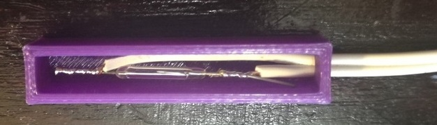
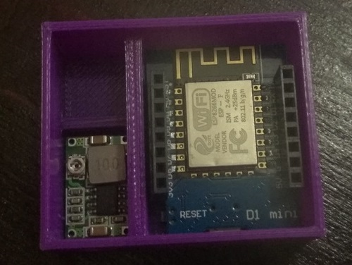
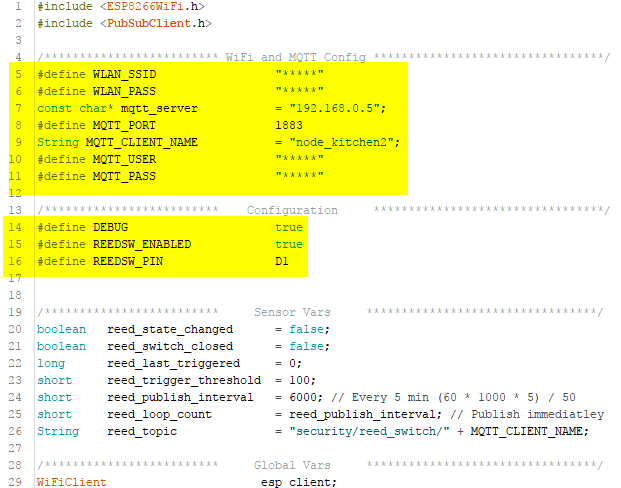
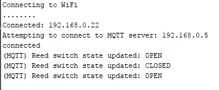
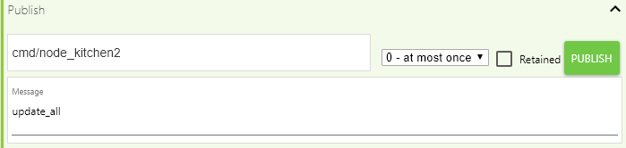
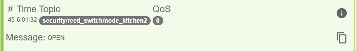
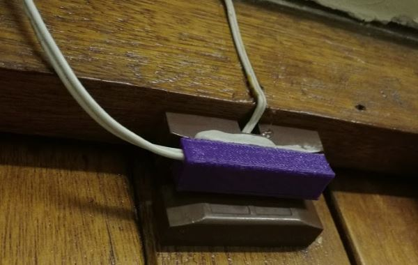
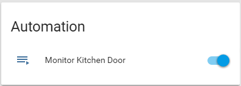
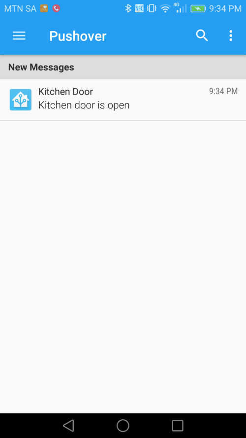
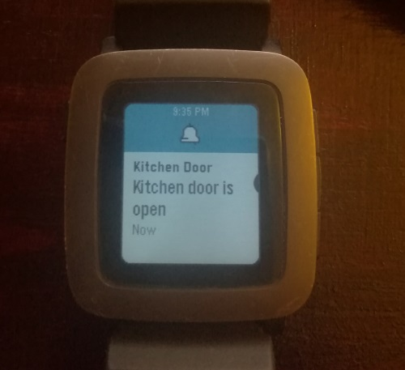

Today I would like to cover setting up alerts through Home Assistant when my kitchen door is opened. In the future this will be used with the built in presence detection offered by [Home Assistant](https://www.home-assistant.io/) to only allow these alerts through when I am not at home, or it's late at night. For now however, I am going to start off with the simplest part (the sensor and alerting).

## The Basic Concept

We are currently renting the house that we stay in so any modifications that I make need to be reversible once we leave. Thankfully we already have an alarm system installed which I am going to be piggy-backing off for this modification. In theory the idea is pretty straight forward:

I am going to be `3D printing` an enclosure for a [reed switch](https://en.wikipedia.org/wiki/Reed_switch) which will be stuck onto the existing home alarm contacts - this will allow me to make use of the already installed magnets for the alarm system.

I have posted the relevant model files on Thingiverse ([you can grab them here](https://www.thingiverse.com/thing:2542138)) should you want to print and use them yourself. At the time all I had access to was speaker wire so the enclosure is a lot bigger than I would have liked it to be, however I will be updating the design going forward once my 0.2mm wire arrives from China. The printed enclosure came out pretty well, and the reed switch fits nice and snugly.



Next up I designed a simple enclosure for a buck converter and an [ESP8266 D1 Mini](https://www.banggood.com/5pcs-D1-Mini-Lite-V1_0_0-WIFI-Internet-Of-Things-Development-Board-Based-ESP8285-1MB-FLASH-p-1295715.html?imageAb=2&p=5T250523689812015082&akmClientCountry=CA&cur_warehouse=CN) module to sit in. Once printed everything fits nice and neatly into the enclosure and is held in place by some spacers. I will need to modify the design a bit though as soldering so close to the walls of the box was a bit challenging.



Because of the small footprint of the box it can easily be placed anywhere (and secured with double sided tape or presstic). Powering the device is as simple as plugging in a 5v mini USB cable into the hole added to the side of the case.

## Code & Hardware Setup

In one of my [previous posts](/blog/2017/2017-09-19/post/) I created a [simple arduino sketch](https://github.com/rniemand/code-samples/tree/main/blog-posts/2017/Gate%20Alarm) to monitor our main gate, and with some minor tweaks to the code it will work perfectly for our application. You can grab the Arduino sketch [from here](https://github.com/rniemand/code-samples/tree/main/blog-posts/2017/Gate%20Alarm), and follow the below instructions to get it up and running on your Home Automation setup.

The only real changes required to the sketch is configuring the WiFi and MQTT Broker settings, this can be done by changing the values highlighted below in the sketch. In addition to the connection options you may want to play around with the DEBUG and REEDSW_PIN values to track down any issues you may run into with the sketch on your home network.



To upload the sketch simply use the [Arduino IDE](https://www.arduino.cc/en/software) with the relevant board selected, once uploaded (and with debugging enabled) you can open the Arduino serial monitor to confirm that the device was able to connect to your WiFi network.



The sketch will publish state changes for the reed switch on the `security/reed_switch/<node>` topic, and listen on the `cmd/<node>` topic for commands. At the moment there is only support for the `update_all` command.

> **Note**: The value of node will be derived from the MQTT_CLIENT_NAME property

To issue a test command to the device open up any MQTT client (in my case I am using [MQTTLens](https://chrome.google.com/webstore/detail/mqttlens/hemojaaeigabkbcookmlgmdigohjobjm?hl=en)) and send an `update_all` command to the client as shown below:



It should reply with the current state of the reed switch.



For installation of the switches I made use of [prestik](https://diy.bostik.com/en-ZA) to secure my reed switch on top of the existing one used for our home alarm system, but for a more permanent solution you may want to look at tapping into your home alarm control panel to make full use of all your sensors / [PIRs](https://en.wikipedia.org/wiki/Passive_infrared_sensor).



## Home Assistant Configuration

The Home Assistant portion of this setup is simple enough and can be accomplished with the following steps:

- Create an [MQTT Binary Sensor](https://www.home-assistant.io/integrations/binary_sensor.mqtt)
- Setup a notification channel (in my case [Pushover](https://www.home-assistant.io/integrations/pushover/))
- Create an [Automation rule](https://www.home-assistant.io/docs/automation/) to alert on state change

### MQTT Binary Sensor

When it comes to sensors in Home Assistant I prefer to create a file per sensor and include them using the below statement in my main configuration file `.homeassistant/configuration.yaml`:

```yaml
binary_sensor: !include_dir_list config/binary_sensors/
```

I created a new binary sensor file called `config\binary_sensors\reed_kitchen_door.yaml` which listens for changes over the `security/reed_switch/node_kitchen` topic as shown below:

```yaml
platform: mqtt
state_topic: "security/reed_switch/node_kitchen"
name: "Kitchen Door"
qos: 0
payload_on: "OPEN"
payload_off: "CLOSED"
device_class: opening
```

### Notifications

The notification channel is equally as simple, I created a new file called `config/notify.yaml` and entered in my current pushover configuration...

```yaml
- name: pushover
  platform: pushover
  api_key: ABCDEFGHJKLMNOPQRSTUVXYZ
  user_key: ABCDEFGHJKLMNOPQRSTUVXYZ
```

... and referenced this file in my main `configuration.yaml` with the below import statement:

```yaml
notify: !include config/notify.yaml
```

We now have a new notification channel called pushover to send messages over.

### Automation Rule

Lastly we need to set up an automation rule to fire off a notification each time the reed switch state changes from off to on. When this occurs we will push a notification over our pushover channel.

I created a new file called `config/automations.yaml` with the below rule:

```yaml
- alias: Monitor Kitchen Door
  trigger:
    platform: state
    entity_id: binary_sensor.kitchen_door
    to: "on"
    from: "off"
  action:
    service: notify.pushover
    data:
      message: "Kitchen door is open"
      title: "Kitchen Door"
      target: ""
```

This rule monitors the state of the reed switch and should its state change from off to on it will send a notification via the notify.pushover service.

After restarting Home Assistant we can now see our new automation rule.



## Testing it all out

The only thing left to do is to test it all out, there are 2 ways of doing this:

- **Simple** Open the door and wait for our alert
- **Hard** Fake the door state via a MQTT message

I went with the simple approach and just opened the door, almost immediately the door's state was reflected on its panel...


... and a couple of seconds later I received a push message on my phone...



... which is reflected on my Pebble also :)



It seems that everything is working as expected, and with minimal hardware / software changes I now know when someone opens my kitchen door. In the future I plan to expand this out to only notify me during certain times (or when I am not at home), but for now this will suffice.

I hope that you found this post helpful and as always I welcome any comments / feedback you may have below.
