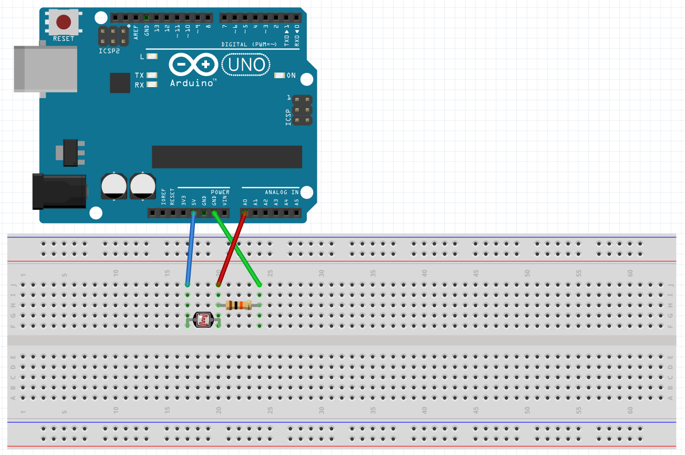
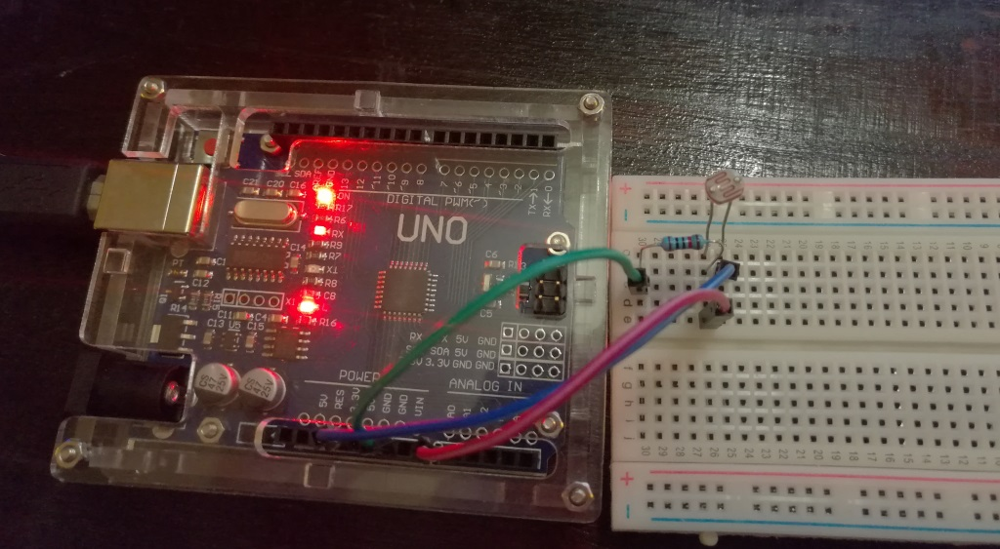
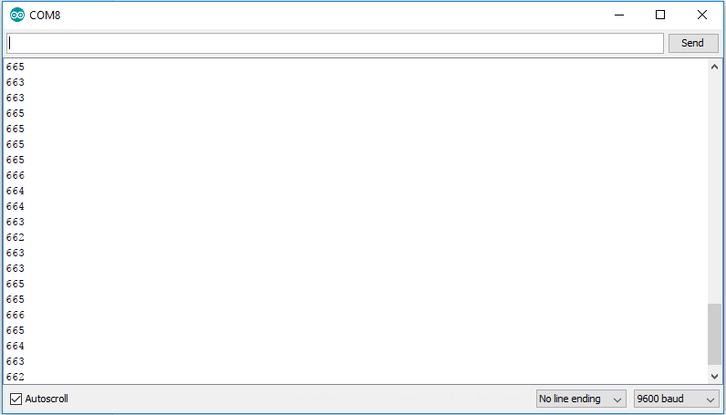

This is the first (in the hopes of many) Arduino Basics posts that I am planning to do. My goal today is to read the value from a [LDR](https://en.wikipedia.org/wiki/Photoresistor) and display its current value on the Arduino Serial Monitor.

To do this we will need the following components:

- Arduino module of your choice (I am using an [Arduino UNO](https://www.aliexpress.com/wholesale?SearchText=arduino+uno&site=glo&groupsort=1&SortType=total_tranpro_desc&initiative_id=SB_20171024222845&filterCat=400103,523,400401))
- Photoresistor ([LDR](https://www.banggood.com/20Pcs-5MM-Light-Dependent-Resistor-Photoresistor-GL5528-LDR-p-943459.html?p=5T250523689812015082&cur_warehouse=CN))
- Single 10k resistor
- Some jump wire
- A breadboard

## The Circuit
The wiring for the circuit is pretty straightforward and is shown below:



And in reality it looks something like this:



We need to connect one end of the LDR to A0 on the Arduino, with the other end pulled up to 5v. To reduce noise (incorrect readings) it is recommended to place a `10k` resistor from the `LDR` data pin (the one going to `A0`) and ground to [pull it down to ground](https://playground.arduino.cc/CommonTopics/PullUpDownResistor/).

## The Code
Below is the code for this project:

```cpp
#define LDRPIN    A0

void setup() {
  Serial.begin(9600);
  pinMode(LDRPIN, INPUT);
}

void loop() {
  Serial.println(analogRead(LDRPIN));
  delay(250);
}
```

Basically it does the following:

- Setus up Serial communication running at a baud rate of 9600
- Defined pin `A0` as an input pin
- Reads and prints out the current value of `A0` to the Serial connection
- Waits 250 ms before running the loop again

## Testing it out
Upload the code to your Arduino and fire up the Serial Monitor (`CTRL + Shift + M`) if all went well you should start receiving a data stream of the current value from the LDR:



That's all there is to it, I hope that you found this post useful and I welcome all comments / suggestions below.
