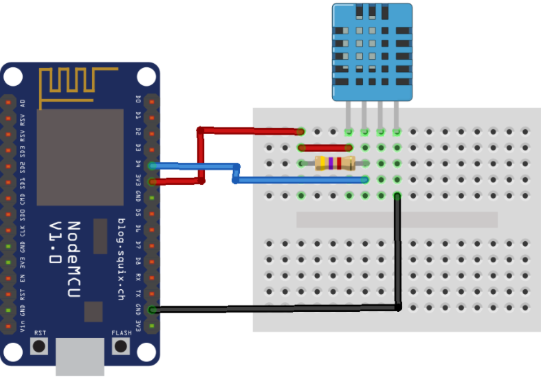
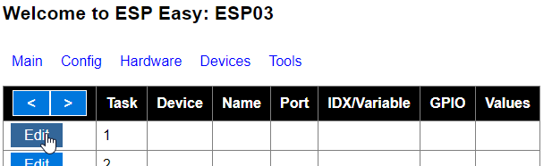
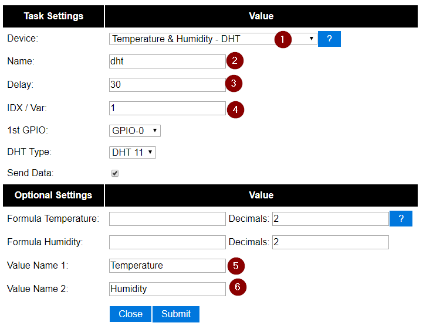
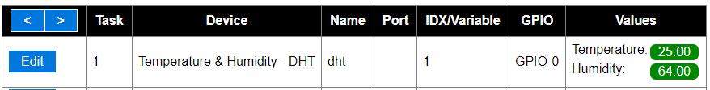
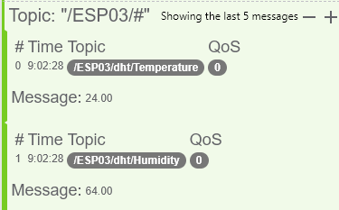
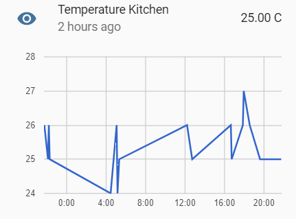

Today I would like to look into an awesome project called [ESPEasy](https://www.letscontrolit.com/wiki/index.php/ESPEasy) and how one may use it to publish temperature data collected via a `DHT11` or similar module.

As the name suggests `ESPEasy` aims to be a simple to use (and install) firmware to transform your ESP module into an easy multi-function sensor device for Home Automation solutions. Installation is straightforward and covered [in great detail here](https://www.letscontrolit.com/wiki/index.php/Basics:_Connecting_and_flashing_the_ESP8266).

For the rest of this post I am going to assume that you have successfully flashed your ESP with the latest build and have connected your device to your home network.

## Configuration

The first thing you will need to do is connect your `DHT sensor` to your ESP similar to the diagram shown below, taking note of the pin used for the data signal (in the case below that is `D4`).



Next, navigate to the devices screen and click the edit button on any free slot.



On the screen that appears next you will need to make the following changes:

- Select the type of device you would like to configure (in our case this will be the DHT module)
- Next you will need to name the device - this is the name that will appear on the MQTT feed generated by your ESP.
- Select a delay of how often you would like the ESP to publish the collected information (this value is in seconds)
- Select an ID for the device (this needs to be unique to all other configured devices on your ESP)
- Using the diagram at the bottom of this post - select the GPIO that your DHT device is connected to.

> If the IDX value is not set you ESP will not publish any data for the configured device (I learnt this the hard way).

- Choose the decimals (optionally the formula for publishing the collected data).
- Finally give the values a friendly name (this will form part of the topic when publishing over MQTT).



Click the submit button to save your changes, and if all went well you should start seeing the collected temperature data being displayed.



## Viewing Published Data

As mentioned above the values entered in when configuring your ESP and the DHT11 device are used to generate a unique MQTT Topic for publishing the collected temperature data.

You can use a tool like [MQTTLens](https://chrome.google.com/webstore/detail/mqttlens/hemojaaeigabkbcookmlgmdigohjobjm?hl=en) to spy on your generated topic, or if you are unsure of what it maybe you can spy on the # global topic. After a while you should see some information being published from your device (mine is every 30 seconds according to my configuration).



The published values are determined by the following formula `/%sysname%/%tskname%/%valname%`, so that becomes `/ESP03/dht/Temperature` and `/ESP03/dht/Humidity`. The formula can be configured globally on the ESP via the main configuration screen.

## HASS Integration

The last thing I would like to do is to display the collected temperature and humidity information in Home Assistant (HASS) for easy viewing and historical graphing. To do this I will need to create a couple of MQTT sensors in HASS with the following configuration:

```yaml
- platform: mqtt
  state_topic: "/ESP03/dht/Temperature"
  name: Temperature (Lounge)
  qos: 0
  unit_of_measurement: celsius

- platform: mqtt
  state_topic: "/ESP03/dht/Humidity"
  name: Humidity (Lounge)
  qos: 0
  unit_of_measurement: "%"
```

After a quick reboot (or reload of the core configuration) I am able to see the published information easily on my home screen...


... and after a while I can view all the collected data points over time.



## Diagrams

The below diagram shows you the most common pin mapping of 90% of the ESP8266 boards when using the ESPEasy firmware.


