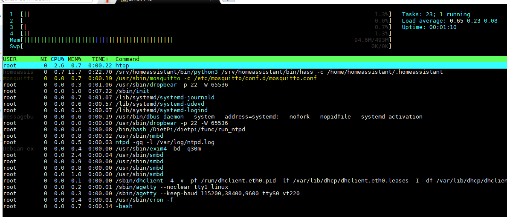
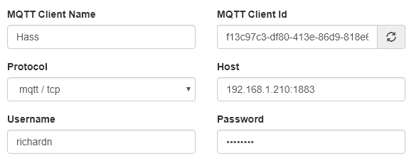
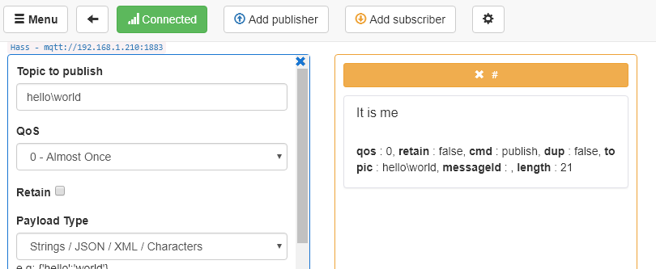

At the end of December last year my family and I immigrated to Canada (from South Africa) for a fresh start and to allow my wife to be closer to her family. We decided to only bring the essentials with us to make things easier and to reduce the cost of the immigration. Now that we are starting to find our feet I have decided to pick up where I left off with my endeavours into home automation and to start setting up [Home Assistant](https://www.home-assistant.io/) again, starting with my MQTT Broker of choice - [Mosquitto](https://mosquitto.org/).

To save on costs I decided to make use of an old Raspberry Pi I packed running the [DietPi OS](https://dietpi.com/) (lightweight version of Raspbian), as opposed to my original [Windows Server running Mosquitto](/blog/2017/2017-06-08/post/) I used to use. This post is just a quick high-level overview of how to get up and running with Mosquitto in under `10 minutes`, so let's dive in.

## Recommended Tools

To make things a lot easier I highly recommend the following tools for this tutorial:

- [MobaXterm](https://mobaxterm.mobatek.net/) - 100% better than [Putty](https://www.putty.org/) with some seriously advanced features
- [MQTTBox](https://apps.microsoft.com/store/detail/mqttbox/9NBLGGH55JZG?hl=en-us&gl=US) - Chrome MQTT client

## Install Mosquitto

Open up a ssh session to your Raspberry Pi and run the obligatory `apt-get update`.

```
sudo apt-get update
sudo apt-get -y upgrade
sudo apt-get -y install mosquitto
```

## Configuring Mosquitto

Once installed you will need to crate a `mosquitto.conf` configuration file:

```
sudo nano /etc/mosquitto/conf.d/mosquitto.conf
```

Add the following lines to your file, note I am going to be locking down my instance with a username / password, if you do not want this functionality be sure to comment out the `password_file` line and to set `allow_anonymous` to true.

```conf
# Config file for mosquitto
#
# See mosquitto.conf(5) for more information.

user mosquitto
max_queued_messages 200
message_size_limit 0
allow_zero_length_clientid true
allow_duplicate_messages false

listener 1883
autosave_interval 900
autosave_on_changes false
persistence true
persistence_file mosquitto.db

allow_anonymous false
password_file /etc/mosquitto/conf.d/passwd
```

## Disable auto-start (for now)

Just for the time being I am going to remove any potentially installed service for Mosquitto from my system (we will add it back later with more granular control). To remove any potential services you will need to run the following commands:

```
sudo systemctl stop mosquitto
sudo update-rc.d mosquitto remove
sudo rm /etc/init.d/mosquitto
```

## Create our Mosquitto service

Next let's create a `systemctl` compatible service for Mosquitto, to do this we will need to create a `mosquitto.service` by running...

```
sudo nano /etc/systemd/system/mosquitto.service
```

... and setting the files contents to the below (updating paths to match your preferred configuration).

```
[Unit]
Description=MQTT v3.1 message broker
After=network.target
Requires=network.target

[Service]
Type=simple
ExecStart=/usr/sbin/mosquitto -c /etc/mosquitto/conf.d/mosquitto.conf
Restart=always

[Install]
WantedBy=multi-user.target
```

## Create Mosquitto users

Adding a new user to Mosquitto is as simple as running ...

```
sudo mosquitto_passwd -c /etc/mosquitto/conf.d/passwd <username>
```

... making sure to replace `<username>` with your desired username.

This will prompt you for the password for the user and update the targeted passwd file (in my case `/etc/mosquitto/conf.d/passwd`) with the user / password.

## Re-Enable Mosquitto Service

Lastly we will need to re-enable the Mosquitto service by running the following commands:

```
sudo systemctl daemon-reload
sudo systemctl enable mosquitto
sudo systemctl start mosquitto.service
```

Should you have done everything right you will be able to connect to your broker!

Bonus: Mosquitto will automatically start when your Pi boots thanks to the mosquitto.service we created :)

## Adding more users

To add additional users to your Mosquitto broker you will need to run the following command:

```
sudo mosquitto_passwd /etc/mosquitto/conf.d/passwd <username>
```

> **NOTE**: I omitted the -c used earlier, if you fail to do this you are going to override your password file!

Once the user has been added you will need to restart your broker with the following command:

```
sudo systemctl restart mosquitto.service
```

## Screenshots

Here are a couple of screenshots of the various apps mentioned above.



Mosquitto is happily running after a restart.





My login credentials are working perfectly.

Good luck!
