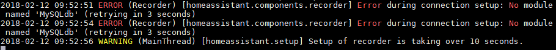
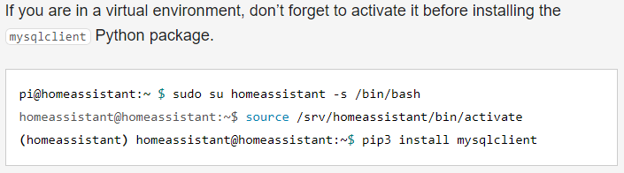
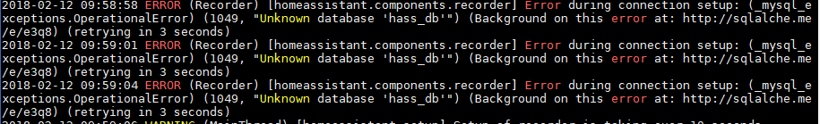
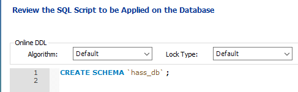
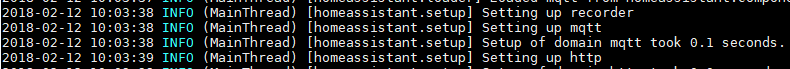
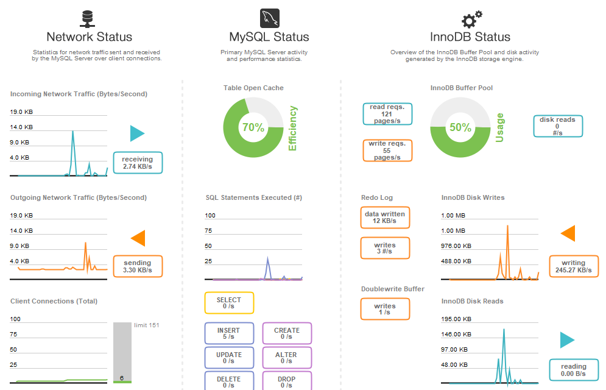
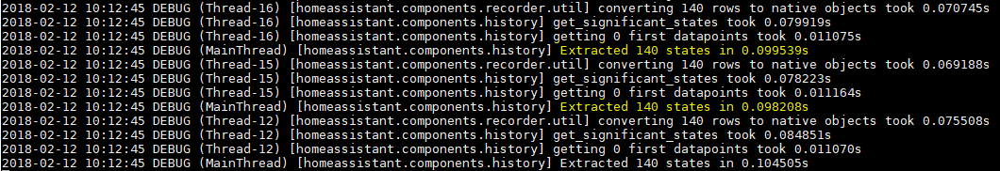
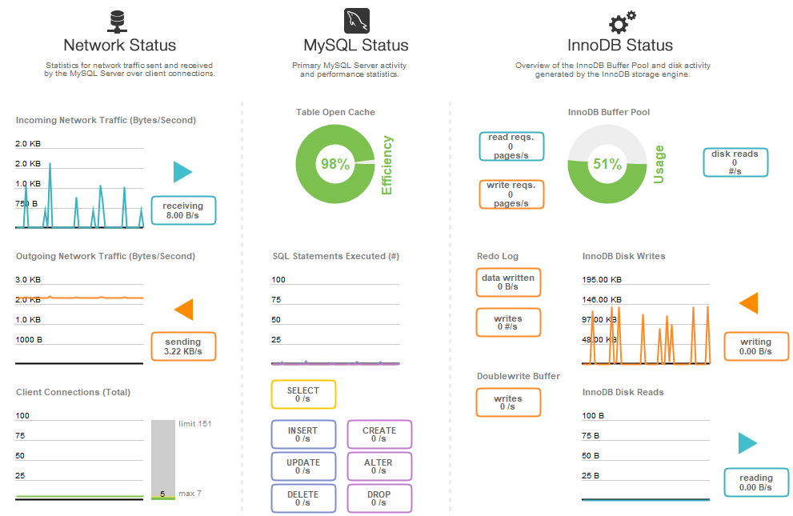
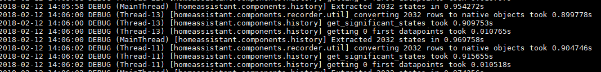
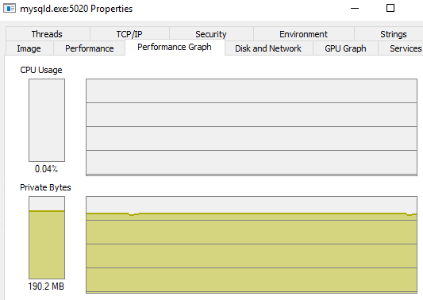

To get the best performance out of [Home Assistant](https://www.home-assistant.io/) I always like to make use of [MySQL](https://www.mysql.com/) as a data store hosted on another computer / device (connected via LAN). Previously I was running my entire Home Assistant setup on a Windows server, but since I moved to Canada I have made the jump to running it on an Orange Pi One and could not be happier.

I am running the latest build of [DietPi](https://dietpi.com/) on my server to get the most out of it, and have already got the latest version of HASS running on it (0.63.2 at the time of writing).

## Installing MySQL
The first thing you will need to do is install the MySQL Client via pip, initially I tried running the following command after logging into my Pi:

```
pip3 install mysqlclient
```

This resulted in a pretty confusing error:



After doing some digging around, and referring to the [recorder documents for HASS](https://www.home-assistant.io/integrations/recorder/) I finally caught on to my mistake, I was not running under the same user context that Home Assistant was installed under.

running under the same user context that Home Assistant was installed under.



> After following their commands, I was able to successfully install the mysqlclient package.
{: .prompt-info }

## Configuring Home Assistant
To configure Home Assistant to connect to your MySQL server you will need to add/modify the following line in your `configuration.yaml` file, be sure to replace the relevant placeholders.

```yaml
recorder:
  db_url: mysql://<user>:<pass>@<ip>/<db>
```

Also ensure that your targeted database exists on your MySQL instance...



You can easily create your database via [MySQL Workbench](https://dev.mysql.com/downloads/workbench/), or the below command.



After that, the Home Assistant should be good to go.



## Performance
As you would expect, the performance is much better right off the bat when using MySQL (you are starting fresh with no history). Using the built in analysis dashboard in MySQL Workbench you can see that my server is running well.



I am able to fetch 140 entries from the DB in less than 0.09 seconds.



After letting Home Assistant do its thing for a while I decided to run another check on the server performance, and was presently surprised to see that the efficiency increased dramatically over the course of the day.



Any retrieving 2032 entries is still coming in under 0.95 seconds!



The MySQL service on my host computer is also using < 200 Mb when running and less than 0.04 % of my CPU overall.



Compared to the default SQLite implementation, and given the choice I will always opt in to using MySQL when running Home Assistant for a large number of devices and automations.

## Enjoy
I hope that you found this post helpful and somewhat interesting, please feel free to leave any comments or suggestions below.
