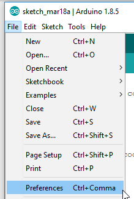
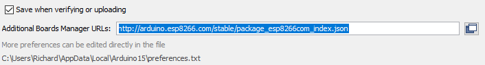
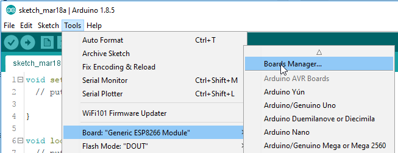
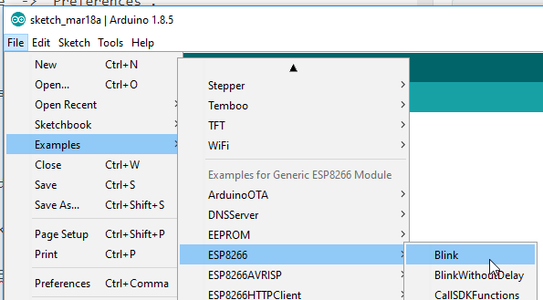

This is a quick reference post to get you up and running with an ESP8266 / ESP32using the Arduino IDE.

## Get Arduino
You can download the latest version of Arduino [here](https://www.arduino.cc/en/software), be sure to select the correct version of the IDE for your computer.

- https://www.arduino.cc/en/Main/Software

Once you have downloaded the IDE, install it as you would any other application.

## Add ESP8266 package Source
Open the Arduino IDE and navigate to `File` -> `Preferences`.

Locate the `Additional Board Manager URL's` section...

... and enter in the following `json` feed URL

- http://arduino.esp8266.com/stable/package_esp8266com_index.json

This is the latest package feed for the [ESP8266 project](https://github.com/esp8266/Arduino) (the micro-controller powering your Sonoff switch) and is required to flash the Tasmota firmware.

## Install the boards package
Next you will need to install the `ESP8266 boards package` which includes all the required files & tooling needed to compile and upload your sketches to your microcontroller.

To do this navigate to `Tools` -> `Board: xxx` -> `Boards Manager..` from the Arduino IDE's main menu.

Search for and install the `esp8266` boards from the ESP8266 Community, the download is approximately 200 Mb so it may take a while to complete depending on your internet connection.

## Blink
After you have installed the `ESP8266` boards you should now load up the obligatory Blink / Hello World tutorial from the newly installed board examples.

Ensure that your board settings are correct for your ESP - this can vary a lot depending on your development board, but thankfully there are a lot of pre-configured settings for all of the common ESP boards.

Finally hit the upload button and wait for the upload to finish. If your board is blinking the built in LED you are done, if not now would be a good time to do some troubleshooting. The most common issue in my experience with sketch uploading failing is due to some incorrect parameters for the board, here Google is your friend and should have you back up and running in no time!

Good luck, and happy coding!
