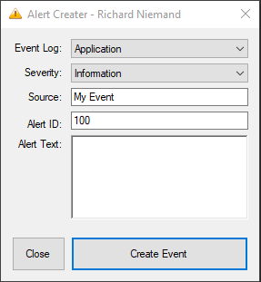
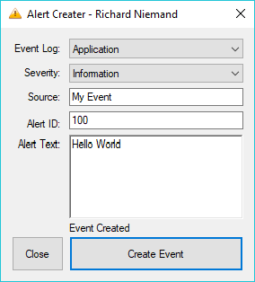
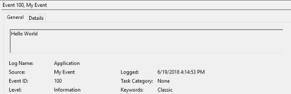

While migrating some of my blog posts over from my old blog to this one I stumbled upon a program I wrote in 2011 when I started learning C# (to give you an idea of the age of this guy, it was written in .net 2.0!).

With some nostalgia I opened the project in VS and ran it, to my surprise it worked with no issues.

While looking through the original source code I cringed at all the bad practices in play (and the nasty 4 space tabs!) - I decided it was high time to upgrade the project to run under .net 4.5, add some comments to the code, fix the poor naming conventions used and add it to source control.

I created the [following repository](https://github.com/rniemand/Alert-Maker) on GitHub should you want to mess around with the code a bit. I have also compiled the code and created a [v 1.0.0 release](https://github.com/rniemand/Alert-Maker/releases/tag/1.0.0) in case you don’t want to compile it.

## What does it do?
In a nutshell the Alert Maker application does just what its name says, it will allow the user to write a custom event log entry into a targeted Windows event log. This was useful to me at the time as I was developing custom management packs for SCOM 2007 R2 and I needed a quick way to trigger monitored events.

In addition to being able to write custom messages to an event log I had also added the ability to create your own event source to use when writing these entries (again this was needed for my management pack development).

## Usage
Usage is pretty simple, all you need to do is complete the “Form” by selecting \ filling in the information you wish the see in the targeted event log like so:

Once you are happy with the selected values, click the Create Event button to fire it off. Your event should land in the targeted log file under the desired source:

That’s pretty much all there is to it, hopefully you found this little trip down memory lane somewhat interesting, or at worst found a use for this application.

Feel free to fork the code and make any changes you want to it, I also accept pull requests :)
