This series of posts will cover setting up my Home Assistant setup from scratch back to, and beyond my old setup I was running back in South Africa. Our little family picked up and moved to Canada at the end of 2017 and recently purchased a property, now I have free reign to re-imagine my Home Automation setup from the ground up. Rather than me just doing it, I thought that it would be beneficial to document everything for someone just starting out and finding everything a bit overwhelming.

Please be sure to keep checking back on this post as I will be updating the list below with all future posts relating to this topic.

## The Posts
You can view the complete post listing [here](https://www.richardn.ca/series/#home-assistant-from-scratch-2018).

## Installation
This post will cover the bare bones installation of Home Assistant on a Raspberry Pi 3 using the Hass.io image. In addition to the installation I will cover the setup of some core plugins to ensure that you get the most out of your Home Assistant installation.

### Hardware
With my initial Home Assistant setup I was [running everything on Windows](https://www.richardn.ca/posts/RunningHomeAssistantAsAWindowsService/) which worked perfectly fine. However I have been wanting to test out [Hass.io](https://www.home-assistant.io/getting-started) as it offers a simpler way of managing your Home Assistant installation, updates and configuration.

My hardware consists of a [Raspberry Pi 3 - Model B](https://www.adafruit.com/product/3055) from [Adafruit](https://www.adafruit.com/) along with a reliable `16 GB class 10 micro SD card` to write the image to.

For a case I am using one of [my own designs](https://www.thingiverse.com/thing:2979595) as I am planning on mounting it on a pegboard along with all my other Single Board Computers (`SBC`), this way the cable management is a lot better and it keeps my desk free of additional clutter.

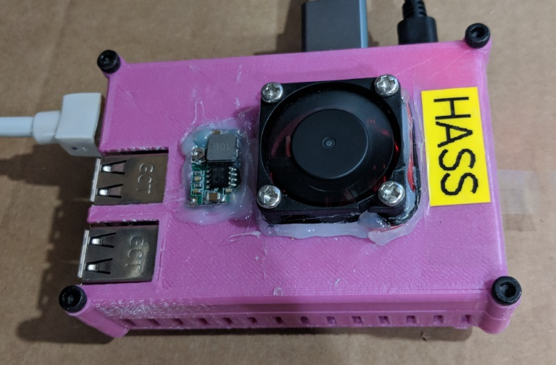

> **Note** Use a class 10 or above SD card for this installation, anything slower becomes unbearably noticeable in the long run.
{: .prompt-tip }

### Flashing the Software
For this installation I am going with [Hass.io](https://www.home-assistant.io/installation), which is an all in one image for your SBC and installation could not be simpler. All you need to do is burn the image to your SD card using an application like [Win32 Disk Imager](https://sourceforge.net/projects/win32diskimager/) or [Etcher](https://www.balena.io/etcher/) like so:

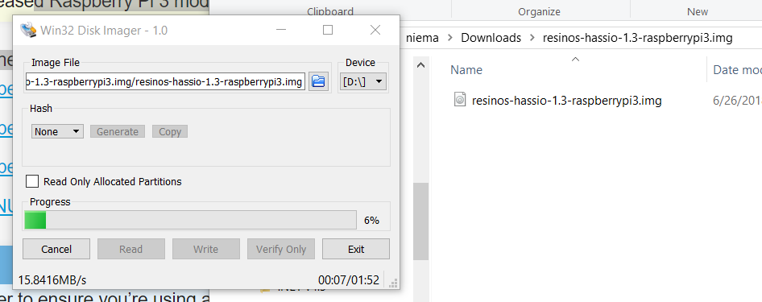

Ensure that the correct SD card is selected, then hit the Write button to burn the image.

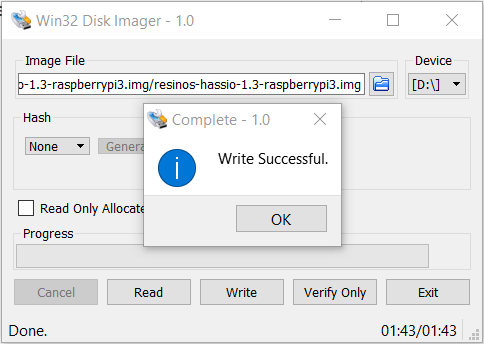

### First Boot
Once you have the Hass.io image on your SD card, insert it into your Raspberry Pi, connect a network cable (WiFi is not a great idea for HASS imho), screen and power cable to boot your Pi. You should see the following screen when Home Assistant is configuring itself. If you do not see this, it is possible that your image may have not been burnt correctly and you may need to try again.

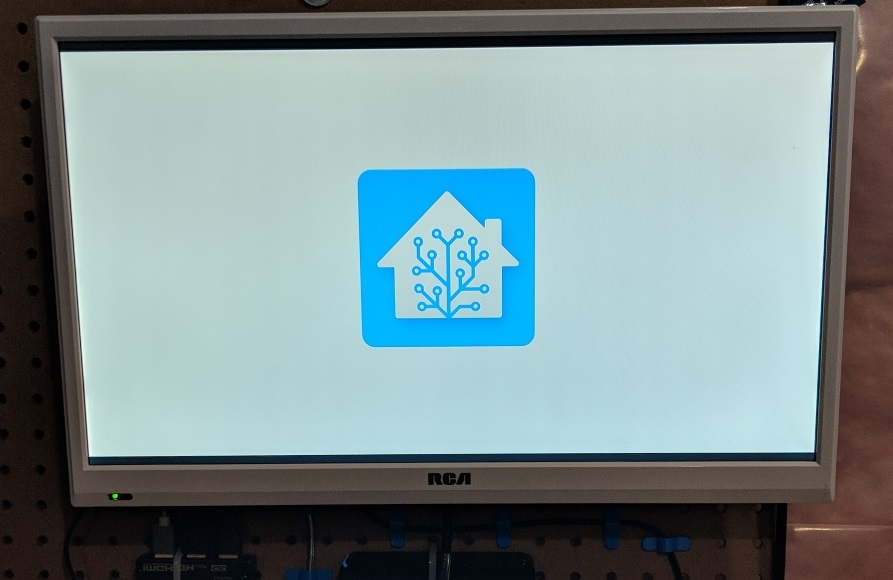

If you navigate over to http://hassio.local:8123 by default, or http://PI'S-IP-ADDRESS:8123 you should see the following welcome screen:

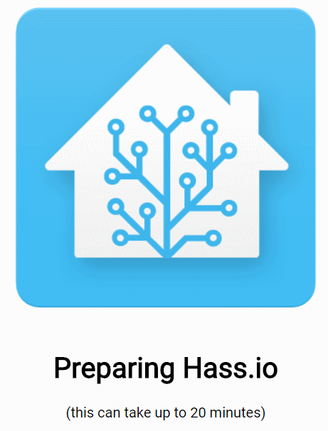

As stated above this can (and will) take a while to complete, initially I thought that my RasPi had frozen and rebooted it only to have to go through the whole waiting process again (be patient!). After about 20 min the browser should refresh and present you with a vanilla installation of Home Assistant.

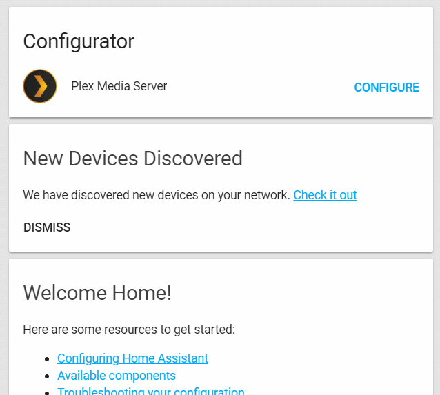

## Add-ons
Now that we have a functioning installation of Home Assistant, it's time to take advantage of the nifty features offered by Hass.io. The biggest draw for me is the ability to install add-ons which extend the functionality of your installation and allow for quick and easier configuration of common features you would have otherwise would have done manually.

For this installation I am going to start off with some of the more common plugins that most people will need right out of the box, these are namely:

- [Configurator](https://github.com/home-assistant/addons/blob/master/configurator/README.md) - Web-based editor to modify your files with syntax highlighting
- [SSH Server](https://github.com/home-assistant/addons/blob/master/ssh/README.md) - allows SSH access to your RasPi
- [Samba Share](https://github.com/home-assistant/addons/blob/master/samba/README.md) - allows Samba server to access hass.io folders

To install add-ons you will need to click the side menu button -> Hass.io -> Add-on store (Tab) to display a list of the currently available add-on's under the Community Hass.io Add-ons repository. You are free to add 3rd party repositories to get even more out of your installation, but for now I will stick with the defaults.

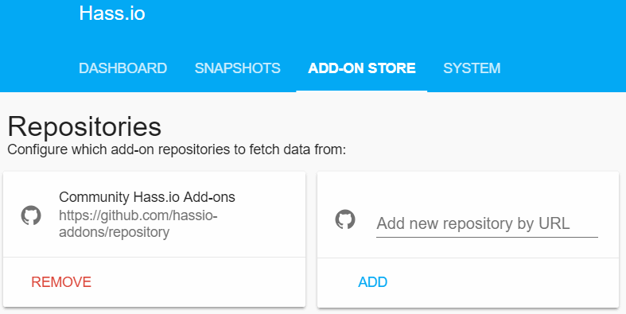

### Configurator
The Configurator add-on gives you the ability to edit your Home Assistant configuration files in your browser with no need to mess around with file shares. This is great when you want to make a quick change to Home Assistant.

Installation is straight forward, just click the install button and wait for the task to complete. Once installed you will need to set a desired username / password under the configuration section.

```json
{
  "username": "<username>",
  "password": "<password>",
}
```

In addition to setting up credentials for yourself you will also need to ensure that you white-list your home IP Range for access (if you do not do this you won't be able to access the web UI), again this is a setting under the configuration section.

```yaml
 "allowed_networks": [
    "10.0.0.0/16"
  ],
```

In my case I am allowing all IP Addresses in the 10.0.0.0/16 range.

Once that's done ensure that Start on boot and Auto update are enabled, then click Start to fire up Configurator.

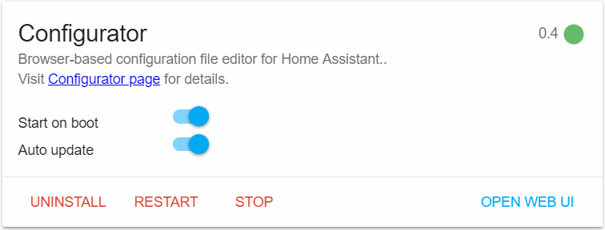

If all went well, clicking Open Web UI should launch a new browser tab, prompt you for your credentials and show you the editor.

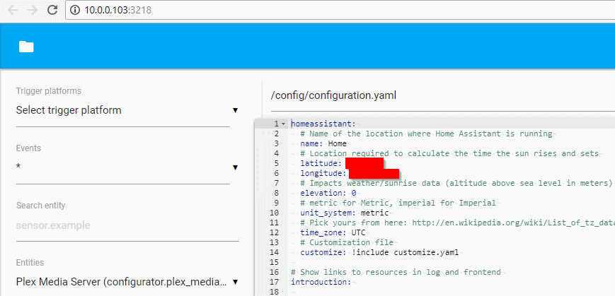

### SSH Server
By default SSH access is disabled on the Hass.io image, and this is where the SSH Server add-on comes in handy. This will install an [Open SSH](https://www.openssh.com/) server on your device and allow you to SSH into your SBC to make changes, install software or control Home Assistant via their command line tools.

Installation is as simple as selecting the add-on from the store. Once installed you will need to set a password via the Config section (remembering to save).

```json
{
  ...
  "password": "<password>"
}
```

Like we did with Configurator, ensure that Start on boot and Auto update are enabled, then click Start.

Using a tool like [Putty](https://www.putty.org/) or [MobaXterm](https://mobaxterm.mobatek.net/) attempt to connect to your RasPi (using its IP Address) and the root user account along with the password that you specified. If all goes well you should see the following welcome screen.

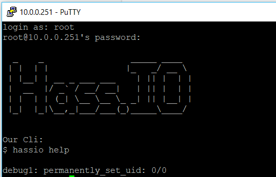

### Samba share
The last add-on that I want to cover for now is [Samba](https://github.com/home-assistant/addons/blob/master/samba/README.md), although it is not technically required when using Configurator it is extremely useful should you want to manually back up your files from your Windows computer. I normally use the backup feature of Hass.io along with a weekly manual backup of the generated files and using Samba makes it a lot easier for me.

Once you have installed Samba from the Add-on store we will need to make the following configuration changes under the Config section:

```json
{
  ...
  "username": "<username>",
  "password": "<password>"
}
```

Ensure that Start on boot and Auto update are enabled then start the add-on. Open an explorer window and navigate to your server's address, when prompted for credentials enter them in and enjoy!

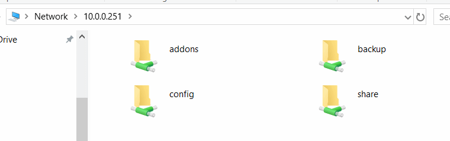

## Deployment
Once you are happy with the base setup of your Home Automation platform, it is time to move it off your desk into a more permanent location. For me this is on my pegboard along with a whole host of other devices (we will cover later on), and thanks to [my case](https://www.thingiverse.com/thing:2979595) it is "neatly" out of the way.

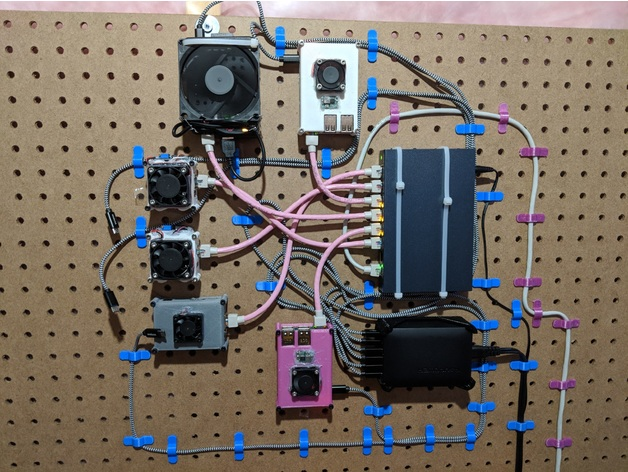

Although this was a long post we only scraped the surface of Home Assistant and have a long way to go before my setup is back to functioning normally. I plan to document every step of my setup no matter how small and trivial it may seem as if I can help out one person just starting out it will be all worth it.

Feel free to leave any comments / feedback / questions below and I will do my best to get to them.
