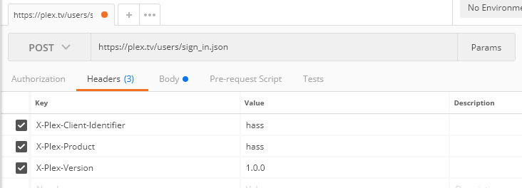
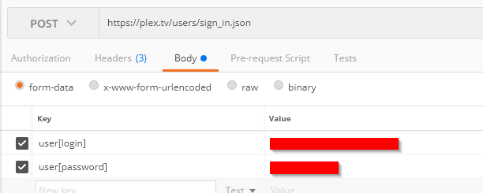
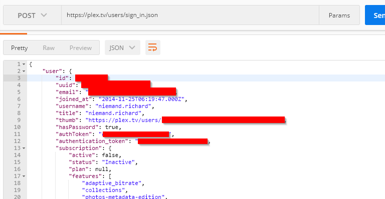
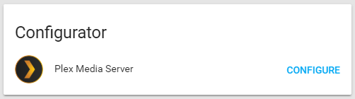
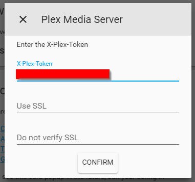
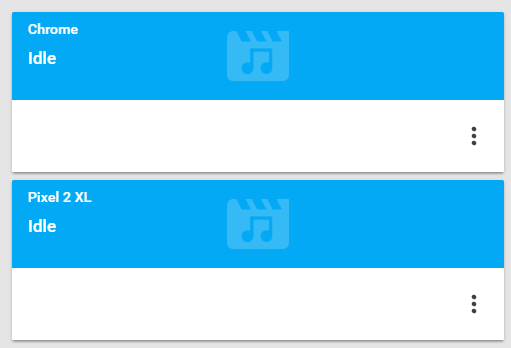
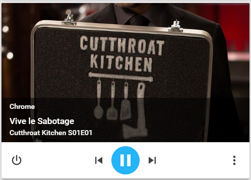
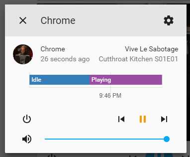
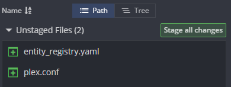

> This is one **[post in a series](/blog/2018/2018-06-27/)** of getting up and running with Home Assistant from scratch.

Today I would like to get [Plex](https://www.plex.tv/) configured and running in [Home Assistant](https://www.home-assistant.io/).

Thanks to all the hard work put in by the developers of Home Assistant this is a pretty trivial task on their side, with a little bit of leg work on ours to get a Plex token.

Before you begin you will need to make sure that you meet the following criteria.

- You have a working Home Assistant setup
- You have a [Plex Media Server](https://www.plex.tv/) (PMS) installed and running somewhere in your home.
- You have an [account with Plex](https://www.plex.tv/sign-up/) - we use this account to obtain a long-living token for Home Assistant to use
- [Postman](https://www.postman.com/) - used to obtain the Plex token

## Obtaining your Plex Token

The first thing we will need to do is get a long-lived Plex token for Home Assistant to use when making calls to your Plex Media Server. If you look at the [Plex Component](https://www.home-assistant.io/integrations/plex/) page you will see that they refer to [this method](https://support.plex.tv/articles/204059436-finding-an-authentication-token-x-plex-token/) to get a token, however this is a temporary token and will expire after some time - so this is of no use to us.

Let’s do that now, first we will need to open Postman and configure it as shown below:



```
Request Type: POST
URL: https://plex.tv/users/sign_in.json
Headers:
    X-Plex-Client-Identifier = hass
    X-Plex-Product:= hass
    X-Plex-Version = 1.0.0
Body:
    Content Type: form-data
    user[login] : <your_login_email>
    user[password] : <your password>
```



Click send to make the request. If you entered in everything correctly you should be greeted with a successful login:



In the response body you will see a property called `“authentication_token”` - this is what we want. Take note of the token as we will be using it in the next step.

## Adding Plex to Home Assistant

As mentioned above the Home Assistant side of things is way simpler, provided that your HASS server is on the same network as your Plex Media Server and discovery (GDM) is enabled in Plex (as far as I know this is the default setting).

When you navigate over to HASS you should see a card similar to the one below telling you that Home Assistant has found an instance of Plex running on its network.



Click the configure button, and enter in the token collected above into the appropriate field as shown below:



Click confirm, and you are done. After a few seconds you should see a new card per plex enabled device currently on your network:



Any device currently watching something on Plex should pop up as a card like so:



Now you have the option to play, pause, stop, skip and change the volume on the streaming device:



## Don’t commit personal files

Once Plex has been added to Home Assistant, and providing that you are following along with this series, a couple of new files should have been added to your Home Assistant directory, namely:

- `plex.conf` - configuration file that contains your Plex access token among other things
- `entity_registry.yaml` - device registry kept by Home Assistant to help identify devices and customise their display names (you can find out more about the entity registry here)



These files are required for Home Assistant to do its thing, but should not be made public if you are using GitHub to manage your configuration like I do. We will need to add these two files to the .gitignore file to prevent accidental publication of your Plex token and home entities information, this is as simple as adding the following lines to your .gitignore file:

```
Entity_registry\.yaml
plex\.conf
```

## Do a manual backup

Until we cover an automated backup flow for your personal files in Home Assistant, now would be a good time to do a manual backup of the following files to a safe location - just in case.

- entity_registry.yaml
- secrets.yaml
- plex.conf

This will allow you to quickly recover from accidental file deletion \ corrupt SD Card easily when paired with your public GitHub repository.

## Final Thoughts

We finally have something to look at on our Home Assistant deployment (besides the welcome and discovery cards), but this is just the beginning.

In the next few posts we will be adding more and more components to Home Assistant in preparation for a post covering Groups and Views, which is one of the most useful features in Home Assistant.

There is still a lot of theory to go over, but as this series progresses I am going to be moving to a more high-level approach to it all, only diving in deep for important \ crucial concepts, otherwise linking to the official Home Assistant documentation.

As always I welcome any feedback, comments and questions.
