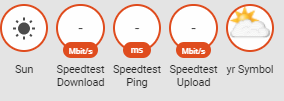

> This is one **[post in a series](https://www.richardn.ca/posts/HomeAssistantFromScratchInstallation/)** of getting up and running with Home Assistant from scratch.
{: .prompt-tip }

In preparation for an upcoming blog post on the recorder and history component we are going to need some historical data to work with. I would like to keep tabs on the performance of our internet connection using the [speedtest.net component](https://www.home-assistant.io/integrations/speedtestdotnet/), we will be doing this in the following steps:

- Add the Speedtest.net sensor to Home Assistant
- Create a group to display the measured values
- Trigger initial data collection through a service
- Customize our group

## Process
### Speedtest.net sensor
Looking at the speedtest sensor's documentation adding the sensor as a new platform under the sensor node. Once added there are a couple of options available on the conditions that you would like to monitor, in my case I am going to be collecting information about ping, download and upload speeds.

To do this we will need to add the following configuration to the `configuration.yaml` file:

```yaml
sensor:
  - platform: speedtest
    monitored_conditions:
      - ping
      - download
      - upload
    minute:
      - 0
      - 15
      - 30
      - 45
```

The above configuration will run a speed test every 15 min (0, 15, 30 and 45 past the hour), these counters will be stored via the recorder & history components.

After a quick configuration check and reload of Home Assistant we can see our new counters in the status area:



### Create a group
I would prefer to have these counters displayed as a card in Home Assistant rather than in the status area. To do this we can simply create a group, list the components that we would like to see in the group and reload the core components of Home Assistant.

To create our group we will first need the component id's of our new counters, you can get the id's through the states view under the developer tools.

We will define our group as below in the `groups.yaml` file:

```yaml
internet_speed:
  name: Internet Speed
  entities:
    - sensor.speedtest_download
    - sensor.speedtest_upload
    - sensor.speedtest_ping
```

After reloading the groups we are presented with the following:


### Triggering data collection
At the moment we don't have any data from Speedtest (as it only collects every 15 min) so we can trigger the collection manually to get our initial counters.

Most components in Home Assistant expose services which can be called either through code or via custom automation rules. Services can range from something as simple as getting \ setting a state on a component or running a complex command for the targeted entity.

You can easily see a list of all available services that you can call in Home Assistant through the services developer tool which is listed under the Developer tools section in the main menu.


The service we are interested in calling is the sensor.update_speedtest service, to do this select it from the drop down list and click the call service button to execute it.


Some services may require additional parameters to function correctly, if that is the case (as with the recorder component) the service will list all available parameters and a description for each one. Passing parameters to a service is as simple as creating a JSON object containing each parameter that you want to post as a property.


`{ "keep_days": 7, "repack": false }`

### Customizing our counters
Lastly I would like to do some basic customization of the collected counters, namely I would like to rename them and add a custom icon per value.

We can make these changes in the customize.yaml file by adding the following lines:

```yaml
sensor.speedtest_download:
  friendly_name: Download Speed
  icon: mdi:cloud-download

sensor.speedtest_upload:
  friendly_name: Upload Speed
  icon: mdi:cloud-upload

sensor.speedtest_ping:
  friendly_name: Ping
  icon: mdi:mixcloud
```

After a quick configuration validation and reloading of Home Assistants core components our counters look a lot better:


Clicking on any of the counters (after a while) will result in a graph containing the collected data - this data comes from the history component.


## Committing Changes
If you are using some form of source control, now would be a good time to commit your changes.

## Final thoughts
This was one of the last posts where I will dive into so much detail around simple configuration tasks in Home Assistant. I will elaborate any topics that require it, but for now please keep the following in mind:

- `configuration.yaml` - stores all configuration relating to adding new components and sensors to Home Assistant
- `customize.yaml` - allows the customization of all your entities (e.g. name, icons and visibility)
- `groups.yaml` - use to group entities together and create views
- `automations.yaml` - place where you create and store custom automation rules
- `secrest.yaml` - used to store sensitive data that you don't want to commit to your configuration repository (provided it's ignored via the .gitignore file).

I hope that you found this post helpful, and as always I welcome any comments, feedback and questions below.
