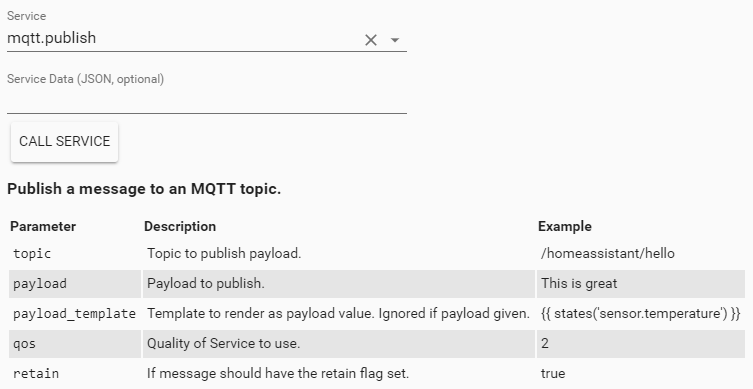
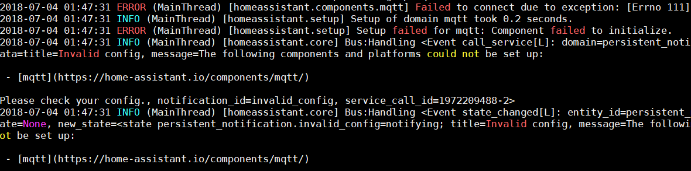

> This is one **[post in a series](/blog/2018/2018-06-27/)** of getting up and running with Home Assistant from scratch.

In this post we will be covering getting up and running with MQTT on Home Assistant - for the purposes of this post I will be working on the assumption that you have a local MQTT broker running on your home network. If you do not, you could always follow this post, or Google to find a tutorial for your OS.

## What it MQTT

MQTT stands for Message Queuing Telemetry Transport and was originally developed by IBM roughly in 1999 as a light-weight, light-overhead messaging protocol. Since its inception the protocol has been adopted and standardised into the MQTT we know it as now - (more here [http://mqtt.org/faq](https://mqtt.org/faq/)).

MQTT is basically a means of passing on messages from one device to another (or many) through a [Pub Sub pattern](https://en.wikipedia.org/wiki/Publish%E2%80%93subscribe_pattern) allowing connected clients to pick and choose the messages that they are interested in hearing about. All messages flow through a broker of some sort which is responsible for maintaining the state of all connected clients and ensuring delivery of messages between them. With the broker doing all the heavy lifting the client-side code is extremely lightweight making it an ideal candidate for connected devices (IoT).

MQTT supports secure communication through SSL, but in most home setups the non-secure method is preferred (unless you are exposing your broker to the internet) as it uses a bit more memory \ processing power to encrypt and decrypt the messages.

Another cool feature of the MQTT standard is the support for QOS levels on your messages ([read more here](https://www.hivemq.com/blog/mqtt-essentials-part-6-mqtt-quality-of-service-levels/)) which can range from a simple fire and forget message to guaranteed delivery of a message to the broker \ clients. This coupled with the ability to persist the last message in a topic is extremely useful in Home Automation as it allows you to ensure something important happens (e.g. locking your front door) but can ease up on the not so important things (like outside `temperature = 23*`).

The last feature offered by MQTT which is useful is the concept of birth messages and last will and testaments that a client is able to register when they first connect to the broker. The broker will send these messages on the client's behalf should it fail to check in (last will) or when they reconnect (birth). These messages are invaluable for Home Automation as it provides a simple form of heartbeat monitoring for connected clients.

## Adding MQTT

Adding MQTT to Home Assistant is as simple as following the steps outlined in the [MQTT documentation](https://www.home-assistant.io/integrations/mqtt/) - however I do suggest breaking up your changes to store your sensitive configuration (i.e. passwords, IP Addresses, etc.) in your `secrets.yaml` file and then referencing them in the main `configuration.yaml` file.

To add MQTT to our current setup we will need to add the following lines to our `secrets.yaml` file:

```yaml
mqtt_host: 10.0.0.104
mqtt_port: 1883
mqtt_user: hass
mqtt_pass: ...
```

... then register the mqtt component in configuration.yaml like so ...

```yaml
mqtt:
  broker: !secret mqtt_host
  port: !secret mqtt_port
  username: !secret mqtt_user
  password: !secret mqtt_pass
```

After validating your configuration you are good to restart Home Assistant so it can download the required modules for MQTT to run.

If everything went well you should be able to see \ call the mqtt.publish service:



## Troubleshooting

Should you run into trouble setting up MQTT, or do not see the mqtt.publish service above I would highly suggest looking at your Home Assistant log file for clues. Initially I had originally entered the incorrect MQTT broker port, and was alerted to it through the following error message.



> You are able to configure the default logging level used in Home Assistant through the logger component, my setup is normally configured as so ...

```yaml
logger:
  default: debug
```

... however you can set the logging level at a component level by simply including it’s namespace along with the logging level under the logger component. Let’s use the following message as an example:

```
2018-07-16 20:52:30 DEBUG (MainThread) [homeassistant.components.websocket_api] error message
```

We would use this as our new configuration to only show warnings from the websockets API.

```
logger:
  default: debug
  homeassistant.components.websocket_api: warning
```

After a quick reloading of the core components your new log entries should start appearing.

## In Closing

I hope that you found this post both informative and helpful, and I am always open to any feedback that will help me produce better quality content. MQTT will open up a lot of doors when it comes to Home Automation (especially on the custom side of things) and will become invaluable as we start to expand the functionality of our home setup.
