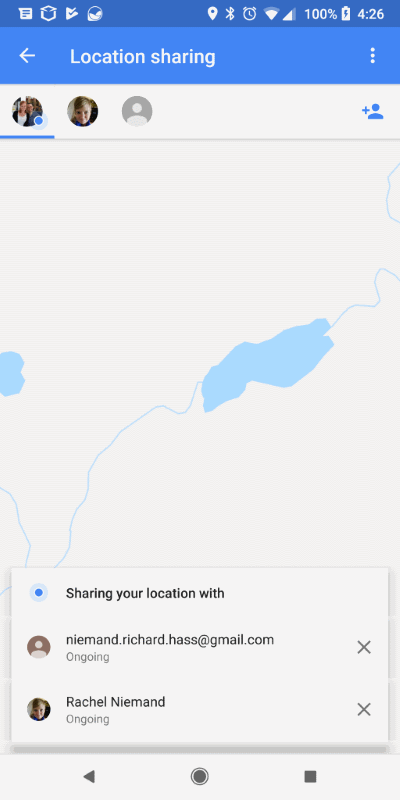
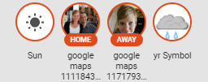
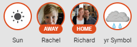
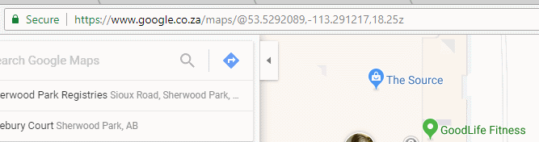
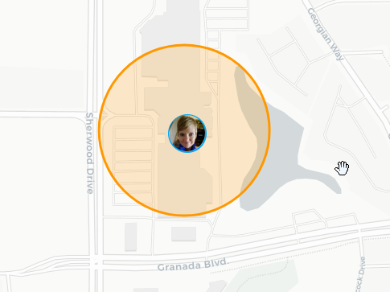
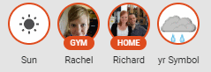
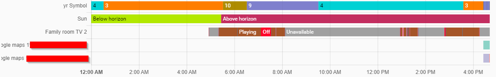
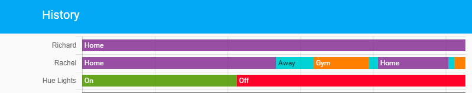

> This is one **[post in a series](/blog/2018/2018-06-27/)** of getting up and running with Home Assistant from scratch.

Today we are going to make our Home Assistant deployment a bit smarter by adding in presence detection. For this I am going to be making use of the [Google Maps Location Sharing](https://www.home-assistant.io/integrations/google_maps/) component as I find it to be more reliable than my old self-hosted OwnTracks instance, and both my wife's phone and mine already have Google Maps installed with location sharing enabled (so there is no need to install another application on Rae's phone).

## Core Configuration

Below are the steps required to get up and running with the Google Maps Location Sharing component.

> **Note**: I strongly recommend creating a new Google account to be used with Home Assistant for this, mainly due to the fact that you will need to share your location with it.

### Google Account Configuration

You will also need to enable [less secure application sign in](https://myaccount.google.com/lesssecureapps?pli=1&rapt=AEjHL4PmYNJjr7LhnWj_lt7RNWbWlRF2t9o63ABWOnZ4_hKtad_9LXD3C0v9ie3V7MeagABgpmi8r_v91ZUSqz64rMhfEoO86A) for the new account, along with approving the login on the [device activity](https://myaccount.google.com/device-activity) overview page after your initial spin up of Home Assistant with Google Maps location sharing enabled.

I noticed when I initially created the account it took a day or so before HASS was able to log into the new account properly to retrieve our device location. I would suggest creating the account, following the steps below and giving it a day or so for your settings to take effect.

Once your account is created, open up Google Maps on your phone, enable location sharing and share your location with your new account - be sure to share your location as ongoing.



### HASS Configuration

Enabling Google Maps Location Sharing in Home Assistant (HASS) is as simple as adding the following 2 lines into your secrets.yaml file...

```yaml
google_user: xxx@gmail.com
google_pass: dddd
```

... the below into your `configuration.yaml` file ...

```yaml
device_tracker:
  - platform: google_maps
    username: !secret google_user
    password: !secret google_pass
```

... validating your configuration and restarting Home Assistant, when Home Assistant comes back up you should see all people sharing their location with your new Google account as shown below.



### known_devices.yaml

Home Assistant will generate a new file called `known_devices.yaml` (if there isn't already one) which it uses to store information about discovered devices. The contents of the file should look something like this:

```yaml
google_maps_<random_uuid>:
  hide_if_away: false
  icon:
  mac:
  name: <random_uuid>
  picture: https://l.../photo.jpg
  track: true
```

This file (`known_devices.yaml`) is specific to your Home Assistant setup and should not be committed to source control, it is safe to add to your .gitignore file.

If you wish to change the display names for your tracked users, this is the file to do it in, simply enter in the desired name for the user into the name property, reload Home Assistant and voila.



## Zones

Home Assistant allows us to configure custom zones through the [zone component](https://www.home-assistant.io/integrations/zone/).

> Zones allow you to specify certain regions on earth. When a device tracker sees a device to be within a zone, the state will take the name from the zone. Zones can also be used as a trigger or condition inside automation setups.

Let's see this in action by defining a Gym zone to see how active I am (spoiler - not very).

### Creating a Gym zone

First thing you will need in order to define a zone is the longitude and latitude coordinates for your desired zone. I find the best way to get these values is by finding the desired area on Google Maps and extracting the values from the URL.



`https://www.google.co.za/maps/@53.5292089,-113.291217,18.25z`

So my latitude should be 53.5292089 and longitude should be -113.291217 - give or take. I can now create my custom zone in the configuration.yaml file like so:

```yaml
zone:
  - name: Gym
    latitude: 53.5301052
    longitude: -113.2932228
    radius: 150
    icon: mdi:dumbbell
```

After validating my configuration and restarting Home Assistant the gym popped up on the map and Rae's location was updated to reflect the new name.





You can repeat this process as many times as you need, just make sure to follow the examples on the zone components page when defining more than one zone.

## History

The last bit of customization I would like to do today would be to address the names that appear in the history view for our devices.



To do this, simply add in the below configuration for each device you want to rename into your customization.yaml file ...

```yaml
device_tracker.google_maps_<guid>:
  friendly_name: Richard
```

... validate configuration, and restart Home Assistant.

Initially this change did not work for me and the devices kept their auto generated names, however the next day the changes took effect.



I suspect that this has something to do with the way history is recorded in the DB, but don't be discouraged if your change doesn't show up immediately either.

## In Closing

As always I hope that you found this post interesting and welcome all comments, questions and feedback.
