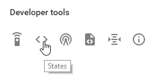
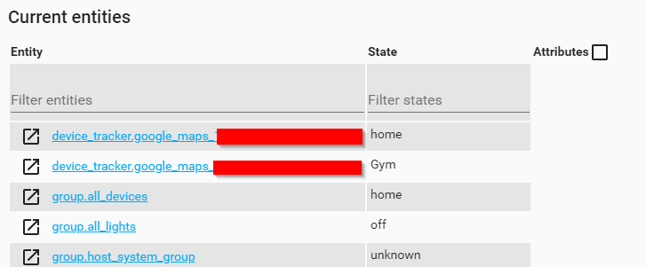
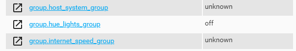
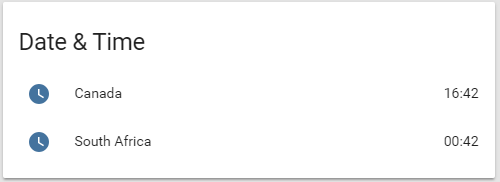
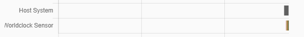
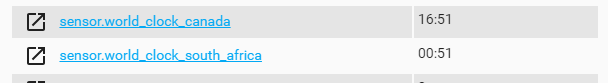
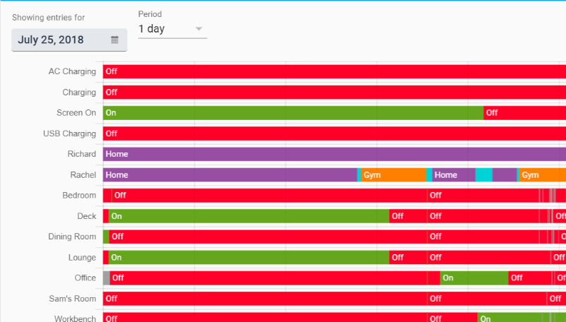

> This is one **[post in a series](https://www.richardn.ca/posts/HomeAssistantFromScratchInstallation/)** of getting up and running with Home Assistant from scratch.
{: .prompt-tip }

Today I would like to cover the History component of Home Assistant, and show you how to ignore certain entities or domains altogether through it.

## New Terminology
In this post I will be talking about `entities` and `domains` in Home Assistant, these are relatively simple terms which you are familiar with already, albeit you didn't know the proper names for them.

### Entities
An entity in Home Assistant is anything that you can interact with, for example one of the [Philips Hue lights we added in an earlier post](https://www.richardn.ca/posts/HomeAssistantFromScratchHue/). All objects in Home Assistant inherit from the [entity base class](https://github.com/home-assistant/core/blob/dev/homeassistant/helpers/entity.py), and can be seen in the states section of the developer tools.





It is these names (I like to think of them as the entity's fully qualified name) that we use to configure certain aspects of Home Assistant - like creating groups, views or automatons. A fully qualified name of an entity follows the `<domain>.<entity_id>` naming convention.

### Domains
Entities are grouped together into collections known as `domains` in Home Assistant, making them easier to manage, and helps provide some insight into what a particular entity does (e.g. deck is less helpful when compared to `light.deck`).

Again we have already seen domains in action when creating the custom light group back in [this post](https://www.richardn.ca/posts/HomeAssistantFromScratchHue/), with the groups we created again being added to the group domain.



This concept is useful in Home Assistant (as you will see later) as it allows you to exclude / include a dynamic collection of entities rather than listing them one at a time.

## World Clock Sensor
I am going to add the [world clock sensor](https://www.home-assistant.io/integrations/worldclock/) to Home Assistant to allow me to keep tabs on the time in Canada and South Africa. We do this by adding the following lines to the configuration.yaml file ...

```yaml
sensor:
  - platform: worldclock
    time_zone: Canada/Mountain
    name: World Clock Canada

  - platform: worldclock
    time_zone: Africa/Johannesburg
    name: World Clock South Africa
```

... and grouping them like so:

```yaml
time_group:
  name: Date & Time
  entities:
    - sensor.world_clock_canada
    - sensor.world_clock_south_africa
```

This will result in the following new panel on your Home Assistant dashboard.



## History Component
The [history component](https://www.home-assistant.io/integrations/history/) will track everything that is going on within Home Assistant and allows the user to browse through it. It depends on the [recorder component](https://www.home-assistant.io/integrations/recorder/) for storing the data and uses the same database setting.

As you can see the history component is great as it allows us to query the state of any component in Home Assistant from the past, what is not so great is the fact that every component in Home Assistant is tracked automatically, including every state change. For something that changes as often as a clock, or for entities we don't care about, this is a waste of storage and can slow down your database (depending on where it is hosted).



We are already getting data stored in history for our clock, let's stop that!

### Ignoring a specific entity
Unfortunately for me the world clock sensor is part of the `sensor's` domain so we cannot exclude it by the domain name - if we were to do this we would lose all sensor information, what we need to do in this case is exclude our clocks by `entity` name.



To exclude an entity from the history component is as simple as adding it to the exclusion list like shown in the documentation:

```yaml
history:
  exclude:
    entities:
      - sensor.world_clock_canada
      - sensor.world_clock_south_africa
```

After validating your configuration to ensure that you didn't make any typos, restart Home Assistant for the changes to take effect. If done correctly you will no longer have any new history entries being recorded for your world_clockcomponents.

> **Note**: You will need to wait a day or so for the data to be removed from the history view, this is because we stopped new data from being recorded and did not delete the recorded data from the DB.
{: .prompt-info }

### Ignoring a domain
In some cases you may not want to collect history for a group of entities in Home Assistant, for me this is all items in the group domain. As mentioned earlier domains are the leading bit in an entity name (e.g. `mediaplayer.loungespeaker` - the domain is `media_player`), you can get an idea of all the domains you are using through the States View.

Like with single entities, you can exclude a domain through the exclude option on the history component, so in my case I can exclude all groups with the following configuration:

```yaml
history:
  exclude:
    domains:
      - group
```

After a quick validation of my configuration, a restart of Home Assistant (and some time for the history to roll over to the next day) - I no longer have any group history :)



## In Closing
As always, I hope that you found this post interesting and helpful. I am always looking for any feedback, comments or suggestions to help provide better content.
