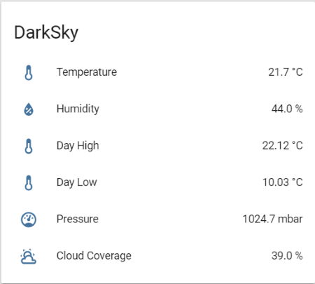

> This is one **[post in a series](/blog/2018/2018-06-27/post/)** of getting up and running with Home Assistant from scratch.

Today I am adding in two new sensors which will be used in some upcoming automation rules in Home Assistant, namely:

- [Dark Sky](https://www.home-assistant.io/integrations/darksky/) - weather information
- [System Monitor](https://www.home-assistant.io/integrations/systemmonitor/) - host computer performance counters

Seeing that we have already done a lot of work with sensors and basic configuration in Home Assistant I am just going to list the configuration I used, along with the relevant configuration commits on GitHub. If you would like more information on why things are done a certain way feel free to [browse all the posts](/series/) leading up to this one.

## Dark Sky

Dark Sky is a weather data provider with a free API (based on usage). It integrates well into Home Assistant, and unless otherwise configured will use your default coordinates to fetch local weather data.

You will need a developer account to use the sensor, with the registration process being quick and easy to follow, once you have a key you are good to go.

### Configuring Dark Sky

First, add your API key to `secrets.yaml` like so:

```yaml
darksky_api: xxx
```

Next, create a new sensor as shown below in the `configuration.yaml` file (feel free to swap out any monitored conditions you want):

```yaml
sensor:
  - platform: darksky
    api_key: !secret darksky_api
    name: DarkSky
    monitored_conditions:
      - temperature
      - cloud_cover
      - humidity
      - pressure
      - temperature_high
      - temperature_low
```

Next, let's create a group (`groups.yaml`) to display the data nicely on a card - note you will need to restart Home Assistant to get the entity names if you are using different conditions:

```yaml
darksky_group:
  name: DarkSky
  entities:
    - sensor.darksky_temperature
    - sensor.darksky_humidity
    - sensor.darksky_daytime_high_temperature
    - sensor.darksky_overnight_low_temperature
    - sensor.darksky_pressure
    - sensor.darksky_cloud_coverage
```

Finally, we can "pretty up" the display names and icons via `customize.yaml`:

```yaml
sensor.darksky_cloud_coverage:
  friendly_name: "Cloud Coverage"
sensor.darksky_daytime_high_temperature:
  friendly_name: "Day High"
sensor.darksky_humidity:
  friendly_name: "Humidity"
sensor.darksky_overnight_low_temperature:
  friendly_name: "Day Low"
sensor.darksky_pressure:
  friendly_name: "Pressure"
sensor.darksky_temperature:
  friendly_name: "Temperature"
```

After verifying your configuration and reloading Home Assistant you should have a Dark Sky card like so:



## System Monitor

[System Monitor](https://www.home-assistant.io/integrations/systemmonitor/) allows you to collect performance counters from your host computer (regardless of the platform).

There are a lot of good code examples on the documentation page for most OS's - in my case I am running Home Assistant on linux (Raspberry Pi to be more precise) so depending on what you are using, your configuration may look a little bit different.

### Configuring System Monitor

First we will need to define the sensor in configuration.yaml like so:

```yaml
sensor:
  - platform: systemmonitor
    resources:
      - type: disk_use_percent
        arg: /config
      - type: memory_use_percent
      - type: load_1m
      - type: network_in
        arg: eth0
      - type: network_out
        arg: eth0
      - type: processor_use
      - type: last_boot
```

Then, we will need to group the counters (groups.yaml) so that they show up nicely on a card:

```yaml
host_system_group:
  name: Host System
  entities:
    - sensor.disk_use_percent_config
    - sensor.last_boot
    - sensor.load_1m
    - sensor.memory_use_percent
    - sensor.network_in_eth0
    - sensor.network_out_eth0
    - sensor.processor_use
```

Finally we will need to verify our configuration changes and restart Home Assistant, if all went well you should have a new card for your Host Information:

## In Closing

Right now (and if you have been following these posts) our Home Assistant dashboard is getting pretty cluttered (we will be doing something about that soon). I still have yet to scratch the surface of this product, but I am getting some immediate benefit with what I have done so far.

In the next post we will be adding support for OctoPrint to Home Assistant, followed by creating views (tabs essentially) and breaking up our configuration into smaller, more manageable parts.

I hope that you found this post interesting and, as always, I welcome any feedback, comments or suggestions you may have.
