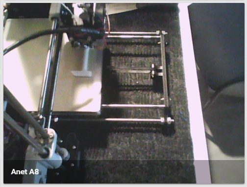

> This is one **[post in a series](/blog/2018/2018-06-27/post/)** of getting up and running with Home Assistant from scratch.

Today I will be adding my 3D printer to Home Assistant via the [octoprint integration](https://www.home-assistant.io/integrations/octoprint/), this post will build up on core concepts that have already been covered in some of my previous posts.

## Requirements

If you wish to follow along, you will need the following.

- Octoprint setup and running for your 3D printer
- A static IP Address assigned to your Octoprint server (makes configuration a whole lot easier)
- The Octoprint MQTT Plugin installed
- (Optional) A webcam configured in Octoprint

## Octoprint

As mentioned above, in order to monitor Octoprint from Home Assistant you will need the [Octoprint MQTT plugin](https://plugins.octoprint.org/plugins/mqtt/) as this allows Octoprint to publish relative information about your printer and any running jobs.

You can install the plugin through Octoprints built-in plugin manager, and configure it to point to your home MQTT server (or cloud server if you are not hosting your own).


I would suggest picking a meaningful topic when setting up MQTT, especially if you are running more than 1 3D printer. In my case I will set this topic to octoprint/anet_a8/:


We can confirm that our configuration is correct by subscribing to either `#` or `octoprint/anet_a8/#` in your preferred MQTT client (in my case I am using [MQTTBox](https://chrome.google.com/webstore/detail/mqttbox/kaajoficamnjijhkeomgfljpicifbkaf)).


## Home Assistant

The first thing we need to do is add the Octoprint component's configuration into your configuration.yaml file.

```yaml
octoprint:
  host: !secret octoprint_host
  api_key: !secret octoprint_api
  bed: true
  number_of_tools: 1
```

> This is the main component to integrate OctoPrint sensors, you will have to set up sensors and binary sensors separately.

Next you will need to create a new octoprint sensor (shown below) in your `configuration.yaml` file and select the monitored conditions that you are interested in.

```yaml
- platform: octoprint
  name: Anet A8
  monitored_conditions:
    - Current State
    - Temperatures
    - Job Percentage
```

After a quick restart of Home Assistant you should see your new sensors.


### Grouping and Customization

I prefer to group similar sensors together in Home Assistant to make it easier to get to the information that I want to see. Below I am creating a new card called Anet A8 which contains all the sensors that I want to see...

```yaml
aneta8_group:
  name: Anet A8
  entities:
    - sensor.anet_a8_current_state
    - sensor.anet_a8_job_percentage
    - sensor.anet_a8_target_bed_temp
    - sensor.anet_a8_actual_bed_temp
    - sensor.anet_a8_actual_tool0_temp
    - sensor.anet_a8_target_tool0_temp
```

This results in the following card appearing in Home Assistant after a restart.


If you are wondering where to get the entity names specific to your 3D printer (e.g. sensor.anet_a8_job_percentag) you can get them through the states panel under the Developer Tools section of your Home Assistant instance.


### Customizing Entities

The next thing I want to do is rename some of the automatically generated names to ones that make more sense to me. To do this I added the following configuration to my customize.yaml file:

```yaml
sensor.anet_a8_current_state:
  friendly_name: Status
  icon: mdi:printer-3d

sensor.anet_a8_job_percentage:
  friendly_name: "Job %"
  icon: mdi:percent

sensor.anet_a8_target_bed_temp:
  friendly_name: "Bed Temp (target)"
  icon: mdi:vector-square

sensor.anet_a8_actual_bed_temp:
  friendly_name: "Bed Temp (actual)"
  icon: mdi:vector-square

sensor.anet_a8_actual_tool0_temp:
  friendly_name: "Tool Temp (actual)"
  icon: mdi:temperature-celsius

sensor.anet_a8_target_tool0_temp:
  friendly_name: "Tool Temp (target)"
  icon: mdi:temperature-celsius
```

The results after a restart can be seen below:


### Webcam Support

Octoprint by default provides a webcam stream which is available at: `http://<IP Address>/webcam/?action=stream`

In my case that would make it: `http://10.0.0.101/webcam/?action=stream&1532530153491`

To get the webcam appearing in Home Assistant all we need to do is add a new mjpeg camera with the stream URL and a meaningful name:

```yaml
camera:
  - platform: mjpeg
    mjpeg_url: http://10.0.0.101/webcam/?action=stream&1532530153491
    name: "Anet A8"
```



### 3D Printer View

The last thing left to do is create a 3D Printer view in Home Assistant (i.e. a TAB on the top row) which will be used to only display information from my 3D printer, to do this I added the following configuration to the groups.yaml file.

```yaml
3d_printers_view:
  name: "3D Printers"
  view: yes
  entities:
    - device_tracker.google_maps_111184378817367767624
    - device_tracker.google_maps_117179315722226620815
    - group.aneta8_group
    - camera.anet_a8
```

After restarting Home Assistant:


## Conclusion

I feel a lot more comfortable being able to check on my 3D printer from another room, and having it integrate so easily into Home Assistant is a huge bonus.

This also opens up the doors for a lot of automation around your printer (e.g. power down after print completion (using a Sonoff), cut power in [thermal runaway](https://reprap.org/forum/read.php?1,786827), etc.).

Having your printer talking on MQTT also allows for integration into other tools such as [Node-RED](https://nodered.org/) greatly expanding what you can do with your automation.

I hope that you found this post helpful, and as always I welcome all feedback, comments and questions.
