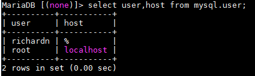
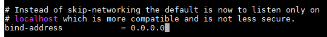
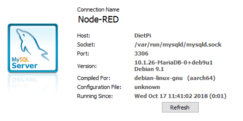
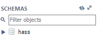

## Base Installation
To install MySQL (or more accurately MariaDB) on your DietPi \ Debian distribution all you need to do is run the following command:

```
sudo apt install mysql-server
```

This will download and install all the required packages and dependencies to get up and running quickly. Note you will need to do some additional configuration (below) in order to manage and access your MySQL instance remotely.

## Creating User Accounts
While connected to your device via ssh, run the below command to start the mysql prompt: `mysql`

Create a new user with the following command, replacing the values for username and password with your own values.

```sql
CREATE USER 'username' IDENTIFIED BY 'password';
```

Grant all permissions to your user with the following command:

```sql
GRANT USAGE ON *.* TO 'username'@'%' IDENTIFIED BY 'password';
FLUSH PRIVILEGES;
```

Confirm that your user has been added successfully.

```sql
select user,host from mysql.user;
```



## Allowing Remote Connections
Before you can login to your MySQL server remotely you will need to make the following changes in the `50-server.cnf` file.

```
nano /etc/mysql/mariadb.conf.d/50-server.cnf
```

Find the `bind-address` and change it to `0.0.0.0` this will allow MySQL to listen on all interfaces for incoming connections.



Save and close the file, followed by restarting the MySQL service.

```
systemctl stop mysql.service
systemctl start mysql.service
```

Test your connection to the server using the user created earlier.



## Creating a Database
Open MySQL prompt: `mysql`

Run the following commands, in my case I am creating a database for my Home Assistant installation.

```sql
CREATE DATABASE `hass`;
```

Give yourself permissions to the DB.

```sql
GRANT ALL privileges ON `database`.* TO 'username'@'%';
FLUSH PRIVILEGES;
SHOW GRANTS FOR 'username'@'%';
```

Your database should now be created and accessible by your user account.



## Useful Paths
- **MySQL data path**: `/var/lib/mysql/`
- **Main configuration file**: `/etc/mysql/mariadb.conf.d/50-server.cnf`
- **Default data directory**: `/var/lib/mysql/`

