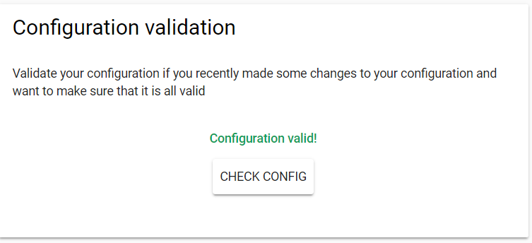
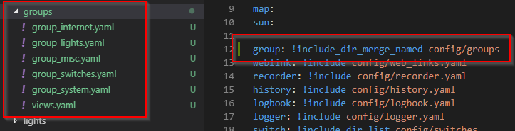

> This is one **[post in a series](https://www.richardn.ca/posts/HomeAssistantFromScratchInstallation/)** of getting up and running with Home Assistant from scratch.
{: .prompt-tip }

Today I would like to tackle breaking up your configuration file (`configuration.yaml`) into smaller, more manageable parts to make configuring Home Assistant a lot easier.

## Home Assistant YAML Commands
Home Assistant offers the following helper keywords for use in your configuration files:

- `!include_dir_list` will return the content of a directory as a list with each file content being an entry in the list.
- `!include_dir_named` will return the content of a directory as a dictionary which maps filename => content of file.
- `!include_dir_merge_list` will return the content of a directory as a list by merging all files (which should contain a list) into 1 big list.
- `!include_dir_merge_named` will return the content of a directory as a dictionary by loading each file and merging it into 1 big dictionary.

The full list of commands can be [found here](https://www.home-assistant.io/docs/configuration/splitting_configuration/), however in my experience the most commonly used command is `!include`.

## The basic idea
To make my configuration more manageable I would like to do the following:

- Break the configuration out into smaller files
- Move those files into a /config directory to clean up the root folder

To achieve this I will be making use of the `!include` and `!include_dir_list` commands and convert configuration like this:

```yaml
switch:
   - platform: mqtt
     command_topic: "cmnd/xmas/POWER"
     state_topic: "stat/xmas/POWER"
     payload_on: "ON"
     payload_off: "OFF"
     name: "XMas Lights"
     optimistic: false
     retain: true

   - platform: mqtt
     command_topic: "cmnd/windowlights/POWER"
     state_topic: "stat/windowlights/POWER"
     payload_on: "ON"
     payload_off: "OFF"
     name: "Window Lights"
     optimistic: false
     retain: true
```

into this:

```yaml
switch: !include_dir_list /config/switches
```

## !include_dir_list
The !include_dir_list command allows you to include all files nested in the target folder, this is ideal if you want to manage multiple components and prefer to have a file for each one.

You will be required to make some changes to the configuration to make this work, namely:

- You are limited to 1 entity per file
- You need to flatten your YAML (no need for indents)

Let's use this switch configuration as an example:

```yaml
switch:
   - platform: mqtt
     command_topic: "cmnd/xmas/POWER"
     state_topic: "stat/xmas/POWER"
     payload_on: "ON"
     payload_off: "OFF"
     name: "XMas Lights"
     optimistic: false
     retain: true
```

This would become a new file called `/config/switches/xmas.yaml` with the following contents:

```yaml
platform: mqtt
command_topic: "cmnd/xmas/POWER"
state_topic: "stat/xmas/POWER"
payload_on: "ON"
payload_off: "OFF"
name: "XMas Lights"
optimistic: false
retain: true
```

Note the lack of spacing in the new file, and would be included with the following statement in your main `configuration.yaml` file: `switch: !include_dir_list config/switches`

> **Note**: I got an error when testing this out with only 1 file in the target folder, this went away as soon as I added a second one though!
{: .prompt-info }

## !include
The other command I use a lot when breaking up my configuration is the `!include` command, this essentially places the targeted file directly in place of the !include placeholder.

Like `!include_dir_list` you will need to pay attention to the spacing used in your referenced file - normally you can get away with removing 1 level of indentation with most configuration files. I would suggest making use of the Configuration Validation tool found under the configuration section.



Once you have broken up your configuration, you just need to reference it in your configuration.yaml file as shown below.

```yaml
weather: !include config/weather.yaml
device_tracker: !include config/device_tracker.yaml
zone: !include config/zones.yaml
sabnzbd: !include config/sabnzbd.yaml
tts: !include config/tts.yaml
mqtt: !include config/mqtt.yaml
group: !include config/groups.yaml
```

At the end of the process your configuration file will just be a list of includes :)

## Breaking up groups.yaml
With all the devices taking part in my home automation deployment my groups.yaml file was looking pretty scary and was a mission to manage. I decided that I would take a similar approach to the rest of my configuration and break out the groups into smaller more manageable files (in a config/groups folder) and include the definitions in a similar manner to the sensors and lights covered above.

Initially I tried using the !include_dir_list command, this passed the configuration validation on Home Assistant but ended up missing out on all of my groups. After some testing I found that the !include_dir_merge_named command did the trick and I was able to break up my configuration as shown below:



This allows me to keep my group definitions smaller, keep similar entities grouped together and gives me the ability to quickly disable a collection of groups by just simply appending an _ to the end of a group file's name.

> **Note** I strongly recommend keeping all your view definitions in the same file, this allows you to control the order that they appear in as the files are loaded alphabetically from the configuration directory when using !includedirmerge_named
{: .prompt-tip }

## Tips
Here are some useful tips to consider when breaking up your Home Assistant configuration:

- If you wish to disable an included file using the `!include_dir_list` command you can just add an `_` to the end of the file extension (e.g. `xx.yaml_`) and restart Home Assistant.
- You can use a program like [BareTail](https://www.baremetalsoft.com/baretail/) to tail the Home Assistant log file (or `tail -f /config/home-assistant.log` on *nix) to get some additional insight into any errors you may encounter
- When breaking up groups be sure to keep all your views in the same file to ensure that they appear in the order that you want.

## Conclusion
Hopefully this post will help others out when it comes to making your Home Assistant deployment easier to manage. I am by no means an expert when it comes to this, but the approach listed above works well for me.

You can always visit the official Home Assistant site for a [big list of public configuration examples](https://www.home-assistant.io/examples#example-configurationyaml) should you need some more inspiration with your deployment.

Please feel free to leave any comments, questions or feedback below!
