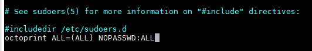
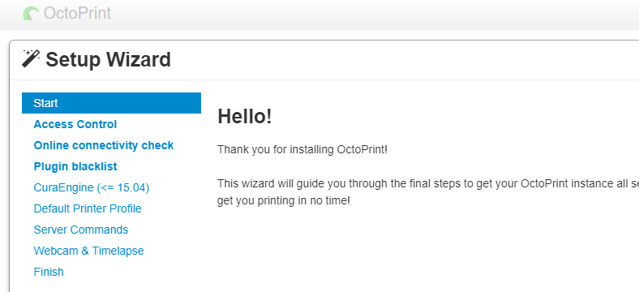
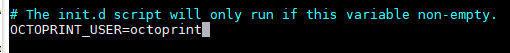
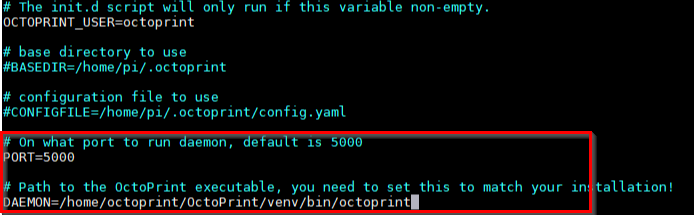
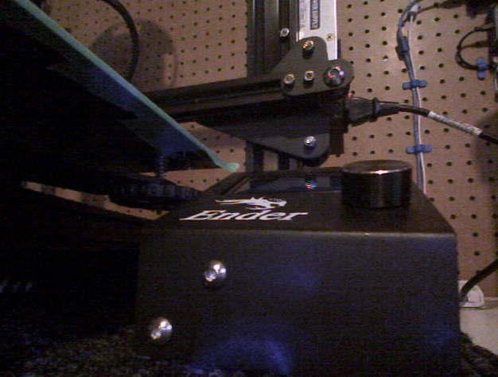
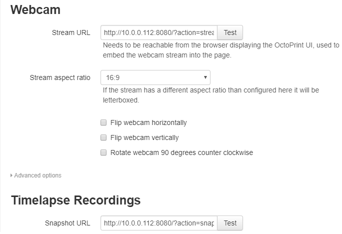
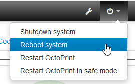
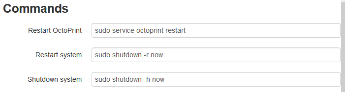
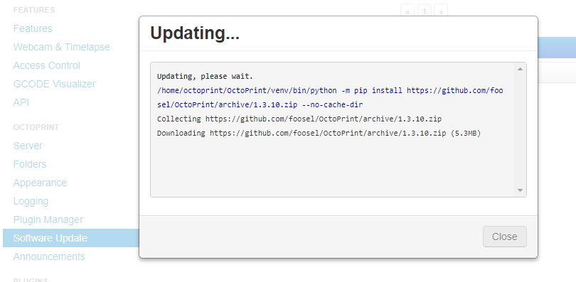

In this post I will cover the setup and configuration of OctoPrint from scratch. I will cover everything from installing OctoPrint to getting a webcam up and running. This post is a bit longer than my normal ones but I need to cover a lot of ground here. This is a collection of commands from various sources online, I have credited the original authors in each section.

## Installing Octoprint
I claim no credit to this process, the majority of the steps are from [this YouTube video](https://www.youtube.com/watch?v=LzLb_FnXu70) which was a big help in getting up and running.

### Flashing Armbian
You will need to download the version of Armbian that is compatible with your device, in my case that is the Orange Pi One: `https://www.armbian.com/orange-pi-one/`

You can find a full list of [supported devices here](https://www.armbian.com/download/).

Once you have the image, write it to an SD card using either [Win32 Disk Imager](https://sourceforge.net/projects/win32diskimager/files/latest/download) or [Etcher](https://www.balena.io/etcher/).

Next, you will need to boot your device and get its assigned IP Address (in my case this was `10.0.0.112`) - there are tools like [Fing](https://www.fing.com/) or [Angry IP Scanner](https://angryip.org/download/#windows) that should make discovering your device's IP Address a bit easier.

### Connect to your Device
Connect to your device using an ssh client like [Putty](https://www.putty.org/) or [MobaXterm](https://mobaxterm.mobatek.net/), the default username is `root` with a password of `1234`, you will be prompted to change this on the first login.

When \ If prompted to create a user account for yourself to use.

### Installing OctoPrint Prerequisites
First we need to update all installed packages for good measure.

```shell
sudo apt-get update
sudo apt-get upgrade
```

Next, we need to create an `OctoPrint` user to run the service.

```shell
sudo adduser octoprint
```

You can use any password you like for the user as it will be removed later on in the installation process.

Next, we need to add the required permissions to the OctoPrint user.

```shell
sudo usermod -a -G tty octoprint
sudo usermod -a -G dialout octoprint
```

Then add him to the list of `sudo` users:

```shell
sudo adduser octoprint sudo
```

Next, edit the sudo file and add the following line:

```shell
sudo visudo
octoprint ALL=(ALL) NOPASSWD:ALL
```


- CTRL + O to save the file
- CTRL + X to exit

Remove the password from the OctoPrint user with the following command:

```shell
sudo passwd octoprint -d
```

Install required supporting software:

```shell
sudo apt-get install git python-pip python-dev python-setuptools psmisc virtualenv
```

Switch over to the OctoPrint user account

```shell
sudo su octoprint
```

Switch to home directory

```shell
cd ~
```

Download and install py-serial:

```shell
wget https://pypi.python.org/packages/source/p/pyserial/pyserial-2.7.tar.gz
tar -zxf pyserial-2.7.tar.gz
cd pyserial-2.7
sudo python setup.py install
cd ~
```

### Installing OctoPrint
As the OctoPrint user navigate to your home directory and clone the latest copy of Octoprint:

```shell
cd ~
git clone https://github.com/foosel/OctoPrint.git
cd OctoPrint
```

Start up they python virtual environment (`virtualenv`)

```shell
virtualenv venv
```

Use python to setup and compile OctoPrint on you device

```shell
./venv/bin/python setup.py install
```

Once the build has completed you can start OctoPrint using the following command:

```shell
~/OctoPrint/venv/bin/octoprint serve
```

Once started you should be able to connect to OctoPrint in your web browser using the following URL `http://<device-ip-address>:5000` so in my case that would be http://10.0.0.112:5000/. This will present you with the OctoPrint Setup Wizard - complete it as normal.



Once done press CTRL and Z to kill OctoPrint in your connected ssh session.

### Auto Starting OctoPrint
Copy relevant files and configure OctoPrint to start on boot with the following commands:

```shell
sudo cp ~/OctoPrint/scripts/octoprint.init /etc/init.d/octoprint
sudo chmod +x /etc/init.d/octoprint
sudo cp ~/OctoPrint/scripts/octoprint.default /etc/default/octoprint
```

Edit the default configuration for OctoPrint

```shell
sudo nano /etc/default/octoprint
```

Change user account from `pi` to `octoprint`:



Enable and change the daemon directory

```shell
DAEMON=/home/octoprint/OctoPrint/venv/bin/octoprint
```



Next, we need to commit the updates we made

```shell
sudo update-rc.d octoprint defaults
```

Finally you can start the OctoPrint service with the following command

```shell
sudo service octoprint start
```

## Webcam Setup
Next we will install [mjpg-streamer](https://github.com/jacksonliam/mjpg-streamer) to allow us to keep an eye on our prints while away, the majority of these steps were taken from this [amazing GitHub post](https://github.com/cncjs/cncjs/wiki/Setup-Guide:-Raspberry-Pi-%7C-MJPEG-Streamer-Install-&-Setup-&-FFMpeg-Recording).

### Installing mjpg-streamer
Let's start off by installing the required dependencies:

```shell
sudo apt-get install cmake libjpeg8-dev
sudo apt-get install gcc g++
```

Now clone the repo:

```shell
cd /tmp
git clone https://github.com/jacksonliam/mjpg-streamer.git
cd mjpg-streamer/mjpg-streamer-experimental
```

Compile `mjpg-streamer`:

```shell
make
sudo make install
```

Test to see if everything is working with the following command:

```shell
/usr/local/bin/mjpg_streamer -i "input_uvc.so -r 1280x720 -d /dev/video0 -f 30 -q 80" -o "output_http.so -p 8080 -w /usr/local/share/mjpg-streamer/www"
```

You should be able to connect to mjpg_streamer using the following URL http://<device-ip-address>:8080/?action=stream, so in my case that would be `http://10.0.0.112:8080/?action=stream`:



### Auto starting mjpg-streamer
We will need to create a startup file:

```shell
nano /home/octoprint/mjpg-streamer.sh
```

For the contents of the file, add in the below code (from [this post](https://github.com/cncjs/cncjs/wiki/Setup-Guide:-Raspberry-Pi-%7C-MJPEG-Streamer-Install-&-Setup-&-FFMpeg-Recording)):

```shell
#!/bin/bash
# chmod +x mjpg-streamer.sh
# Crontab: @reboot /home/octoprint/mjpg-streamer/mjpg-streamer.sh start
# Crontab: @reboot /home/octoprint/mjpg-streamer/mjpg-streamer-experimental/mjpg-streamer.sh start

MJPG_STREAMER_BIN="/usr/local/bin/mjpg_streamer"  # "$(dirname $0)/mjpg_streamer"
MJPG_STREAMER_WWW="/usr/local/share/mjpg-streamer/www"
MJPG_STREAMER_LOG_FILE="${0%.*}.log"  # "$(dirname $0)/mjpg-streamer.log"
RUNNING_CHECK_INTERVAL="2" # how often to check to make sure the server is running (in seconds)
HANGING_CHECK_INTERVAL="3" # how often to check to make sure the server is not hanging (in seconds)

VIDEO_DEV="/dev/video0"
FRAME_RATE="5"
QUALITY="80"
RESOLUTION="1280x720"  # 160x120 176x144 320x240 352x288 424x240 432x240 640x360 640x480 800x448 800x600 960x544 1280x720 1920x1080 (QVGA, VGA, SVGA, WXGA)   #  lsusb -s 001:006 -v | egrep "Width|Height" # https://www.textfixer.com/tools/alphabetical-order.php  # v4l2-ctl --list-formats-ext  # Show Supported Video Formates
PORT="8080"
YUV="yes"

################INPUT_OPTIONS="-r ${RESOLUTION} -d ${VIDEO_DEV} -f ${FRAME_RATE} -q ${QUALITY} -pl 60hz"
INPUT_OPTIONS="-r ${RESOLUTION} -d ${VIDEO_DEV} -q ${QUALITY} -pl 60hz --every_frame 2"  # Limit Framerate with  "--every_frame ", ( mjpg_streamer --input "input_uvc.so --help" )

if [ "${YUV}" == "true" ]; then
    INPUT_OPTIONS+=" -y"
fi

OUTPUT_OPTIONS="-p ${PORT} -w ${MJPG_STREAMER_WWW}"

# ==========================================================
function running() {
    if ps aux | grep ${MJPG_STREAMER_BIN} | grep ${VIDEO_DEV} >/dev/null 2>&1; then
        return 0
    else
        return 1
    fi
}

function start() {
    if running; then
        echo "[$VIDEO_DEV] already started"
        return 1
    fi

    export LD_LIBRARY_PATH="$(dirname $MJPG_STREAMER_BIN):."

    echo "Starting: [$VIDEO_DEV] ${MJPG_STREAMER_BIN} -i \"input_uvc.so ${INPUT_OPTIONS}\" -o \"output_http.so ${OUTPUT_OPTIONS}\""
    ${MJPG_STREAMER_BIN} -i "input_uvc.so ${INPUT_OPTIONS}" -o "output_http.so ${OUTPUT_OPTIONS}" >> ${MJPG_STREAMER_LOG_FILE} 2>&1 &

    sleep 1

    if running; then
        if [ "$1" != "nocheck" ]; then
            check_running & > /dev/null 2>&1 # start the running checking task
            check_hanging & > /dev/null 2>&1 # start the hanging checking task
        fi

        echo "[$VIDEO_DEV] started"
        return 0

    else
        echo "[$VIDEO_DEV] failed to start"
        return 1
    fi
}

function stop() {
    if ! running; then
        echo "[$VIDEO_DEV] not running"
        return 1
    fi

    own_pid=$$

    if [ "$1" != "nocheck" ]; then
        # stop the script running check task
        ps aux | grep $0 | grep start | tr -s ' ' | cut -d ' ' -f 2 | grep -v ${own_pid} | xargs -r kill
        sleep 0.5
    fi

    # stop the server
    ps aux | grep ${MJPG_STREAMER_BIN} | grep ${VIDEO_DEV} | tr -s ' ' | cut -d ' ' -f 2 | grep -v ${own_pid} | xargs -r kill

    echo "[$VIDEO_DEV] stopped"
    return 0
}

function check_running() {
    echo "[$VIDEO_DEV] starting running check task" >> ${MJPG_STREAMER_LOG_FILE}

    while true; do
        sleep ${RUNNING_CHECK_INTERVAL}

        if ! running; then
            echo "[$VIDEO_DEV] server stopped, starting" >> ${MJPG_STREAMER_LOG_FILE}
            start nocheck
        fi
    done
}

function check_hanging() {
    echo "[$VIDEO_DEV] starting hanging check task" >> ${MJPG_STREAMER_LOG_FILE}

    while true; do
        sleep ${HANGING_CHECK_INTERVAL}

        # treat the "error grabbing frames" case
        if tail -n2 ${MJPG_STREAMER_LOG_FILE} | grep -i "error grabbing frames" > /dev/null; then
            echo "[$VIDEO_DEV] server is hanging, killing" >> ${MJPG_STREAMER_LOG_FILE}
            stop nocheck
        fi
    done
}

function help() {
    echo "Usage: $0 [start|stop|restart|status]"
    return 0
}

if [ "$1" == "start" ]; then
    start && exit 0 || exit -1

elif [ "$1" == "stop" ]; then
    stop && exit 0 || exit -1

elif [ "$1" == "restart" ]; then
    stop && sleep 1
    start && exit 0 || exit -1

elif [ "$1" == "status" ]; then
    if running; then
        echo "[$VIDEO_DEV] running"
        exit 0
    else
        echo "[$VIDEO_DEV] stopped"
        exit 1
    fi
else
    help
fi
```

We will need to make this file executable:

```shell
chmod +x /home/octoprint/mjpg-streamer.sh
```

Then add it to the CRON jobs...

```shell
crontab -e
```

... by adding the following line to the bottom of the file

```shell
@reboot /home/octoprint/mjpg-streamer.sh start
```

Save the file and exit, reboot your device to see if the webcam comes up.


### Installing ffmpeg
Next we will need to install ffmpeg to allow OctoPrint to render time-lapses etc, to do this all we need to do is run the following command:

```shell
apt-get install ffmpeg
```

## Configuring OctoPrint
We are so close to being done, the last thing we need to do is configure OctoPrint and make it aware of all our configuration. We will be doing all of this configuration through OctoPrint's web interface (http://10.0.0.112:5000/), let's get started:

### Adding in the webcam
Open settings and navigate to the Webcam & Timelapse page, here we will enter in the following information:

- **Stream URL**: http://10.0.0.112:8080/?action=stream
- **Snapshot URL**: http://10.0.0.112:8080/?action=snapshot
- **Path to FFMPEG**: /usr/bin/ffmpeg



### Server Controls
The next thing I would like to do is enable the server controls in OctoPrint (e.g. shutdown, restart, etc.).



These can be added under the Server configuration section, all that's required here is to enter in the correct commands for the desired action, for e.g.:



- **Restart OctoPrint** - sudo service octoprint restart
- **Restart System** - sudo shutdown -r now
- **Shutdown System** - sudo shutdown -h now

Once you have entered the relevant commands, save the changes so that they can take effect.

### Keeping OctoPrint up to date
Provided that you followed the installation steps listed above you should be able to update OctoPrint through the web interface whenever there is a new release of the software.

Unlike the pre-configured image I am running on my Orange Pi Lite where you can update directly from the notification, you will need to manually update through the settings page which is a slight bummer.

I noticed that I got a couple of warnings \ errors logged to the console while applying the latest update, however the update completed fine and everything seems to be working as expected.



## Final thoughts
Although it took me the better part of 3 hours to scrape everything together for this post, it should take you no more than 20-30 min to follow along for yourself.

OctoPrint is by far worth the effort and breathes new life into even the oldest of 3D printers, I love having the ability to remotely control \ monitor my printers and when paired with a Sonoff Basic and an empty print bed - you don't even need to be by your printer to start a print.

As always I welcome all feedback, comments and suggestions, happy printing!
