Today I would like to cover installing [InfluxDB](https://www.influxdata.com/products/influxdb-overview/) on a Windows computer. In case you didn't know "InfluxDB is a high-performance data store written specifically for time series data", and this is extremely useful when working with `Home Automation` data like system up-time, temperature, etc.

All the downloads for the [TICK Stack](https://www.influxdata.com/time-series-platform/) (the InfluxData platform) can be found [here](https://portal.influxdata.com/downloads/), but today we will only be covering getting up and running with [InfluxDB](https://www.influxdata.com/products/influxdb-overview/).

## Download and first run
Downloading InfluxDB is as simple as going to the downloads page and clicking the InfluxDB [download link](https://portal.influxdata.com/downloads/) as shown below (at the time of writing this was for version `1.7.2`).

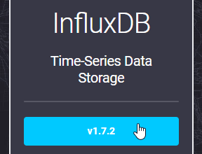

Once downloaded you will need to make a folder on your computer to extract and tune everything from - there are no installers for the TICK stack, rather a zip file containing everything that you need to get up and running. For the purposes of this tutorial I will be using the following folder (`c:\Program Files\InfluxData\`) as my root directory.

### Extract the ZIP file
Let's create a folder called influxdb and extract the contents of the `influxdb.1.7.2_windows_amd64.zip` file into it.

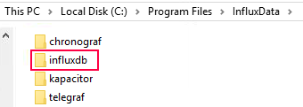

Once done it should look something like this:

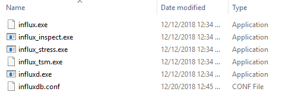

### Configuring InfluxDB
Next we will need to edit the `influxdb.conf` in order to set the relevant folders and settings when running on Windows. I would recommend creating a folder outside of the main InfluxDB directory to store your data as it will make upgrading and backups a lot easier (in my case this is `c:\Program Files\InfluxData\influx-data\`). You will need to make the following changes to your influxdb.conf file (along with creating the folder paths).

#### Change the META dir
Locate and change the meta directory as shown below (remember to create the folder if it is missing).

```ini
[meta]
  # Where the metadata/raft database is stored
  dir = "D:/Program Files/InfluxData/influxdb-data/meta"
```

#### Change the DATA + WAL dir
Locate and change the data directory as shown below:

```ini
[data]
  # The directory where the TSM storage engine stores TSM files.
  dir = "D:/Program Files/InfluxData/influxdb-data/data"
  ...
  wal-dir = "D:/Program Files/InfluxData/influxdb-data/wal"
```

#### Configure logging (if you want it)
If you would like to enable \ configure logging below are some of the most common settings you will need to modify.

```ini
logging-enabled = true
trace-logging-enabled = false
query-log-enabled = true
```

#### Enable the HTTP endpoint
If you would like to make use of the HTTP endpoint (in most cases you do), you can enable it via the below configuration key:

```ini
[http]
  # Determines whether HTTP endpoint is enabled.
  enabled = true
```

### First Time Run
Provided that the HTTP Endpoint was enabled above, you can test to see if everything is configured correctly by simply running the influxd.exe from your installation directory.

Watch the launched console for any errors relating to the configuration properties you have changed, once everything is happy you can navigate to 'http://localhost:8086/query/' in your browser and should be greeted with some form of response from InfluxDB.

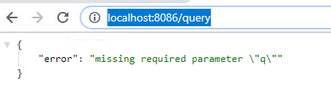

## Running as a service
To run InfluxDB as a Windows service I find it easiest to use [nssm](https://nssm.cc/download) (`the Non-Sucking Service Manager`) with the configuration detailed below.

To install the service you will need to copy nssm.exe to a location on your PC (I suggest placing it in the root InfluxData directory we created earlier c:\Program Files\InfluxData\nssm.exe) and launching the installer through an elevated command prompt window using this command:

```
nssm install
```

On the Application tab enter in the following:

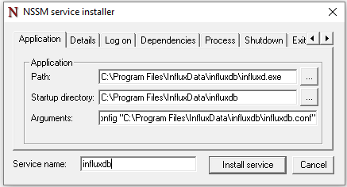

- **Path**: c:\Program Files\InfluxData\influxdb\influxd.exe
- **Startup Directory**: c:\Program Files\InfluxData\influxdb\
- **Arguments**: -config "C:\Program Files\InfluxData\influxdb\influxdb.conf"
- **Service Name**: influxdb

On the Details tab enter in the following:

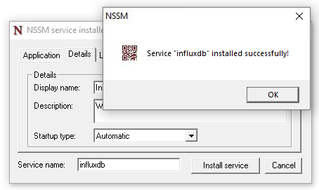

- **Name**: InfluxDB
- **Description**: anything you would like
- **Startup Type**: Automatic

Once done, click Install Service - that's it!

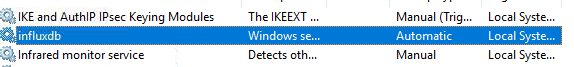

You should now be able to start the influxdb service as you would any other Windows service and you should still have access to the HTTP endpoint (http://localhost:8086/query/).

## Windows Firewall
If you are planning on running InfluxDB on a remote server (like I am doing) you will need to add a firewall rule to allow connections to it (default port 8086) - this is as simple as opening the advanced firewall rules in windows and completing the new rule wizard as follows:

Create a Port based rule ...

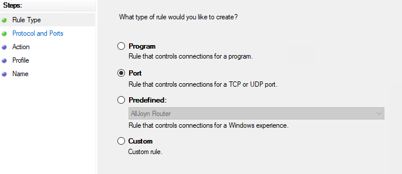

... specifying the port as 8086 ...

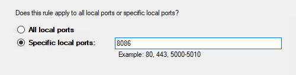

... allowing the connection from your selected domains ...

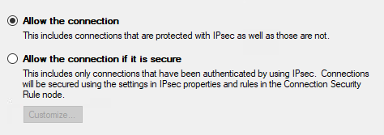

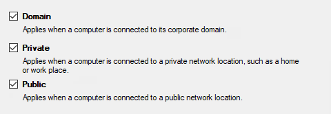

... and giving the rule a meaningful name :)

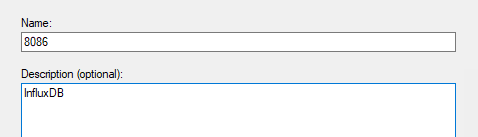

This should allow remote access to InfluxDB:

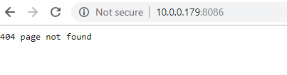

## In Closing
Setting up InfluxDB is super simple (albeit there are a few steps to follow) and should take you no longer than 10 min if following this guide.

InfluxDB is an awesome time-series database and performs fast even on the oldest hardware \ single board computers, and when paired with [Grafana](https://grafana.com/) makes an awesome addition to my home automation monitoring.

As always I welcome any feedback, questions or comments on my posts and will do my best to respond in a timely manner. I hope you found this post helpful!
