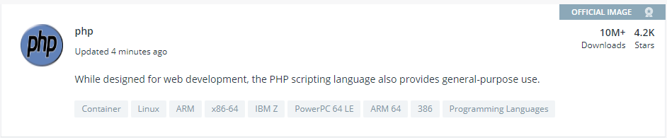

Today I am going to quickly cover getting a php script up and running in Docker. In case you are unfamiliar with Docker:

> Docker is a tool designed to make it easier to create, deploy, and run applications by using containers. Containers allow a developer to package up an application with all of the parts it needs, such as libraries and other dependencies, and ship it all out as one package.

Before getting started you will need to make sure that the following requirements are met:

- You have a CPU capable of running Docker (most modern CPU should work)
- Ideally you are on a `x64` based CPU architecture
- You have the appropriate version of [Docker Desktop](https://www.docker.com/products/docker-desktop/) installed for your OS.

Once that is all sorted, you are good to go.

## Find a base container

Docker uses the concept of containers to store and run your applications - and is not intended to run a secondary OS like VirtualBox. [VirtualBox](https://www.virtualbox.org/) allows you to run a secondary OS on your host computer by emulating the hardware of a virtual computer and intercepting low level system calls, Docker on the other hand uses the host OS (or runs a common one if needed) to run a sand-boxed application intercepting and passing system calls to the host OS to handle giving it a smaller resource overhead when compared to VirtualBox.

That being said, when you want to run an application like PHP you will either need to find a base container to work from (recommended) or create your own container from scratch. Going the path of least resistance I am going to use a pre-built PHP image. You can use [https://hub.docker.com/](https://hub.docker.com/) to search for pre-built containers as a starting point for your application - be sure to make sure that your chosen container is from a reputable source and is being actively maintained. For now I am going to be making use of [this container](https://hub.docker.com/_/php):



## Select a container version

Once you have found a base container to work with, you will need to choose a minimum version of the container to use with your application. This is simply done by scrolling down on the containers information page and looking for the tags section on the Description tab.


> **Note** The tag versions go from more specific to super vague when reading left to right. You can use a very restrictive tag like 7.3.0-apache to lock into a specific PHP version, or 7-apache for the latest version of PHP 7.

In my case I am going to go with `7.3.0-apache`.

This will form the base container we are going to use for our application and we will refer to this as the FROM directive in our Dockerfile later on.

## Creating a Dockerfile

You can run a Docker container ad-hock from the command line, or via a Dockerfile file. Both mechanisms have their merits, but for now I am going to be using the Dockerfile method as this would allow me to commit my application to source control for other developers to use.

I will start this by creating a new folder on my computer to store my container in along with the PHP source files for development. In the root of my new folder I create a blank text file and rename it to Dockerfile making sure to remove the .txt extension, and add the following configuration to the file:

```dockerfile
FROM php:7.3.0-apache
COPY src/ /var/www/html
EXPOSE 80
```

This file will be used to describe the application to Docker:

- **FROM** - tells Docker that we are going to be using the php:7.3.0-apache base container.
- **COPY** - used to copy all files from a src folder to the /var/www/html folder of the docker container (you can normally get a list of all available paths on the selected containers information page).
- **EXPOSE** - used to expose port 80 (HTTP) from the container to the host computer.

That's pretty much it for the Dockerfile, lastly let's add some content to the PHP file we are going to be running (`src/index.php`):

```php
<?php
echo 'Hello World';
```

## Building and Running

You need to build your Dockerfile in order to run it - in our case it is as simple as running the following command:

```
docker build -t hello-world .
```

> **Note** I use `.` here are is am already in the folder containing the Dockerfile

This will interrogate your Dockerfile and pull down all the required images to build your container (this may take a while the first time you do this).


Once completed you can run your container using:

```
docker run -p 5001:80 hello-world
```

- `-p` allows us to map a port from the host computer to the container, in my case localhost:5001 -> container:80.
- `CTRL + C` will kill the apache process and shut down the container.

Now you should be able to browse to http://localhost:5001 on your computer and see our "Hello World" message.


## Using Volumes

One thing to note here is that no matter what changes we make to the index.php file after we build, they do not reflect in our application. This is due to the fact that when we built our application using the Dockerfile, Docker made a copy of index.php at that point in time and persisted it to our container. Although this is excellent for production, it will not do for development cases as we will want to make changes to the file as we go.

This is where volumes come in as they allow the linking of folders from the host system to the container. Also any changes made to these mounted folders are synchronised between the host and container. We can override /var/www/html as shown below:

```
docker run -p 5001:80 -v C:\Users\niema\Desktop\docker\src\:/var/www/html hello-world
```

> **Note** you will need to replace C:\Users\niema\Desktop\docker\src\ with your desired source directory.

Now any changes that we make to index.php are reflected in our application.


## In Closing

I am still pretty new to Docker so please take this post with a pinch of salt, it was written to the best of my understanding at the time.

Docker makes it easy to experiment with different development environments and saves the hassle of setting up the tools needed to run them, for production it offers a consistent experience between the development environment and server. It is lightweight and relatively simple to use!

As always I welcome any feedback, comments and questions!
