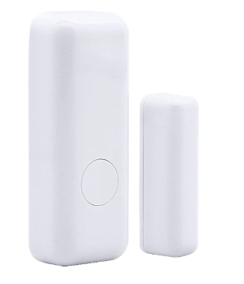
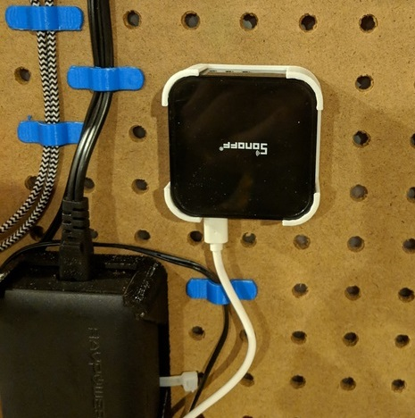
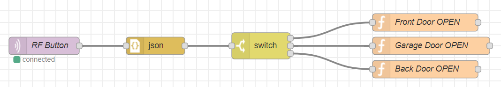
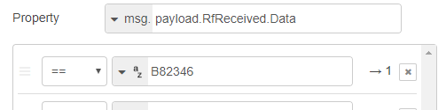
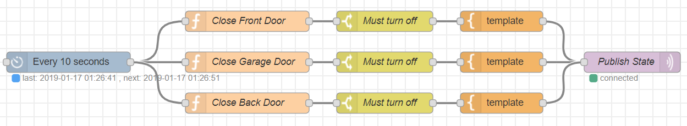
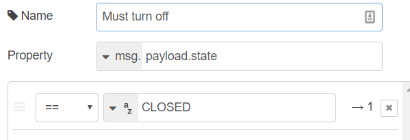
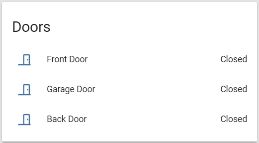
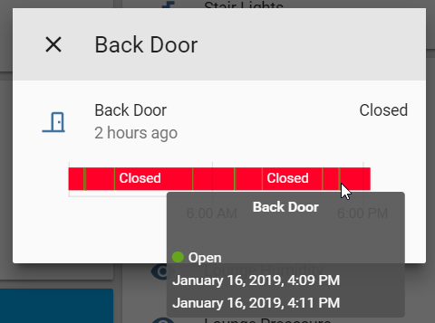
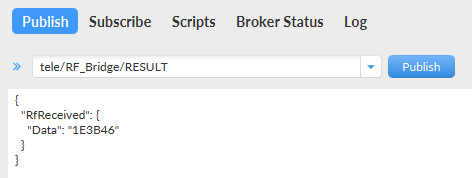

I work out of the basement at home and often don't hear when my wife gets back from work or my daughter gets back from school. I wanted a way to be notified when either the front door (or back door in this case) gets opened so I can head upstairs and greet them.

I happened to have some [433 Mhz RF door sensors](https://www.aliexpress.com/item/32862123837.html) lying around and decided to try setting up an audible alert on the basement Google Home when the door opens, this post is just a quick explanation of the flow I ended up using.

With no doubt there are easier ways to go about solving this problem, but the solution I ended up using made the most sense to me at the time.

## The Hardware
As mentioned above the star of the show are the 433 Mhz RF door sensors I bought from China:



Unfortunately the model I selected only sends a single code (others offer a code for the `open` and `closed` state) - so I had to do some dirty hacking around this (see the Node-RED flows).

I have a [Sonoff RF Bridge](https://itead.cc/product/sonoff-rf-bridge-433/) running [Tasmota](https://github.com/arendst/Tasmota) which intercepts all 433 MHz RF signals and relays them to my MQTT broker allowing me to use the switches in my Home Automation setup.



The rest of the hardware used in the project consists of:

- Raspberry Pi 3 running Home Assistant
- Google Home - used for notifications
- [NanoPi NEO2](https://nanopi.io/nanopi-neo2.html) running Node-RED <- this is an awesome $20 SBC!

## Node-RED Flow
As mentioned above the RF sensors I am using only send a code when the contact is broken (i.e. the door is opened). I would like the door to return to a closed state after 2 min so a re-trigger is possible, and a more accurate state for the door is recorded in Home Assistant.

The simplest solution I came up with here was to:

- Create a flow to listen for the door open messages and schedule a closed message 2 min from its arrival
- Create a flow to publish the closed message at the correct time

### Schedule Reset Message
Here is the flow to schedule the reset (closed) messages in Node-RED.



- Subscribe to the Sonoff RF results topic (`tele/RF_Bridge/RESULT`)
- Convert the message body into an JSON object
- Switch based on the value of `msg.payload.RfReceived.Data`



Execute a simple JavaScript code block to schedule the reset message

```js
let offTime = new Date((new Date()).getTime() + 1000 * 60 * 2);
flow.set('door_back_offAt', offTime);
flow.set('door_back_state', 'OPEN');
```

### Send Reset Message
The flow to send the reset message looks like this:



- At an interval of `10 seconds`

Run a script to determine if we need to send a reset message

```js
let doorState = flow.get('door_back_state');
let turnOffAt = flow.get('door_back_offAt');
let newState = 'IGNORE';
if(doorState === 'OPEN') {
    if(new Date() > turnOffAt) {
        flow.set('door_front_state', 'CLOSED');
        newState = 'CLOSED';
    }
}
msg.payload = { state: newState };
return msg;
```

- Filter to check for the CLOSED state



Template to generate the reset message:

```json
{"RfReceived":{"Data":"B82346OFF"}}
```

Publish the reset message via MQTT on the `tele/RF_Bridge/RESULT` topic - mocking the required structure of a decoded Sonoff RF message.

### Flows Side by Side
Schedule reset message flow:


Send reset message flow:


## Home Assistant Binary Sensor
Although technically not required I setup a [MQTT binary sensor](https://www.home-assistant.io/integrations/binary_sensor.mqtt) in Home Assistant to allow me to check the state history of the door:

```yaml
binary_sensor:
  - platform: mqtt
    name: "Back Door"
    state_topic: "tele/RF_Bridge/RESULT"
    payload_on: "1E3B46"
    payload_off: "1E3B46OFF"
    device_class: door
    value_template: '{{ value_json.RfReceived.Data }}'
```

> **Note** the `1E3B46OFF` payload is the actual reset message sent from Node-RED
{: .prompt-info }

After restarting Home Assistant I now had my doors showing up:



And after some time I was able to get state history for the doors, see that the door was open for 2 min :).



## Alerting Rule
Now that I have my door in Home Assistant it was time to set up the actual alert, this was done through an Automation script, and after some playing around I ended up with the following:

```yaml
alias: "Back Door Opened"
initial_state: True

trigger:
  - platform: mqtt
    topic: tele/RF_Bridge/RESULT

condition:
  condition: template
  value_template: "{{ trigger.payload_json['RfReceived']['Data'] == '1E3B46' }}"

action:
  - service: tts.google_say
    data:
      entity_id: media_player.gym_speaker
      message: Back door open
```

Broken up it's easy enough to follow:

- `alias` - what you want to call the Automation in Home Assistant
- `initial_state` - enabled by default
- `trigger` - condition to trigger the automation, in my case this was an MQTT message
- `condition` - used to filter out the specific MQTT payload I wanted
- `action` - response to the trigger and condition being met

After reloading the automatons in Home Assistant my Back Door Opened entry was listed!


## Testing it out
I didn't want to keep opening and closing the door to test the flow so I ended up using [MQTT.fx](https://mqttfx.jensd.de/) to post a bare-bones JSON payload mimicking that of the Sonoff RF bridge.



## In closing
This is a rather complex solution to a simple problem, Ill be the first to admit that - however I love little challenges like this as it gets me thinking of new ways to solve them.

The code used for Node-RED is not optimised at all (I would like to roll up the logic into a single step), but it gets the job done. The binary sensors in Home Assistant are only used for tracking the state of the door visually and are not required if you are following along at home.

Hopefully you found this post interesting or amusing. I am blown away each day with the power and versatility packed into these open source projects - the community has poured a lot of love and devotion into them and it shows.

Feel free to post any comments, questions or suggestions below!

Happy hacking
