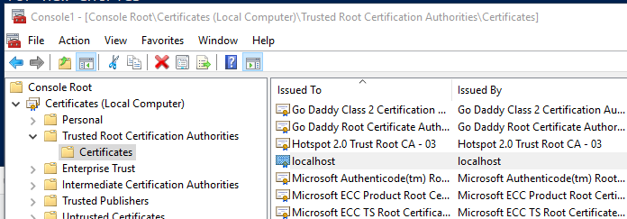
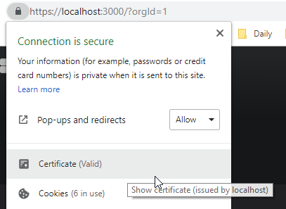

I am currently developing a custom data-source for [Grafana](https://grafana.com/) and needed to run the server in HTTPS mode in order to test out a rather odd use-case, this is just a quick post on how I did it - hopefully this saves you some time in the future.

## Generating the certificates
Following the [steps outlined here](https://letsencrypt.org/docs/certificates-for-localhost/), I decided to spin up an Ubuntu [Docker](https://www.docker.com/) container for this, making sure to map the /home directory to a folder on my PC for easy access.

```
docker run -it --rm -v C:\docker-data\ubuntu:/home ubuntu
```

Once booted I installed openssh with the following command:

```
apt-get update && apt-get upgrade -y && apt-get install -y openssl
```

Once installed be sure to change to your home directory:

```
cd /home
```

Then run the below to generate a certificate for localhost:

```
openssl req -x509 -out localhost.crt -keyout localhost.key \
  -newkey rsa:2048 -nodes -sha256 \
  -subj '/CN=localhost' -extensions EXT -config <( \
   printf "[dn]\nCN=localhost\n[req]\ndistinguished_name = dn\n[EXT]\nsubjectAltName=DNS:localhost\nkeyUsage=digitalSignature\nextendedKeyUsage=serverAuth")
```

This should generate the following files in your mapped /home folder:

- localhost.crt
- localhost.key

Copy these files to somewhere where your Grafana server can access them.

## Configure Grafana
In order to use the certificates you will need to make the following changes to your Grafana's `defaults.ini` file:

```ini
[server]
protocol = https
cert_file = D:\WRK\grafana-5.4.2\localhost.crt
cert_key = D:\WRK\grafana-5.4.2\localhost.key
```

Save and close the file - that's it from the Grafana side.

### Trusting the certificate
If you were to browse to your server on https now - your browser would throw up an error page saying that the certificate is not valid \ trusted. We can solve this by importing the localhost.crt file into the computer's rusted Root Certification Authorities.

Note this is not recommended for production environments - but is the path of least resistance for us developers :)

- Open a Run dialog
- Enter in `mmc` and click OK
- Click File then Add/Remove Snap-in
- Select Certificates from the available snap-ins and click the Add > button
- Select Computer Account on the screen that appears and click Next >
- Ensure that Local Computer is selected on the next screen and click Finish
- Click OK to close the add snap-in dialog
- Using the left hand side panel navigate to Certificates -> Trusted Root Certification Authorities -> Certificates
- Right click on the Certificated folder and select All Tasks -> Import from the context menu
- On the Certificate Import Wizard screen click Next
- Browse for the and select your localhost.crt on the next screen, then click Next
- Leave everything as is on the next screen - click Next
- Review the pending changes and click Finish to import your certificate

If all goes well you should see a localhost certificate in the list:



You're done with the import - you can now close the console.

## Testing it all out
You can now navigate to your Grafana's server address on https (in my case that's https://localhost:3000/?orgId=1) - your browser should pick up the certificate and allow the connection as shown below:



> **VIP**: you may need to restart your browser as I know Chrome for a fact needs a restart to pick up changes to certificates - don't panic if it fails initially you probably just need to restart your browser.
{: .prompt-warning }

You are done!
