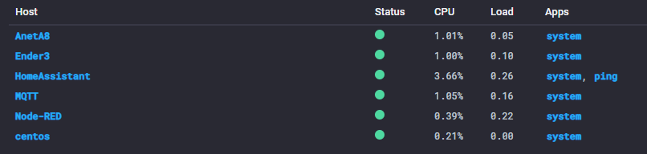

Today I would like to cover getting up and running with [Telegraf](https://www.influxdata.com/time-series-platform/telegraf/) on my SBC computers, namely most arm/arm64 based Debian distros.

This will be a brief post just covering the commands \ "hacks" used to get it all sorted.

## Uninstalling (Optional)

I had initially done a manual installation of Telegraf which needed to be removed:

```shell
systemctl stop telegraf.service
systemctl disable telegraf.service
systemctl daemon-reload
```

## Installing from influxdata.com

These steps are summarised from the [official documentation](https://docs.influxdata.com/telegraf/v1.10/introduction/installation/).

Add the influxdb.key key:

```shell
wget -qO- https://repos.influxdata.com/influxdb.key | sudo apt-key add -
```

Create a source entry for `influxdb.list`:

```shell
echo "deb [arch=arm64] https://repos.influxdata.com/debian stretch stable" | sudo tee /etc/apt/sources.list.d/influxdb.list
```

> **Note**: depending on your SBC architecture you may need to replace [arch=arm64] with [arch=armel] or [arch=armhf]! You can get your CPU architecture by running cat /proc/cpuinfo

Run `apt-get update` and install required dependencies:

```shell
sudo apt-get update && sudo apt-get install apt-transport-https
```

Install telegraf:

```shell
sudo apt-get update && sudo apt-get install telegraf
```

## Configuration

By default the configuration file can be found at `/etc/telegraf/telegraf.conf`.

You will need to edit this file to point Telegraf to your local InfluxDb server and add any modules you require:

```shell
nano /etc/telegraf/telegraf.conf
```

## Running as a service

Enabling the telegraf service should be as easy as issuing the following commands:

```shell
systemctl start telegraf
systemctl status telegraf
```

Optionally you can run the below command to enable the service if it was not done as part of the installation:

```shell
systemctl enable telegraf
```

## Notes

The official repository I used for discovering the supported CPU architectures is here: [https://repos.influxdata.com/debian/dists/stretch/stable/](https://repos.influxdata.com/debian/dists/stretch/stable/).

Once running you should start seeing your hosts appearing in Chronograf.



Hopefully you found this post helpful and as always, I welcome any comments, questions and feedback.
