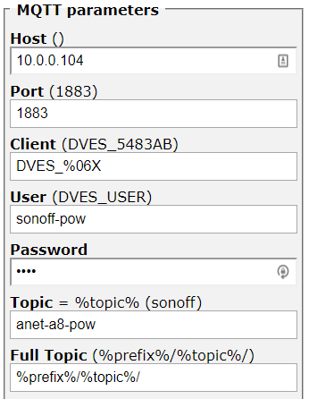
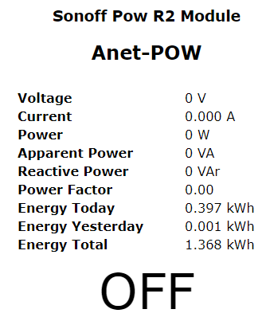
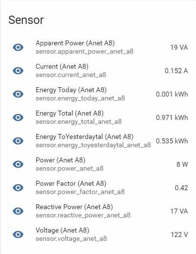
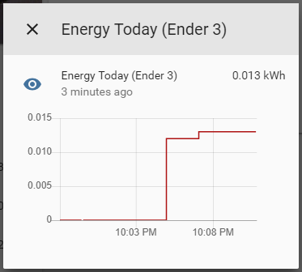

This post covers the process of collecting performance data from most Sonoff devices, in this instance I will be working with my Sonoff Pow R2.

## Requirements
To follow along you will need the following:

- an MQTT server - some setup [posts here](https://www.richardn.ca/categories/mqtt/)
- a Sonoff device running [Tasmota](https://github.com/arendst/Tasmota)

## Setting the correct time
If you haven't already done so, I would recommend ensuring that you have the correct time set on your Sonoff device, setting the time can be done through the web console through one of the [following methods](https://github.com/arendst/Tasmota#management):

### Manual
You can set the time manually with any of the following commands (Timezone, TimeSTD, TimeDST), for example if I wish to manually set it for myself I could issue the following command:

```shell
Timezone -6
```

### NTP
The simplest way to set the time by far is through the use of a NTP Server - just google for one closest to you, my search returned the following server (2.ca.pool.ntp.org). To set the time using an NTP server you would use the NtpServer command followed by the servers address:

- `NtpServer 2.ca.pool.ntp.org`

## Configure Telemetry
Next we will need to configure how often Tasmota publishes the telemetry data (statistics) that we want to collect. This is set in seconds and can range from 10 seconds all the way up to 300 seconds (5 min).

Again this can be set through the Web Console with the TelePeriod command:

```shell
TelePeriod 10
```

## Configuring MQTT
By far the easiest way to send data between your Sonoff device and Home Assistant is through MQTT.

Configuration is done via the `Configuration` -> `Conffigure MQTT` links:



Take note of the topic as we will need to subscribe to it in Home Assistant.

## MQTT Payload
The telemetry payload from my Sonoff POW R2 is shown below.

```json
{  
   "Time":"2019-04-02T19:31:06",
   "ENERGY":{  
      "TotalStartTime":"2019-03-19T21:10:01",
      "Total":1.368,
      "Yesterday":0.001,
      "Today":0.397,
      "Period":0,
      "Power":0,
      "ApparentPower":0,
      "ReactivePower":0,
      "Factor":0.00,
      "Voltage":0,
      "Current":0.000
   }
}
```

As you can see there is a lot of useful data in the payload and it's pretty easy to work out what each value relates to on your Sonoff device.



## Home Assistant
We will be making use of the [MQTT Sensor](https://www.home-assistant.io/integrations/sensor.mqtt) component in Home Assistant with a custom `value_template` to extract the counter we are interested in. You will need to create one entry per value you wish to collect.

Here is the configuration used to collect the Reactive Power (ReactivePower) value from the above MQTT payload.

> **Note**: The parsed JSON payload is available through the value_json template variable.
{: .prompt-tip }

```yaml
sensor:
  - platform: mqtt
    state_topic: "tele/anet-a8-pow/SENSOR"
    name: 'Reactive Power (Anet A8)'
    unit_of_measurement: 'VA'
    value_template: "{{ value_json.ENERGY.ReactivePower }}"
```

Repeat this step for each counter you wish to collect.

Once done be sure to check your configuration before restarting Home Assistant, and if all goes well you should end up with your new counters:



Provided you are running the base recorder configuration, Home Assistant should store history data for your counters.



## In Closing
I hope that you found this post helpful, and that you are able to use your newly collected data to build all kinds of cool automations around your home.

Feel free to leave any comments, feedback and suggestions below.

Happy hacking!
